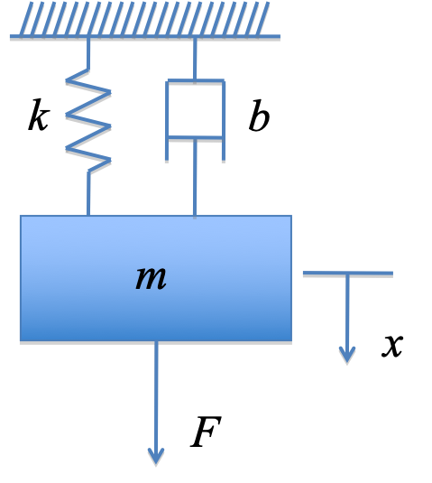
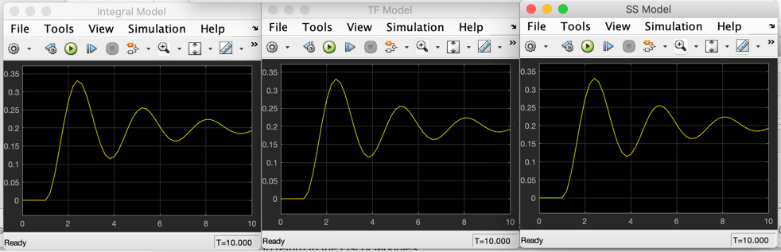

---
redirect_from:
  - "/01/modsim"
interact_link: content/01/modsim.ipynb
title: 'Systems Modelling and Simulation'
prev_page:
  url: /intro
  title: 'Introduction to this Module'
next_page:
  url: /02/ssntr
  title: 'Steady-State and Transient Response'
comment: "***PROGRAMMATICALLY GENERATED, DO NOT EDIT. SEE ORIGINAL FILES IN /content***"
---

# System Modelling and Simulation

## Contents

* Ordinary differential equations
* Transfer functions
* Integral models
* Using Simulink
* State-space models

## Ordinary Differential Equations

* Used to model a wide variety of so-called “lumped parameter” problems in engineering and technology.
* Based on the fundamental laws of nature such as Ohm’s law, Newton’s laws of motion, thermodynamics, chemistry etc.
* We will assume that you have or can derive such a model in your domain of interest.

### An Example

Spring Mass Damper System



### Free body diagram


### Differential equation

$$\begin{eqnarray*}
m\ddot x &=& \sum \mathrm{forces} \;\mathrm{in}\;\mathrm{the}\;x\;\mathrm{direction}\\
 &=& F - kx - b\dot x\\
F &=& m\ddot x + kx + b\dot x
\end{eqnarray*}$$

### Challenge for Electrical Engineers

Can you think of a simple electrical circuit that has a similar differential equation?

*Clue*: it would have 1 resistor 1 capacitor and 1 inductor.

## Transfer functions

### Laplace transform

* Allows us to represent a the differential equation representing a linear-time invariant (LTI) system as a rational polynomial in $s$.
* This can be solved for $t$ using the inverse-Laplace transform (time domain).
* Can substitute $s=j\omega$ to determine the response to sinusoidal inputs (frequency domain).

### Transform version of the SMD

Let:

$$\begin{eqnarray*}
X(s) &=& \mathcal{L}x(t)\\
F(s) &=& \mathcal{L}F(t)
\end{eqnarray*}$$

then

$$F(s) = ms^2X(s) + bsX(s) + bX(s)$$

### Transfer function

$$X(s) = \frac{1}{ms^2 + bs + b}F(s)$$

### Block diagram


### MATLAB LTI Object


{:.input_area}
```matlab
m = 1; % kg
b = 0.6; % Ns/m
k = 5; % N/m

```


{:.input_area}
```matlab
smd_tf = tf([1], [m b k])
```


{:.output_stream}
```

smd_tf =
 
         1
  ---------------
  s^2 + 0.6 s + 5
 
Continuous-time transfer function.


```


{:.input_area}
```matlab
step(smd_tf)
```


## Integral Models

* If system is non-linear, time-varying or very high order, we may not be able to solve the differential system directly.
* We typically resort to simulation
* MATLAB has a system simulation tool called *Simulink*.
* We first need to convert the differential equation to integral form.

### Integral form

* Makes use of the fact that for any differential term:

$$x(t)=\int_{0}^{t}\,\dot{x}(t)\,dt$$

* We can use this fact to rearrange any *n*<sup>th</sup>-order differential equation into n first-order integral equations.
* Using a numerical integration algorithm, we can solve such equations.


### Integral form of SMD equations

$$\begin{eqnarray*}
\ddot{x}&=&\frac{1}{m}\left(F-b\dot{x}-kx\right)\\
\dot{x}&=&\int\ddot{x}\,dt\\
x&=&\int\dot{x}\,dt
\end{eqnarray*}$$

### Block diagram


**Note** 

$$\mathcal{L}\left(\int x(t)\,dt\right) = \frac{1}{s}$$


### Simulink model


{:.input_area}
```matlab
smd
```


### Results of simulation


## State-space models

Let $x_1 = x$ and $x_2 = \dot{x}$ then

$$\begin{eqnarray*}
\dot{x}_1&=&x_2\\
\dot{x}_2&=&-\frac{k}{b}x_2-\frac{b}{m}x_1+\frac{F}{m}
\end{eqnarray*}$$

In matrix form

$$\left[ {\begin{array}{*{20}{c}}
  {\dot {x}_1} \\ 
  {\dot {x}_2} 
\end{array}} \right] = \left[ {\begin{array}{*{20}{c}}
  0&1 \\ 
  { - \frac{b}{m}}&{ - \frac{k}{m}} 
\end{array}} \right]\left[ {\begin{array}{*{20}{c}}
  {{x_1}} \\ 
  {{x_2}} 
\end{array}} \right] + \left[ {\begin{array}{*{20}{c}}
  0 \\ 
  {\frac{1}{m}} 
\end{array}} \right]F$$

### General state-space model

$$\begin{eqnarray*}
\mathbf{\dot x} &=& {\mathbf{Ax}} + {\mathbf{B}}u\\
y &=& {\mathbf{Cx}} + {\mathbf{D}}u
\end{eqnarray*}$$

### MATLAB LTI Model


{:.input_area}
```matlab
A = [0 1; -k/m -b/m]; % state matrix
B = [0; 1/m]; % input matrix
C = [1 0]; % Output matrix - output y = x1
D = [0]; 
```


{:.input_area}
```matlab
smd_ss = ss(A, B, C, D)
```


{:.output_stream}
```

smd_ss =
 
  A = 
         x1    x2
   x1     0     1
   x2    -5  -0.6
 
  B = 
       u1
   x1   0
   x2   1
 
  C = 
       x1  x2
   y1   1   0
 
  D = 
       u1
   y1   0
 
Continuous-time state-space model.


```


{:.input_area}
```matlab
step(smd_ss)
```


## Comparison


{:.input_area}
```matlab
smdcompare
```


### Results



## Models and their uses

* Integral models for general solution of high-order, linear and non-linear differential equations.
* State-space models for *linear* time-invariant, time-varying and multi-input multi-output (**MIMO**) systems.
* Transfer function for linear time-invariant (**LTI**), single-input single output (**SISO**) systems

## Feedback and suggestions

"**Which bit of this session did you find the most difficult to understand**”

Use the Teams [week 1 discussion](https://teams.microsoft.com/l/channel/19%3aa25f34ac58624f56b6a73358b97d2b42%40thread.skype/Week%25201?groupId=8831ec02-d0cc-4627-b070-40b1bff6a4e4&tenantId=bbcab52e-9fbe-43d6-a2f3-9f66c43df268) to post feedback.

Or tweet @[eglm03](https://twitter.com/eglm03) hashtag #[eglm03](https://twitter.com/hashtag/eglm03)

