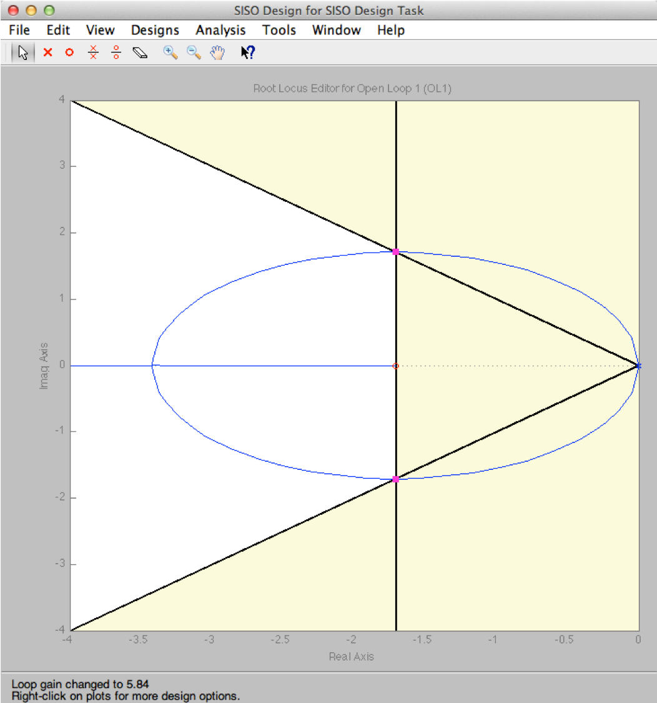

---
redirect_from:
  - "/03/1/intro"
interact_link: content/03/1/intro.ipynb
title: 'Introducing phase-lead compensation'
prev_page:
  url: /03/classical
  title: 'Classical Control Systems Design'
next_page:
  url: /03/2/velfb
  title: 'Introduction to Root Locus Design'
comment: "***PROGRAMMATICALLY GENERATED, DO NOT EDIT. SEE ORIGINAL FILES IN /content***"
---

# Introducing phase-lead compensation

## Time Response Design Characteristics

Two types of characteristic given:

* Steady-state performance

* Transient transient performance

Achievement of both usually requires design tradeoffs.

The availability of computer tools simplifies iteration…

… if we know what direction we are going in!

## Typical design problems

* Steady-state OK but need to improve transient response (relative stability, speed, damping)

* Transient is OK but need to improve steady-state performance

* Both steady-state and transient need improvement

* Design method to be used: *Root Locus*

## Introduction to Root Locus Design

Plant: Satellite Attitude Control System (double integrator)

Use of [velocity feedback](../2/velfb) now.

Next we will use [Proportial+Derivative](../3/pplusd) and [Phase-Lead compensation](../4/leadc).

### Plant

**Figure 1: Satellite attitude control**

The model assumes that the satellite can be modeled as a disk (or a cylinder) with moment of inertia $J$ rotating around its axis. The control action is the torque produced by gas jets attached to the circumference of the disk. The jets fire in either direction but in opposition as shown in the figure. They will produce a torque in the opposite direction to the gas flow. The equation of motion is simply obtained from Newton’s law which relates the angular acceleration of the disk to the torque applied.

$$q(t) = J\frac{d^2\theta}{dt^2}$$

$J$ is the moment of inertia.

$$\Theta(s) = \frac{1/J}{s^2}Q(s)$$ 

Let $J = 1$ kgm2

**Fig 2: Simple feedback**

We arrange the system like this so that the torque applied to the system is proportional to the error between the demanded angle and the actual angle. We would then choose $K$ so that we achieved the design criteria to be defined next.

$$q(t) = K(\theta - \theta_d)$$

$$Q(s)=K(\Theta(s)-\Theta_d(s))$$

$$Q(s)=KE(s)$$

### Design Requirements

Zero steady-state error:

$$e(t) = \left.\theta(t)-\theta_d(t)\right|_{t\to\infty} = 0$$

$$s\left.E(s)\right|_{s\to 0} = 0$$

"Ideal" damping: 

$$\zeta = \frac{1}{\sqrt{2}}$$

Settling time:

$$T_s = 2.3\;\mathrm{s}$$

### Pre-design Questions

* What is the minimum type number the system has to have to achieve required steady-state performance1?

* What angle will the damping line subtend with the positive real axis2?

* What will the real-part of the closed-loop poles be3?

* What will the damped, natural frequency of the closed-loop poles be4?

* What design criteria can we satisfy5?

**Notes**: 

1. System type number refers to the number of integrators in the forward path. For a unity-gain feedback system, these will appear as multipliers $s^n$ in the denominators in the open-loop transfer function $G_o(s)$ and correspond to poles at the origin of the s-plane (that is $s = 0$). Thus, the system type number is equal to $n$.

2. The angle that the line of constant damping makes with the negative real axis is $cos^{-1}(\zeta)$. Since $zeta = 1/\sqrt(2) = 0.707$, that angle is $45^\circ$. The question asks for the angle subtended by this line and the positive real axis, so this is $180^\circ – 45^\circ = 135^\circ$. The question was asked this way because when we calculate the contribution of open-loop poles and zeros to the closed-loop poles and zeros for the purposes of satisfying the root locus angle criterion, we measure the angle from the positive real axis.

3. The settling time is $T_s = 4.6/(\zeta\omega_n)$. Since $T_s = 2.3$, $\zeta\omega_n$ must be 2. The real part of the complex poles for a second order system is, by definition, $\sigma_s = - \zeta\omega_n$. Hence -2 is the correct answer.

4. The triangle formed by the line of constant damping is at $45^\circ$ degrees so if the base is 2, the height must be 2 as well so the answer is 2 rad/s.

5. The system type number for the system with gain and unity gain feedback is 2 so theoretically, the steady state step and velocity error should be zero. However, because the system never actually reaches steady state in this configuration, the correct answer is actually "none of them". In fact, for a step change in attitude angle there is no steady-state, the damping ratio is zero, and settling time is infinite! It is easy to see this when you look at the root locus on the next slide.

**Figure 3: The Design Region**

There are two poles at the origin and the root locus will move up and down the imaginary axis as $K$ is increased. We need to be at the intersection of the two lines and clearly we are not for any value of $K$.

**Figure 4: Adding a zero to achieve design requirements**

We need to add a zero to the system so that the root locus looks like this. We can then find a value of the zero location for which the root locus passes through the intersection of the design curves as shown. The [next section](../2/velfb) explains how the system equations can be configured to allow position of the zero to be determined by the angle criterion and the corresponding system gains $K$ and $K_t$ can be selected to place the root locus at the desired location.

### Velocity Feedback

This is how we would use velocity feedback to place the root locus in the desired location. The values needed for $K$ and $K_t$ are left as an exercise. 

*Hint*: determine the closed-loop characteristic equation and equate it to the model second order equation. 

We will show how the root locus is calculated in the next sections.

This is the corresponding step response. Does it meet the design requirements?
