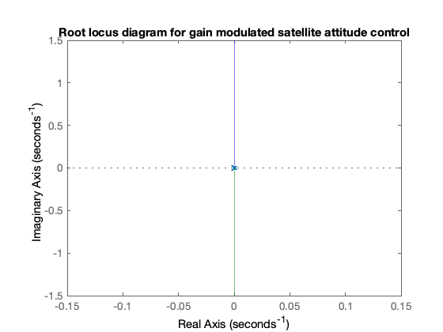
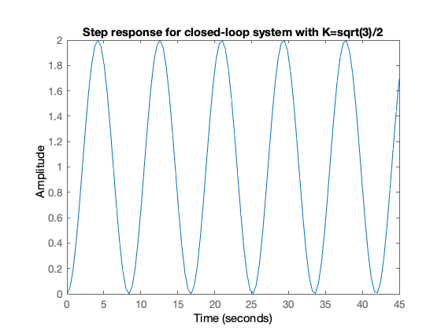
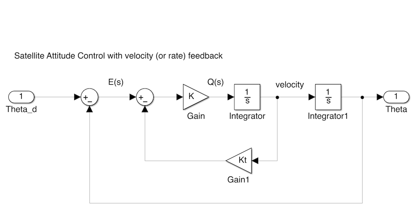
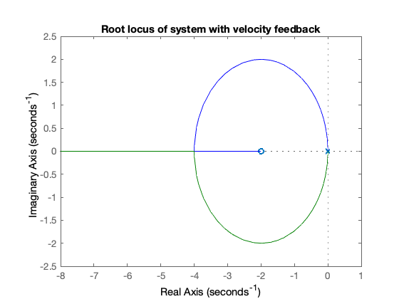
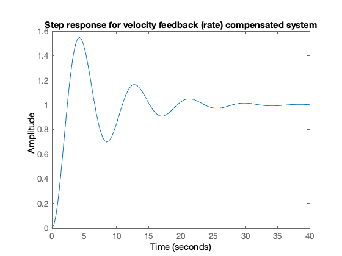

---
redirect_from:
  - "/03/2/velfb"
interact_link: content/03/2/velfb.ipynb
title: 'Introduction to Root Locus Design'
prev_page:
  url: /03/1/intro
  title: 'Introducing phase-lead compensation'
next_page:
  url: /03/3/pplusd
  title: 'Proportional plus derivative compensation'
comment: "***PROGRAMMATICALLY GENERATED, DO NOT EDIT. SEE ORIGINAL FILES IN /content***"
---

**Lecturer**

Set up MATLAB


{:.input_area}
```matlab
cd matlab
pwd
clear all
format compact
```


{:.output_stream}
```
ans =
    '/Users/eechris/dev/eglm03-textbook/content/03/2/matlab'

```

# Introduction to Root Locus Design

In this section we will engage in a short exploration of compensator design in the time domain with a look at root-locus design of a velocity-feedback compensator for a simple "double integrator" system. This serves as an introduction to the topic of phase lead compensation which is used to improve transient performance and relative stability.

## Gain compensation

First design example (Satellite Attitude Control). The system may be represented 
in block diagram form as shown in Figure 1. (Simulink model: [satellite.slx](matlab/satellite.slx))


**Figure 1 Satellite control with gain modulated torque**

For this system the plant transfer function is 

$$G(s) = \frac{1}{s^2}$$
 
Feedback: 
 
$$H(s) = 1$$

Controller: 
 
$$D(s) = K$$
 
The root locus equation is:
 
$$1 + KG(s)H(s) = 0$$
 
with root locus parameter = $K$.
 

Defining the problem in Matlab


{:.input_area}
```matlab
G = tf(1,conv([1,0],[1,0]));
H = tf(1,1);
Go = G*H
```


{:.output_stream}
```

Go =
 
   1
  ---
  s^2
 
Continuous-time transfer function.


```

*Note*: The root locus gain $K$ is implied in Matlab (it does not need to be defined)


{:.input_area}
```matlab
rlocus(Go),title('Root locus diagram for gain modulated satellite attitude control')
```





Pick off an arbitrary gain


{:.input_area}
```matlab
[K]=rlocfind(Go,3/4j)
```


{:.output_stream}
```
K =
    0.5625

```

Closed-loop transfer function


{:.input_area}
```matlab
Gc = feedback(K*G,H)
```


{:.output_stream}
```

Gc =
 
     0.5625
  ------------
  s^2 + 0.5625
 
Continuous-time transfer function.


```

$$G_c(s) = \frac{0.5625}{s^s + 0.5625}$$


{:.input_area}
```matlab
step(Gc,45),title('Step response for closed-loop system with K=sqrt(3)/2')
```





## With velocity feedback,

The block diagram becomes that shown in Figure 2 (Simulink model: [velfb.slx](matlab/velfb.slx)). 

The root locus equation is

$$1 + \frac{KK_T(s + 1/K_T)}{s^2} = 0$$

where $KK_T$ is the root locus gain.

 

 
**Figure 2 System with velocity feedback**


{:.input_area}
```matlab
Kt = 0.5;
Go2=tf(Kt*[1, 1/Kt],[1,0,0]);
rlocus(Go2),title('Root locus of system with velocity feedback')
```





## Closed-loop step response
 
$$G_o(s)=\frac{1}{s}\times \frac{K/s}{1 + (KK_T)/s}$$
 
$$G_o(s)= \frac{K}{s(s + KK_T)}$$
 
$$G_c(s) = \frac{K}{s^2 + KK_T s + K}$$


{:.input_area}
```matlab
Integrator=tf(1,[1,0]);
G1=feedback(K*Integrator,Kt)*Integrator;
Gc2=feedback(G1,1)
```


{:.output_stream}
```

Gc2 =
 
          0.5625
  -----------------------
  s^2 + 0.2812 s + 0.5625
 
Continuous-time transfer function.


```


{:.input_area}
```matlab
step(Gc2),title('Step response for velocity feedback (rate) compensated system')
```





## Resources

An executable version of this document is available to download as a MATLAB Live Script file [velfb.mlx](matlab/velfb.mlx).

The Simulink model of the satellite attitude control system is [satellite.slx](matlab/satellite.slx).

The system with velocity feedback control is available as [velfb.slx](matlab/velfb.slx).
