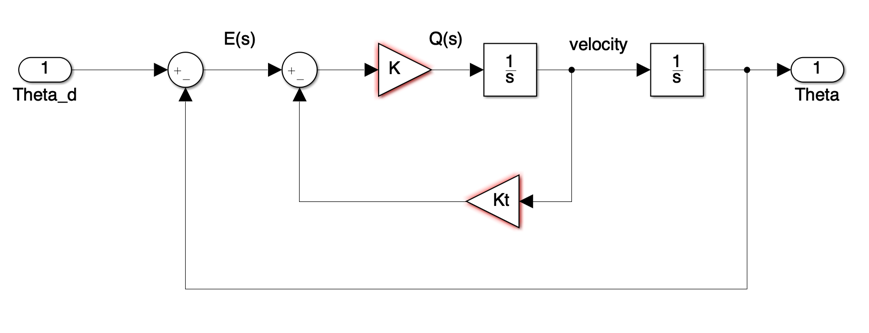
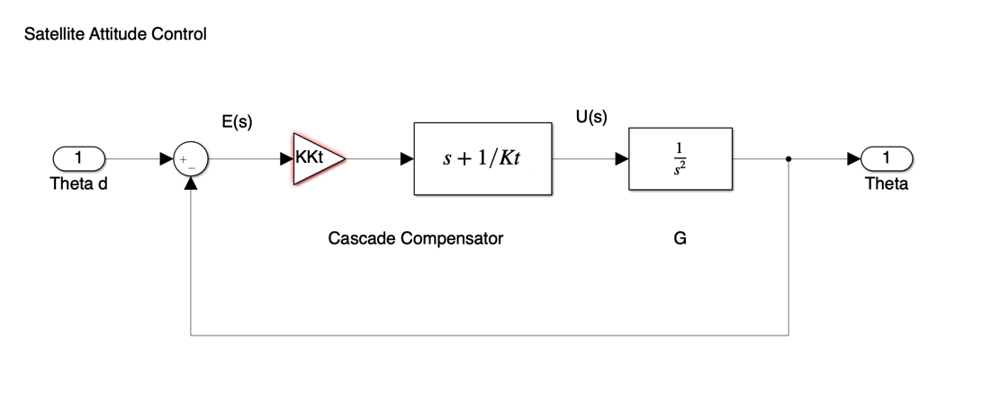
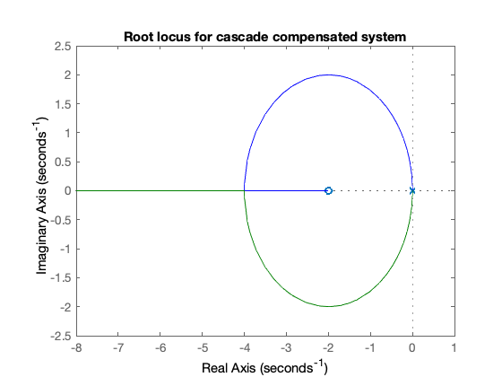
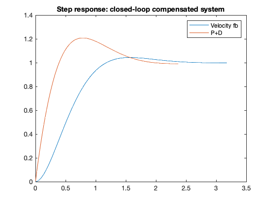

---
redirect_from:
  - "/03/3/pplusd"
interact_link: content/03/3/pplusd.ipynb
title: 'Proportional plus derivative compensation'
prev_page:
  url: /03/2/velfb
  title: 'Introduction to Root Locus Design'
next_page:
  url: /03/4/leadc
  title: 'Lead compensation'
comment: "***PROGRAMMATICALLY GENERATED, DO NOT EDIT. SEE ORIGINAL FILES IN /content***"
---

**Lecturer**

Set up MATLAB


{:.input_area}
```matlab
cd matlab
pwd
clear all
format compact
```


{:.output_stream}
```

ans =

    '/Users/eechris/dev/eglm03-textbook/content/03/3/matlab'


```

# Proportional Plus Derivative Compensation

## Introduction

First design example (Satellite Attitude Control). 

Plant:  $$G(s) = \frac{1}{s^2}$$

Feedback: 

$$H(s) = 1$$

With velocity feedback the system is as shown in Figure 1.


**Figure 1 Satellite Attitude Control with Velocity Feedback**

For this system, the root locus equation is

$$1+\frac{KK_T \left(s+\frac{1}{K_T }\right)}{s^2 }$$

and the design parameters where calculated to be


{:.input_area}
```matlab
Kt = 0.5; K = 8;
```


The closed-loop characteristic equation is


{:.input_area}
```matlab
clce1 = [1, K*Kt, K];
```


The closed-loop transfer function is then:


{:.input_area}
```matlab
Gc1 = tf(K,clce1)
```


{:.output_stream}
```

Gc1 =
 
        8
  -------------
  s^2 + 4 s + 8
 
Continuous-time transfer function.


```

In this document we illustrate how we may implement a silimilar control 
law using cascade compensation.

## Cascade compensator

An alternative compensation architecture is the cascade compensator illustrated in Figure 2.


**Figure 2 The cascade compensator**

The compensator is in series with the plant so that, in general, if the compensator transfer function is

$$D(s)=\frac{K_c(s+z_1)\ldots(s+z_r)}{(s+p_1)\ldots(s+p_q)}$$
	 
and the compensator poles and zeros are simply added to the poles and zeros of the plant. 

If we wish to achieve the same root-locus equation as the previous design (1) then the compensator must have transfer function 

$$D(s) = K_c(s + z_1)$$

where

$$K_c = K K_t = 4$$

$$z_1 = 1/K_t = 2$$
	 

Let us verify that this gives the same results as the previous example:


{:.input_area}
```matlab
z1 = -1/Kt;
Go = zpk(z1,[0, 0],1) % root locus gain initially set to unity
```


{:.output_stream}
```

Go =
 
  (s+2)
  -----
   s^2
 
Continuous-time zero/pole/gain model.


```


{:.input_area}
```matlab
rlocus(Go),title('Root locus for cascade compensated system')
```





Find the root locus gain at the point on the root locus where the poles are located at $s=-2+j2$.


{:.input_area}
```matlab
Kc = rlocfind(Go,-2+2j)
```


{:.output_stream}
```
Kc =
     4

```

Now add this to the compensator


{:.input_area}
```matlab
D = tf(Kc*[1 -z1],1)
```


{:.output_stream}
```

D =
 
  4 s + 8
 
Continuous-time transfer function.


```

$$D(s) = 4s + 8$$

Analysis of this compensator reveals that it is of a type known as "_proportional 
plus derivative_" (P+D). The output of the compensator is of the form

$$U(s) = K_DsE(s)+K_{\mathrm{prop}}E(s)$$

$$u(t) = K_d\frac{de(t)}{dt}+K_{\mathrm{prop}}e(t)$$

and is made up of a "proportion" of the error plus a proportion of the 
rate-of-change (or derivative) of the error. It is the derivative term that 
gives the dampening effect required to allow the frictionless system to come 
to rest.

## Closed-loop response

The closed-loop tranfer function is given by 

$$G_c(s) = \frac{D(s)G(s)}{1+D(s)G(s)}$$


{:.input_area}
```matlab
G=tf(1,[1,0,0])
```


{:.output_stream}
```

G =
 
   1
  ---
  s^2
 
Continuous-time transfer function.


```


{:.input_area}
```matlab
Gc2 = feedback(D*G,1)
```


{:.output_stream}
```

Gc2 =
 
     4 s + 8
  -------------
  s^2 + 4 s + 8
 
Continuous-time transfer function.


```

Let us plot and compare the step responses of the P+D and velocity feedback 
results.


{:.input_area}
```matlab
[y1,t1]=step(Gc1);
[y2,t2]=step(Gc2);
plot(t1,y1,t2,y2),...
 legend('Velocity fb','P+D'),...
 title('Step response: closed-loop compensated system')
```





## Notes

Notice that, although the settling time is about the same in both designs, 
the overshoot is considerably larger in the P+D compensated system. This is 
because the zero added by the P+D compensator appears in the numerator of the 
closed-loop transfer function. (refer back to Contact Hour 2 for an explanation).

## Resources

An executable version of this document is available to download as a MATLAB Live Script file [pplusd.mlx](matlab/pplusd.mlx).

The Simulink model of the satellite attitude control system with P+D compensation is [satellite.slx](matlab/pd.slx).
