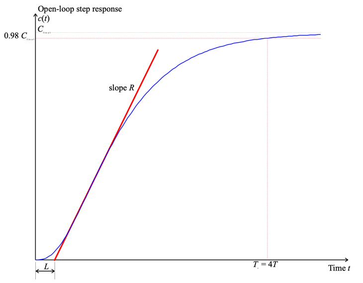

---
redirect_from:
  - "/04/1/zeigler"
interact_link: content/04/1/zeigler.ipynb
title: 'Zeigler-Nichols Tuning Algorithms'
prev_page:
  url: /04/0/intro
  title: 'Introduction to PID Compensation'
next_page:
  url: /04/2/tuning
  title: 'Manually Tuning a PID compensator'
comment: "***PROGRAMMATICALLY GENERATED, DO NOT EDIT. SEE ORIGINAL FILES IN /content***"
---

**Lecturer**

Set up MATLAB


{:.input_area}
```matlab
cd matlab
pwd
clear all
format compact
```


{:.output_stream}
```

ans =

    '/Users/eechris/dev/eglm03-textbook/content/04/1/matlab'


```

# Zeigler-Nichols Tuning Algorithms

Based on empirical observations of PID tuning strategies for process control, Zeigler and Nichols have proposed two methods of choosing the first-pass settings for PID compensators. The methods only need measured system responses and are generally applicable to type 0 systems of any order that are commonly found in process control applications (i.e. control of level, temperature, pressure, flow, etc.). 

## Step Response Method

Zeigler-Nichols' step response method will work on any system that has an 
open-loop step response that is an essentially critically or overdamped damped 
character like that shown in Figure 1.



**Figure 1: Open-loop step response for a typical process control system**

From this response it is necessary to determine only two parameters. 

* The slope $R$ of the tangent to the steepest part of the rising edge. 
* The "apparent dead-time" $L$ (which is the intersection of the tangent with the time axis).

Given that $a = RL$, the PID parameters are then tuned according to Table 1. 

**Table 1 Tuning parameters for Zeigler-Nichols' time response method**

| Type | $K_{\mathrm{prop}}$ | $T_I$ | $T_D$  |
|------|---------------------|-------|--------|
| P    | 1/*a*               |       
| PI   | 0.9/*a*             | 3*L*  |        |    
| PID  | 1.2/*a*             | 2*L*  | 0.5*L* |
  

Provided that the open-loop response is stable, it is possible to measure the apparent time constant $T$. For a second order system it can be shown that the settling time (to 98% of the final value) of an overdamped system is approximately $4T$. We thus take this as an approximation for any higher-order system that has the general shape indicated in Figure 1. Thus

$$T\approx \frac{T_s }{4}.$$                                      

Given the apparent time constant, Zeigler-Nichols' step response tuning 
method works reasonably well for

$$0.15\le \frac{L}{T}\le 0.6.$$                                .

Under these conditions, the choice of tuning parameters indicated in Table 1 would give a closed-loop system with good load-disturbance rejection properties. Zeigler-Nichols tuning methods, however, tend to produce systems whose transient response is rather oscillatory and so will need to be tuned further prior to putting the system into closed-loop operation.

## Ultimate sensitivity method

This tuning algorithm works for type 0 systems that have order > 2. It can also be adapted to work in auto-tuning implementations of PID compensators<sup>2</sup>. The tuning method relies on being able to find the gain at which the Nyquist response crosses the critical point or equivalently when the root locus crosses the imaginary axis. It can be found experimentally, but requires that the gain be increased in closed-loop operation until the response becomes a sustained oscillation. This may be a dangerous mode of operation in some process control applications! The gain at which the system becomes marginally stable is called $K_u$. The period of oscillation of this frequency is $T_u$. 

Once these two parameters are known, the PID parameters are selected according to Table 2. 

**Table 2 Tuning parameters for Zeigler-Nichols' ultimate sensitivity method**

| Type | $$K_{\mathrm{prop}}$$ | $$T_I$$     | $$T_D$$   |
|------|-----------------------|-------------|-----------|
| P    | 0.5 *K<sub>u</sub>* |
| PI   | 0.45 *K<sub>u</sub>*         | *T<sub>u</sub>*/1.2 |           |    
| PID  | 0.6 *K<sub>u</sub>*          | *T<sub>u</sub>*   | *T*<sub>u</sub>/8 | 

The static gain for the open-loop system is

$$K_p=\left.G(s)H(s)\right|_{s=0}$$            

The ultimate sensitivity tuning method works well if:

$$2<K_p\,K_u<20$$ 

but again, the closed-loop response tends to be somewhat under-damped.

## Examples

To illustrate the application of the Zeigler-Nichols tuning rules we take 
the plant:

$$\begin{equation}G(s)=\frac{6}{(s+1)(s+2)(s+3)}\end{equation}$$                          .                                 


{:.input_area}
```matlab
G = zpk([],[-1;-2;-3],6)
```


{:.output_stream}
```

G =
 
          6
  -----------------
  (s+1) (s+2) (s+3)
 
Continuous-time zero/pole/gain model.


```

The feedback:


{:.input_area}
```matlab
H=1; 
```


Loop transfer function:


{:.input_area}
```matlab
GH=G*H;
```


### Time response method
The open-loop step response of the system is


{:.input_area}
```matlab
step(GH)  
```


From this figure, we determine that settling time:


{:.input_area}
```matlab
Ts = 4.95; 
```


so


{:.input_area}
```matlab
T = Ts/4; 
```


The tangent seems to cross the time axis at 


{:.input_area}
```matlab
cmin = 0; tmin = 0.42; 
```


and the final value at


{:.input_area}
```matlab
cmax=1; tmax = 2.674;
```


Let us add this information to the step response:


{:.input_area}
```matlab
[c,t]=step(GH,6);
plot([tmin,tmax],[cmin,cmax],'r-'),axis([0,6,0,1]),hold on,...
plot([0,6],[0.98,0.98],'g--',[Ts,Ts],[0,0.98],'g--',[Ts],[0.98],'b*'),...
title('Zeigler-Nichols Step Response Method'),plot(t,c),hold off  
```


The slope of the tangent is


{:.input_area}
```matlab
R = (cmax-cmin)/(tmax-tmin)  
```


{:.output_stream}
```
R =
    0.4437

```

The parameter


{:.input_area}
```matlab
L = tmin;
L/T 
```


{:.output_stream}
```
ans =
    0.3394

```

is in the rquired range so


{:.input_area}
```matlab
a=R*L;   
```


and the PID parameters are


{:.input_area}
```matlab
Kprop = 1.2/a; Ti = 2*L; Td = 0.5*L;  
```


we construct the PID compensator


{:.input_area}
```matlab
Prop = tf(1,1);
Integ = tf(1,[Ti,0]);
Deriv = tf([Td,0],1);
PID1 = Kprop*(Prop + Integ + Deriv)  
```


{:.output_stream}
```

PID1 =
 
  1.136 s^2 + 5.41 s + 6.44
  -------------------------
           0.84 s
 
Continuous-time transfer function.


```


{:.input_area}
```matlab
PID1z = zpk(PID1) 
```


{:.output_stream}
```

PID1z =
 
  1.3524 (s+2.381)^2
  ------------------
          s
 
Continuous-time zero/pole/gain model.


```

Let us examine the root-locus. The closed-loop poles are:


{:.input_area}
```matlab
Gc1 = feedback(PID1*G,H);
[poles,zeros,gain]=zpkdata(Gc1,'v');  
```


So the root-locus (with closed-loop poles superimposed)


{:.input_area}
```matlab
rlocus(PID1*GH),hold on,plot(poles,'*'),...
    title('Zeigler Nichols: Root Locus for Step Response Method'),hold off  
```


and the step response


{:.input_area}
```matlab
step(Gc1),title('Zeigler Nichols: Step Response for Step Response Method')  
```


### Ultimate sensitivity method

The open-loop transfer response of the system is $KG(s)H(s)$. We use the Routh-Hurwitz 
criterion for determine the "ultimate" gain _Ku_.

The closed-loop transfer function is:

$$\begin{equation}G_c(s)=\frac{6K}{s^3+6s^2+11s+6(1+K)}.\end{equation}$$     .                            

So the closed-loop characteristic equation is:

$$\begin{equation}s^3+6s^2+11s+6(1+K)=0.\end{equation}$$

The routh array is

$$\begin{array}{*{20}{c}}  
\mathrm{Order}&| & {}&{} \\
\hline  
s^3 &| & 1&{11} \\   
s^2 &| & 6&{6(1 + K)} \\
s^1 &| & {10 - K}&{} \\
s^0 &| & {6(1 + K)}&{} 
\end{array}$$

So the ultimate gain  $K_u=10$.  

When $K = K_u$ the $s_1$ row is zero and the previous row represents a 
factor of the characteristic equation. Hence

$$ 6{s^2} + 6(1 + K) = 0 \\
6{s^2} + 66 = 0 \\
{s^2} =  - 11 \\
s =  \pm j\sqrt {11}$$                             

The ultimate frequency and ultimate period:

$$\omega_u=\sqrt{11}$$                                       


{:.input_area}
```matlab
Ku = 10; Tu = 2*pi/sqrt(11);  
```


To check the validity of this design:


{:.input_area}
```matlab
Kp = dcgain(GH)
Kp*Ku  
```


{:.output_stream}
```
Kp =
     1
ans =
    10

```

... which is in the suggested range.

The PID parameters are


{:.input_area}
```matlab
Kprop = 0.6*Ku; Ti = Tu/2; Td = Tu/8;  
```


We again construct the PID compensator


{:.input_area}
```matlab
Prop = tf(1,1);
Integ = tf(1,[Ti,0]);
Deriv = tf([Td,0],1);
PID2 = Kprop*(Prop + Integ + Deriv)  
PID2z = zpk(PID2)  
```


{:.output_stream}
```

PID2 =
 
  1.346 s^2 + 5.683 s + 6
  -----------------------
         0.9472 s
 
Continuous-time transfer function.


PID2z =
 
  1.4208 (s+2.111)^2
  ------------------
          s
 
Continuous-time zero/pole/gain model.


```

Let us examine the root-locus. The closed-loop poles are:


{:.input_area}
```matlab
Gc2 = feedback(PID2*G,H);
[poles,zeros,gain]=zpkdata(Gc2,'v');  
```


So the root-locus (with closed-loop poles superimposed)


{:.input_area}
```matlab
rlocus(PID2*GH),hold on,...
    plot(poles,'*'),...
    title('Zeigler Nichols: Root Locus for Ultimate Sensitivity Method'),hold off  
```


and the step response


{:.input_area}
```matlab
step(Gc2),title('Zeigler Nichols: Step Response for Ultimate Sensitivity Method')  
```


## Discussion

Comparison of the two designs:


{:.input_area}
```matlab
[y1,t1]=step(Gc1,10);
[y2,t2]=step(Gc2,10);
plot(t1,y1,t2,y2),legend('Step response','Ultimate sens.'),...
    title('Comparison of results')  
```


There is actually very little difference in these two responses. We might choose the result of the ultimate sensitivity as it has a slightly lower peak overshoot. However, it is likely that we can do much better by taking these results as a staring point. 

## Footnotes

[1] Integral action is hardly ever added to systems of type 1 or greater. The additional pole at the origin is usually extremely destabilising.

[2] An auto-tuner is a PID compensator that can choose its own parameters. It is naturally a digital device and consists of a microcontroller with some built-in tuning algorithms. Such devices are available commercially.

## Resources

An executable version of this document is available to download as a MATLAB Live Script file [zeigler.mlx](matlab/zeigler.mlx).
