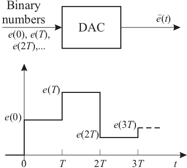
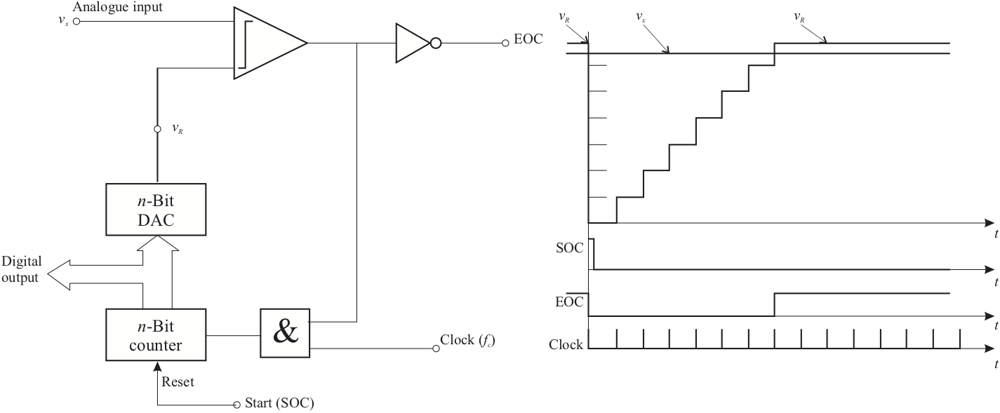
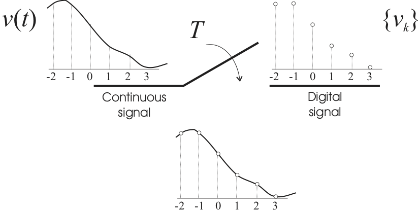

---
redirect_from:
  - "/06/1/digi-intro"
interact_link: content/06/1/digi_intro.ipynb
title: 'Introduction to Digital Systems'
prev_page:
  url: /06/digital
  title: 'Digital Control Systems'
next_page:
  url: /06/2/dsm
  title: 'Digital System Models and System Response'
comment: "***PROGRAMMATICALLY GENERATED, DO NOT EDIT. SEE ORIGINAL FILES IN /content***"
---

# Introduction to Digital Systems

* Digital systems are important in modern technology because they are used extensively to implement designs that previously used analogue (continuous) technology.
* The concepts developed for continuous systems are all applicable to digital systems.
* This introduction commences with *digital signals*, continues with *digital systems*, and ends with an overview of how analogue systems may be converted to digital systems.

## Analogue v Digital

The real world we inhabit is analogue. We process analogue signals: e.g. vision and sound. Physical systems are analogue systems of force, velocity, current, voltage, temperature pressure, etc.

Advances in electronics means that more and more of the storage, distribution and processing of signals is actually done using digital technology.

There have to be methods of converting analogue to digital (e.g. recording of sound) and digital to analogue (e.g. signals delivered by loudspeakers).

We need to be able to model the signals, their conversion and the systems that process them.

## Samplers and Discrete-Time Physical Systems

As hinted in the introduction, we need to convert analogue signals to digital signals before the digital signal can be stored, distributed and manipulated by a digital system. At the point of delivery, we need to convert the signal back into digital form. In this section we introduce the signal conversion devices and give an example of one
commonly seen digital system.

### Analogue to Digital Converter

We begin by describing the *digital to analogue converter* (D/A or DAC),
since this device is usually also a component of the *analogue to
digital compensator* (A/D or ADC). We assume that the DAC receives a
digital signal, in the form of a binary number, every $T$ seconds
(usually from a digital computer, micro-controller or a digital signal
processor). The DAC converts the binary number to a constant voltage
equal to the value of that number, and outputs this voltage until the
next number arrives and the DAC input. The block diagram of the DAC and
a typical response is shown in Figure 1.

#### Digital to Analogue Converter (D/A or DAC)

**Figure 1**

We next describe a comparator, which is also a component of the ADC. A
comparator and its characteristics are illustrated in Figure 2. The input
voltage $v_i(t)$ is compared with the reference voltage $v_r(t)$. If
$v_i(t) > v_r(t)$ the comparator outputs logic "1"; for example logic 1
is 5V for TTL logic. If $v_i(t) < v_r(t)$ the comparator outputs logic
"0"; which is less than 1V for TTL logic. The signal ground is normally
omitted from circuit diagrams, but all voltages are compared relative to
signal ground.

#### Comparator

**Figure 2**

Several circuits are used to implement an analogue to digital converter.
Each circuit has different characteristics. We illustrate the up-counter
ADC shown in Figure 3. The $n$-bit counter is reset to zero when the
start-of-conversion (SOC) signal is received by the device. The count
increases by 1 with the arrival of each clock pulse. The $n$-bit DAC
converts the binary equivalent of the count to a voltage $v_R$.

#### The Counter ADC

**Figure 3**

The analogue voltage $v_x$ to be converted is compared to $V_R$. When
$V_R$ becomes greater than $v_x$, the comparator outputs a logic 0,
which halts the clock input through the AND gate. The end-of-conversion
(EOC) pulse then signals that the digital equivalent to $v_x$ is ready.
The counter output can then be read from the digital output as a binary
number which is approximately equal to the analogue input.

## Digital Systems

Once we have the ability to convert analogue signals into binary numbers
and back, we have the ability to process the information using computers
and other digital devices. A once familiar device will be the compact disk
(CD) player.

### Compact Disk (Analogue to Digital)

Continuous time signal is filtered with an "anti-aliasing" band-pass filter with bandwidth of 5 to 20,000 Hz.

Filtered audio signal sampled using ADC at 44,100 samples per second and with 14-16 bits precision.

Each sample is stored, along with error correcting bits, as a stream of binary codes.

The codes are recorded using microscopic pits etched into the surface of the CD.

### Compact Disk (Digital to Analogue)

For stereo music, two channels are sampled and stored.

Data is stored on a continuous track that spirals outwards from the centre.

Data is read at a constant rate (44,100 Hz) and is processed (e.g. error corrected and buffered for tilt control) before being converted, using DAC, to a signal that can be delivered to a loudspeaker.

Velocity of disk needs to be controlled so that it decreases as the radius of the track increases. Position and the focus of the laser used to read the data is also controlled.

Audio CD holds approx. 540 MBytes of data which is enough to store 74 minutes of stereo music.

## Generation of Digital Signals

Digital signals do not occur naturally. They are generated by sampling
continuous signals, or by digitally processing other digital signals.
Sampling is accomplished by a sampler known as an "*Analogue to Digital
Converter (ADC)*".

### Sampling and Sequences

Sampling - mathematical model of the ADC

Sampled signals are modelled as sequences

Sequences can be shifted backwards (*advanced*) and forwards (*delayed*)

The advance and delay operators are analogies to the derivative and integral operators

#### Sampling – Mathematical model of the ADC

**Figure 4**

The analogue to digital converter is modelled as a switch as shown in
Figure 4.

Quantisation, introduced by converting an analogue signal to a binary number with a finite number of bits, will not be considered.

#### Modelling Sampling: Sequences

At each sampling instant the switch is closed for an infinitesimal time,
during which the digital signal has the same value as the continuous
signal. 

The digital signal is therefore a "*Sequence*"
$$\ldots\ v_{-2}\ v_{-1}\ v_{0}\
v_{1}\ v_{2}\ \ldots$$ 

which will be denoted by $$\left\{v_k\right\}$$

At each sampling instant the switch is closed for an infinitesimal time,
during which the digital signal has the same value as the continuous
signal. The digital signal is therefore a "*Sequence*"
$$\ldots\ v_{-2}\ v_{-1}\ v_{0}\
v_{1}\ v_{2}\ \ldots$$ which will be denoted by $$\left\{v_k\right\}$$

#### Modelling sampling: Regular Sampling

Only regular sampling will be considered. A constant period $T$ s
between sampling instants is equivalent to a sampling frequency
$\omega_s$ rad s$^{-1}$, where $$T = \frac{2\pi}{\omega_s}.$$

Sampling is assumed to be synchronized to the time origin $t=0$ so that
$$v_k = v(kT)\ \forall \ k.$$

#### Sampling: The Signals

**Figure 5**

#### Sampling: Indexing the sequence

The index $k$ denotes the current value. Digital signals will be taken
as zero prior to the time origin, in the same way as continuous signals:
$$v_k = v(kT) = 0\ \mathrm{for}\ k<0.$$

Except in cases where it is necessary to distinguish between them, both
the continuous signal $v(t)$ and the digital signal $\left\{v_k\right\}$
will be denoted by $v$.

## Shifting Digital Signals

Shifting digital signals is the mechanism by which dynamic behaviour is introduced into digital systems. 

The shifting operators are comparable to differentiating and integrating continuous signals.

### Forward Shifting a Digital Signal

The first forward shift of a digital signal $v$ is generated by
    applying the "*Advance Operator*" $\triangle$ to give the advanced
    digital signal $\triangle v$, where $$\triangle v = \triangle
      \{v_k\} = \{\triangle v_k\} = \{v_{k+1}\}.$$

The signal $v$ is advanced by one value (a time advance of $T$).
    $v_0$ vanishes because $\triangle v$ is zero prior to $t=0$.

Repeated operation gives the $r$-th forward shift
    $$\triangle^r v = \{v_{k+r}\}.$$

### Advance and Derivative Operator

The advance operator $\triangle$ is equivalent to the derivative
    operator $d/dt$.

Neither the advance operator $\triangle$ nor the derivative $d/dt$
    is physically realistic.

$\triangle$ is not realistic because the current value of
    $\triangle v$, which is $\triangle v_k$, is the *future* value of
    $v_{k+1}$ of the signal $v$.

The Advance operator $\triangle$ for digital signals is equivalent to
the differential operator $d/dt$ for continuous signals. The first
forward shift $\triangle v$ $\equiv$ first derivative $dv/dt$. The
$r$-th forward shift $\triangle^r$ $\equiv$ $r$-th derivative
$d^rv/dt^r$. Neither the $\triangle$ operator nor the $d/dt$ operator
are physically realistic.

### Backward Shifting a Digital Signal

The first backward shift of a digital signal $v$ is generated by
    applying the "*Delay Operator*" $\nabla$ to give the delayed digital
    signal $\nabla v$, where $$\nabla v = \nabla
      \{v_k\} = \{\nabla v_k\} = \{v_{k-1}\}.$$

The signal $v$ is delayed by one value (a time delay of $T$).

Repeated operation gives the $r$-th backward shift
    $$\nabla^r v = \{v_{k-r}\}.$$

The delay operator $\nabla$ is equivalent to the integral operator
    $\int$.

The delay operator $\nabla$ is not only physically realistic but can
    be implemented easily by storage and retrieval in a digital
    computer.

The delay operator $\nabla$ for digital signals is equivalent to the
integral operator $\int dt$ for continuous signals. The first backward
shift $\nabla v$ $\equiv$ first integral $\int v dt$. The $r$-th
backward shift $\nabla^r$ $\equiv$ $r$-th integral $\int \int \cdots
\int v dt$. Both the $\nabla$ operator and the $d/dt$ operator are
physically realistic.

### Mathematical and Computer Models

*Advance operators* (like differential operators) are best suited to
    mathematical models.

*Delay operators* (like integral models) are best suited to computer
    models.

#### Block Diagram Model

In a *Digital Operational Block Diagram* the fundamental dynamic
operation is denoted by the *delay* operator

## Definition of the z Transformation

The $z$ transformation has the same role in digital systems that the
    Laplace transform has in continuous systems.

The $z$ transformation of a digital signal $v$ is defined as $$V =
     V(z) = \mathcal{Z} v = \mathcal{Z} \{ v_{k} \}=\sum_{k=0}^{\infty}
     v_k z^{-k}.$$

Similarly, $v$ is the *inverse $z$ transform* of $V$, or
    $$\mathcal{Z}^{-1} V.$$

### z Transform is a summed series

Obtaining $z$ transforms involves summing series. 

Often this is a *binomial* series $$(1+x)^r = 1 + rx + \frac{r(r-1)}{2}x^2 +
    \cdots + \frac{r(r-1)\cdots(r-n+1)}{n!}x^n + \cdots$$

The transform pairs for common functions are put into tables so that
    it is not necessary to sum a series in most cases.

### Example 1: What is the z Transform of the Unit Impulse $\delta(t)$?

If $v$ is the digital sequence $\{\delta_k\}$, that is
    $$1\ 0\ 0\ 0\ 0\ \ldots$$

$z$ transform is
    $$\sum_{k=0}^{\infty} 1\times z^{-k} = 1 + 0\times z^{-1} + 0\times z^{-2}+\cdots$$

Thus $\mathcal{Z}(\delta(t)) = 1$.

### Example 2: What is the z Transform of the Unit Step $\epsilon(t)$?

If $v$ is the digital sequence $\{\epsilon_k\}$, that is
    $$1\ 1\ 1\ 1\ 1\ \ldots$$

$z$ transform is
    $$\sum_{k=0}^{\infty} 1\times z^{-k} = 1 + z^{-1} + z^{-2}+\cdots$$

This is summed as a binomial series as
    $$(1-z^{-1})^{-1} = \frac{1}{1-z^{-1}} =
    \frac{z}{z-1}.$$

### Example 3: z Transform of a Power Series

Another example which is commonly found is the digital signal $v$ given
by $\{v_k\} = \{\alpha^k\}$. What is the $z$-transform of this signal?

$\{v_k\} = \{\alpha^k\}$

The $z$ transform is
    $$\sum_{k=0}^{\infty} \alpha^{k} z^{-k} = 1 + \alpha z^{-1} + \alpha^2
    z^{-2}+\cdots$$

$\ldots$ which is summed as a binomial series as
    $$(1-\alpha z^{-1})^{-1} = \frac{1}{1-\alpha
      z^{-1}} = \frac{z}{z-\alpha}.$$

### Example 4: z Transform of a Continuous Signal

If the digital signal $v$ is generated by sampling the continuous
    signal $v(t)$, then the transform $V$ also has a correspondence with
    $v(t)$.

For example, if $$v(t) = e^{-at}$$ 

then $$v_k = v(kT)
    = e^{-akT} = (e^{-aT})^k.$$

$\ldots$ So, from the previous result, with $\alpha=e^{-aT}$, we
    have the $z$ transform as
    $$\frac{1}{1-e^{-aT}z^{-1}}=\frac{z}{z-e^{-aT}}.$$

## z Transforms of the Shift Operators

### z Transform of the Forward Shift

This is similar to the derivative property of the Laplace transform.

$$\mathcal{Z}\triangle v = z V(z) - zv_0$$ 

It also introduces the
    initial member $v_0$.

We can also show that
    $$\mathcal{Z}\triangle^2 v = z^2 V(z) - z^2 v_0 - z v_1$$

and in general
    $$\mathcal{Z}\triangle^r v = z^r V(z) - \sum_{i=0}^{r-1} v_i z^{r-i}.$$

### Example 5: Proof of z Transform of Forward Shift

Prove that the $z$
Transform of the Forward Shift:
$$\mathcal{Z}\triangle v = z V(z) - zv_0$$

To prove the relationship illustrated in we note that
$$\triangle v = v_1\ v_2\ v_3\ \ldots\ v_{k+1}\ldots$$ so that
$$\begin{eqnarray*}
  \mathcal{Z}\triangle v & = &  v_1 z^0 + v_2 z^{-1} + v_3 z^{-3} + \cdots
  + v_{k+1}z^{-k}+\cdots \\
& = & z(v_0 + v_1 z^{-1} + v_2 z^{-2} + \cdots
  + v_{k+1}z^-{k+1}+\cdots)-zv_0\\
&=& zV(z) - zv_0.\end{eqnarray*}$$ 

Similar arguments may be used to prove
the other relationships shown in the previous slide.

### z Transform for the Backward Shift

This is similar to the integral property of the Laplace transform.

$$\mathcal{Z}\nabla v = z^{-1} V(z)$$
    

The proof is similar to the Forward shift case and is left as an exercise.

## The Inverse z Transformation

The inverse $z$ transform of $V$ is $\mathcal{Z}^{-1} V = v$, where $v$ is a digital signal, that is a sequence.

This contrasts with the inverse Laplace transformation, which gives functions of time.

As the definition of the transform involves $z^{-1}$, through
    $$V=\sum_{k=0}^{\infty} v_k z^{-k},$$ it is often useful to commence
    the inversion if $V(z)$ by expressing it as a function of $z^{-1}$
    rather than of $z$.

### Methods of obtaining the inverse z Transform

There are several methods for obtaining inverse $z$ transforms.

They generally involve expressing $V$ as a series involving powers
    of $z^{-1}$, from which the coefficients give the sequence $\{v_k\}$
    that is $v$.

Alternatively, a partial fraction expansion is used to obtain terms
    from which the inverse transforms may be looked-up from tables.

### Example 6

Use the direct and indirect methods to determine the inverse $z$
transform of $$V=\frac{4z^3 - 16z}{z^3 - z^2 -
  0.25 z + 0.25}.$$

#### Direct Method (polynomial division)

This involves expressing $V$ as a function of $z^{-1}$, and dividing the
numerator polynomial by the denominator polynomial.

First express $V$ as a function of $z^{-1}$ by multiplying numerator and
denominator by $z^{-3}$.

$$V = \frac{4-16z^{-2}}{1-z^{-1}-0.25 z^{-2} + 0.25 z^{-3}}$$ 

Then divide 
$$\begin{array}{rrrrrrr}
   & +4 & +4z^{-1} & -11z^{-2} & -11z^{-3} & +\cdots  \mathrm{etc}& \\ \hline
  1-z^{-1}-0.25
z^{-2} + 0.25 z^{-3} &  |\ +4 & . & -16z^{-2} &  & &
\\
   & +4 & -4z^{-1} & -z^{-2} & +z^{-3} &  &  \\ \hline
   &  &   +4z^{-1} & -15z^{-2} & -z^{-3} &  &  \\
   &  &   +4z^{-1} & - 4z^{-2} & -z^{-3} & +z^{-4} &  \\
   \hline
   &  &           & -11z^{-2} & .         &    -z^{-4} &  \\
   &  &           & -11z^{-2} & +11z^{-3} & +2.75z^{-4} & -2.75z^{-5}
   \\\hline
  &   &           &           & -11z^{-3} & -3.75z^{-4} &
  +2.75z^{-5} \\
    &   &           &           & \cdots & \cdots &
  \cdots \\
\end{array}$$

So $$V = 4 + 4z^{-1} -11 z^{-2} -11z^{-3} + \cdots\
\mathrm{etc}$$ $$v = \begin{array}{ccccccc}
  4 & 4 & -11 & -11 & \cdots & \cdots & \mathrm{etc}.
\end{array}$$

#### Indirect Method (partial fraction expansion)

This also involves expressing $V$ as a function of $z^{-1}$, but now the
denominator is factorized and a partial fraction is obtained.

So $$\begin{aligned}
 V  &=  \frac{4-16z^{-2}}{1-z^{-1}-0.25 z^{-2} +
0.25 z^{-3}}\\ &= \frac{16-64z^{-2}}{4-4z^{-1}-z^{-2} + z^{-3}}\\
&= \frac{16(1-2z^{-1})(1+2z^{-1})}{(2-z^{-1})(2+z^{-1})(1-z^{-1})}\\
&= \frac{\frac{16\times -3\times 5}{4\times -1}}{2-z^{-1}} +
\frac{\frac{16\times 5\times -3}{4\times 3}}{2+z^{-1}} +
\frac{\frac{16\times -1 \times 3}{1\times 3}}{1-z^{-1}}
\\ &=\frac{60}{2-z^{-1}} -
\frac{20}{2+z^{-1}} - \frac{16}{1-z^{-1}}
\\&=\frac{30}{1-{1/2}z^{-1}} -
\frac{10}{1+{1/2}z^{-1}} - \frac{16}{1-z^{-1}}
\\
&= 30\frac{z}{z-{1/2}} - 10\frac{z}{z+{1/2}} - 16\frac{z}{z-1}.\end{aligned}$$
Inverse transforming each term from tables gives $$\begin{aligned}
v&=30\{(1/2)^k\}-10\{(-1/2)^k\} -16 \{\epsilon_k\}\\
&= \begin{array}{ccccccc}
  4 & 4 & -11 & -11 & \cdots & \cdots & -16
\end{array}.\end{aligned}$$

The direct method of polynomial division is useful for obtaining the
first few members of a sequence, and the indirect method of partial
fraction expansion is useful for obtaining a closed-form representation
of the sequence (if one exists).

Two further properties of the $z$ transform are useful
for finding the initial and final values of a sequence.

## Initial and Final Values of a Sequence

*Initial Value Property* $$v_0 = \lim_{z\rightarrow
      \infty}V(z).$$

*Final Value Property*
    $$\lim_{k\rightarrow \infty}v_k = \lim_{z\rightarrow
          1}\frac{z-1}{z}V(z).$$

### Example 7

Determine the initial and final values of the response of the system
given in Example 6.

In the example, the initial value is $$\lim_{z\rightarrow
  \infty}\frac{4z^3-16z}{z^3-z^2-0.25z+0.25} = 4.$$ The final value is
$$\begin{aligned}
  \lim_{k\rightarrow \infty}v_k =& \lim_{z\rightarrow
      1}\frac{z-1}{z}\ \frac{4z^3-16z}{z^3-z^2-0.25z+0.25}\\
 =& \lim_{z\rightarrow
      1}\frac{z-1}{z}\ \frac{(4)(z)(z-2)(z+2)}{(z-1)(z-0.5)(z+0.5)}\\
=& \frac{4\times -1 \times 3}{0.5\times 1.5} = -16.\end{aligned}$$
