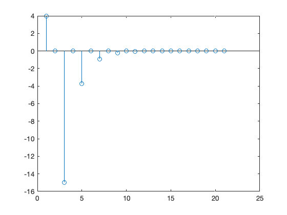
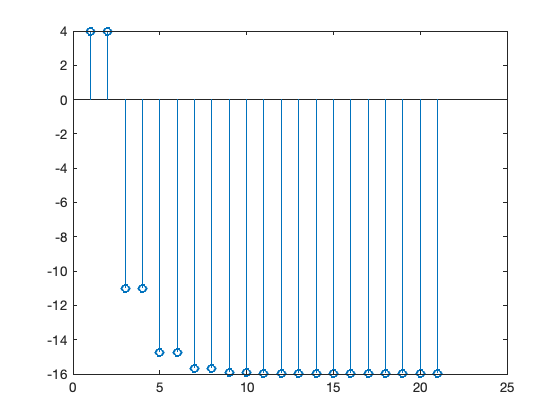
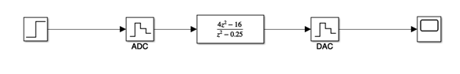
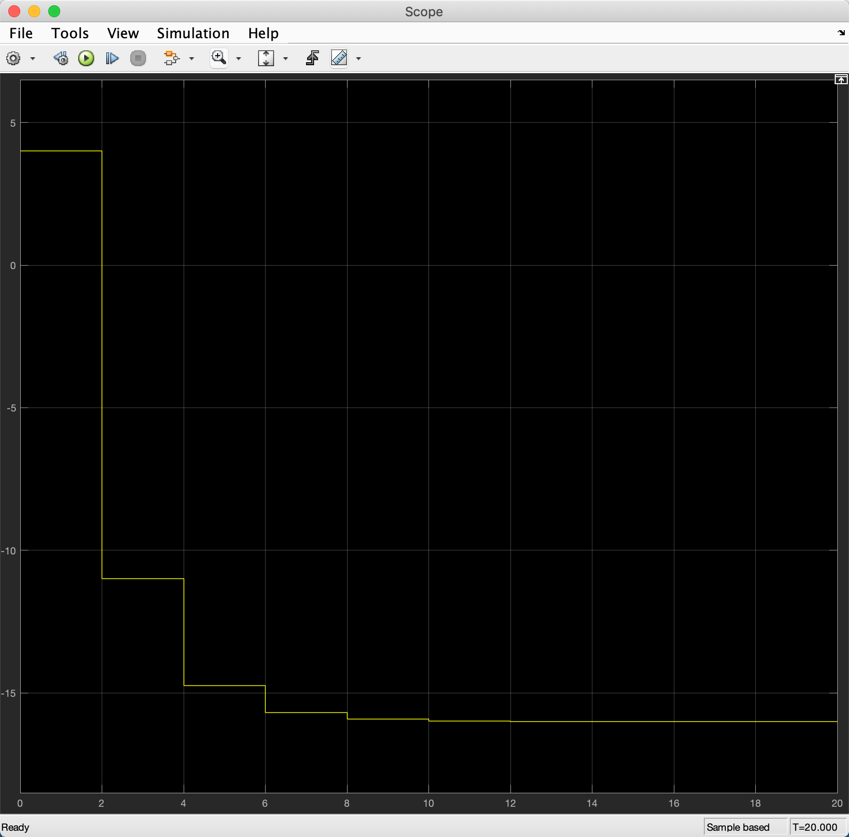

---
redirect_from:
  - "/06/2/dsm"
interact_link: content/06/2/dsm.ipynb
title: 'Digital System Models and System Response'
prev_page:
  url: /06/1/digi_intro
  title: 'Introduction to Digital Systems'
next_page:
  url: /06/3/cse
  title: 'Continuous Systems Equivalence'
comment: "***PROGRAMMATICALLY GENERATED, DO NOT EDIT. SEE ORIGINAL FILES IN /content***"
---

# Digital System Models and System Response

## Digital System Models

The equivalent of the differential equation model for continuous systems is the difference
equation for digital systems.

Replacing the differential operator $\frac{d}{dt}$ by the advance
operator $\triangle$ gives the general form of the difference equation
as 

$$\begin{equation}
  \triangle^ny + a_{1}\triangle^{n-1}y + \ldots +  a_n y = b_0
  \triangle^n u + b_{1}\triangle^{n-1} u + \ldots + b_n u.\end{equation}$$

The equivalent of the differential equation model for continuous systems
is the difference equation for digital systems.

### Difference equation

Now, given the definition of the advance operator derived in a previous lecture

$$\triangle^n v_k = v_{k+n}$$

we can re-write equation (1) as
the *difference equation* 

$$\begin{equation}
  y_{k+n} + a_{1}y_{k+n-1} + \ldots + a_n y_k = b_0
   u_{k+n} + b_{1} u_{k+n-1} + \ldots +  b_n u_k.\end{equation}$$

### Difference equation in terms of the delay operator

Unlike the differential equation, however, which is hardly ever expressed in an integral form, the difference equation is more usually expressed in terms of the delay operator $\nabla$. 

Applying the operator $\nabla^n$ to equation (1)
gives $$\begin{eqnarray}
y + a_{1}\nabla y + \ldots  + a_n \nabla^n y &=& b_0 u +
b_{1}\nabla u + \ldots +  b_n\nabla^n u\\
  y_{k} + a_{1}y_{k-1} + \ldots +  a_n y_{k-n}
   &=& b_0
   u_{k} + b_{1} u_{k-1} + \ldots + b_n u_{k-n}.
   \end{eqnarray}$$

### z-transform of difference equation

Applying the $z$ transform directly to the difference equation with the delay operator
(3) gives 

$$\begin{eqnarray}
 Y + a_{1}z^{-1} Y + \ldots + a_n z^{-n} Y
&=& b_0 U + b_{1}z^{-1} U + \ldots + b_n z^{-n} U\nonumber\\ 
(1 + a_{1}z^{-1} + \ldots +  a_n z^{-n}) Y &=& (b_0 + b_{1}z^{-1} +
\ldots + b_n z^{-n}) U
   \end{eqnarray}$$

### z Transfer Function

Given that $$(1 +
a_{1}z^{-1} + \ldots +  a_n z^{-n}) Y(z) = (b_0 + b_1 z^{-1} +
\ldots + b_n z^{-n}) U(z)$$ 

The $z$ transfer function is
$$H(z) = \frac{Y(z)}{U(z)}=\frac{b_0 + b_{1}z^{-1} + \ldots + b_n
z^{-n}}{1 + a_1z^{-1} + \ldots + a_n z^{-n}}$$

A digital system in this general form is known as a "*pole-zero,
infinite impulse response, recursive auto-regressive moving average
digital filter(!)*"

### z Transfer Function (2)

If $b_1 = b_2 = \cdots = b_n = 0$ then the transfer function is
$$H(z) = \frac{b_0}{1 + a_1z^{-1} + \ldots + a_n z^{-n}}$$

A digital system in this form is known as an "*all pole, infinite
impulse response, recursive auto-regressive digital filter.*"

### z Transfer Function (3)

When $a_1 = a_2 = \cdots = a_n = 0$ then the transfer function is
$$H(z) = b_0 + b_{1}z^{-1} + \ldots + b_n
z^{-n}$$

A digital system in this form is known as an "*all zero, finite impulse
response, non recursive moving average digital filter.*"

### Other forms of digital transfer function

The transfer function can also be expressed in the zero-pole-gain form

$$H(z) = \frac{k(z-z_1)(z-z_2)\cdots(z-z_n)}{(z-p_1)(z-p_2)\cdots(z-p_n)}$$

and the partial fraction form

$$H(z) = \frac{r_1}{z-p_1}+\frac{r_2}{z-p_2}\cdots\frac{r_n}{z-p_n}$$

### Canonical Forms

With the transfer function written as
    $$H(z) = \frac{b_0 z^n + b_{n-1} z^{n-1} + \cdots + b_1 z + b_n}{z^n + a_1 z^{n-1} + \cdots + a_{n-1} z + b_n}$$
    there is a direct analogy with the general form of the continuous
    system transfer function with $s$ instead of $z$.

This was implemented with the physically realistic integral operator
    $\int
    dt$ for which the digital equivalent is the delay operator $\nabla$.

## End of Pre-Class Presentation

This concludes the pre-class presentation.

In the class we will look at system response and compute the impulse and step responses of an example system.

## Digital System Response

As in the case of a continuous system, the response of a digital signal
comprises the sum of a free response and a forced response. The free
response is dependent on the initial conditions of a digital system
states, and as these are taken as zero here the free response is also
zero and will not be considered further.

### Digital System Response

The response of a
digital system with transfer function $H(z)$ to a digital input signal
$u$ is the digital output signal $y$ given in transform form as
$$\begin{equation}
  Y(z) =H(z) U(z)\end{equation}$$ 

The inverse transform needed to determine the digital system response is
obtained using the inverse z transform methods, e.g. polynomial division
and partial fraction expansion, discussed in a previous lecture.

Taking the inverse transform gives the digital
system response as $$\begin{equation}
  y_k = \mathcal{Z}^{-1}Y(z) = \mathcal{Z}^{-1} \left\{H(z)
  U(z)\right\}\end{equation}$$

## Response to Singularity Signals

The elemental singularity signals in a digital system response include
the digital impulse signal and the digital step input.

### Impulse response

#### Impulse signal

The digital impulse
signal is given by $$\begin{equation}
  v = \delta = \{\delta_k\}\end{equation}$$ 

where $\delta_0 = 1$ when $k = 0$, and
$\delta_k = 0$ otherwise. 

Therefore the sequence for the impulse is
simply $$\delta_k = 1,\ 0,\ 0,\ 0,\ \ldots.$$

The transform of the digital impulse signal is $$\begin{equation}
  V = \Delta = \sum_{k=0}^{\infty}\delta_k z^{-k} = 1\end{equation}$$

#### Example 1: Impulse Response Calculate the impulse
response of the digital system with transfer function
$$H(z) = \frac{4z^2 - 16}{z^2 - 0.25}$$

Consider the system 

$$H(z) = \frac{4z^2 - 16}{z^2 - 0.25}$$ 

The impulse response will be 

$$Y(z) = H(z)\times 1 = \frac{4z^2 - 16}{z^2 - 0.25}$$

We shall determine this response using the partial fraction expansion.
$$\begin{eqnarray*}
Y(z) &=& \frac{4 - 16z^{-2}}{1 - 0.25 z^{-2}}\\
     &=& \frac{4(4 - 16z^{-2})}{4 - z^{-2}}\\
     &=& \frac{4(2 - 4z^{-1})(2 + 4z^{-1})}{(2 - z^{-1})(2 + z^{-1})}\end{eqnarray*}$$

Assuming a partial fraction expansion of the form 

$$Y(z) = \frac{A}{2 - z^{-1}} + \frac{B}{2 + z^{-1}} + C$$ 

we have

$$\begin{eqnarray*}
 \frac{4(2 - 4z^{-1})(2 + 4z^{-1})}{(2 - z^{-1})(2 + z^{-1})}
     &=& \frac{A(2 + z^{-1}) + B(2 - z^{-1}) + C(2 - z^{-1})(2 + z^{-1})}{(2 - z^{-1})(2 + z^{-1})}\\
     16 - 64z^{-2} &=& 2A + Az^{-1} + 2B - Bz^{-1} + 4C - Cz^{-2}
 \end{eqnarray*}$$ 
 
Gathering terms and equating coefficients

$$\begin{eqnarray}
16 &=& 2A +2B + 4C\\ 
0 &=& A - B\\ 
-64 &=& -C\end{eqnarray}$$ 

Hence
$$\begin{eqnarray}
C &=& 64\\ A &=& B\\ 16 &=& 4A + 256\\ A &=& B = -60\end{eqnarray}$$ 

Thus
$$\begin{eqnarray*}
    Y(z) &=& 64 -\frac{60}{2-z^{-1}}-\frac{60}{2+z^{-1}}\\
    &=& 64 -\frac{30}{1-1/2 z^{-1}}-\frac{30}{1+1/2 z^{-1}}\\
     y_k& =& \left\{64\delta_k - 30\left(\frac{1}{2}\right)^k - 30
\left(-\frac{1}{2}\right)^k\right\}\\
 &=& \left\{4,\ 0,\ -15,\ 0,\ -3.75,\ 0,\ -0.9375,\ \ldots
 \right\}\end{eqnarray*}$$

### Step response

#### Step signal

The digital step signal
is $$\begin{equation}
  v = \epsilon = \{\epsilon_k\}\end{equation}$$ 

where $\epsilon_k = 1$ when $k \ge 0$,
and $\epsilon_k = 0$ otherwise. 

Therefore the sequence for the step is
simply $$\epsilon_k = 1,\ 1,\ 1,\ 1,\ \ldots.$$

#### z-transform of step signal

The transform of the
digital step signal is $$\begin{eqnarray}
  V = E &=& \sum_{k=0}^{\infty}\epsilon_k z^{-k}\\
        &=& \sum_{k=0}^{\infty} z^{-k}\nonumber \\
        &=& 1 + z^{-1} + z^{-2} + z^{-3} + \cdots z^{-n} + \cdots \nonumber\\
        &=& \frac{1}{1-z^{-1}} = \frac{z}{z-1}.\end{eqnarray}$$

#### Example 2: Step Response

Calculate the step response of the digital system with transfer function
$$H(z) = \frac{4z^2 - 16}{z^2 - 0.25}$$

The step response of the example system is

$$Y(z) = H(z)\times \frac{z}{z-1} = \frac{z(4z^2 - 16)}{(z-1)(z^2 - 0.25)}$$

We shall determine this response using the partial fraction expansion.

$$\begin{eqnarray*}
Y(z) &=& \frac{4z^3 - 16z}{z^3 - z^2 - 0.25z + 0.25}\\
 &=& \frac{4 - 16z^{-2}}{1 - z^{-1} - 0.25z^{-2} + 0.25z^{-3}}\\\end{eqnarray*}$$

Earlier we showed that the result of the partial fraction expansion was

$$\frac{30}{1-1/2 z^{-1}} - \frac{10}{1+1/2z^{-1}} -
\frac{16}{1-z^{-1}}$$

and the corresponding sequence is

$$y_k = \left\{30(1/2)^k -10(-1/2)^k -16\epsilon_k\right\}.$$

## Computing Digital System Responses with MATLAB

We will run this part of the presentation in class. There is an executable version as a MATLAB Live Script available as [digiresp.mlx](matlab/digiresp.mlx).

### Control System Toolbox Help

What functions do we have in the controls system toolbox?


{:.input_area}
```matlab
help control
```


#### Modelling

Modeling looks likely


{:.input_area}
```matlab
help ctrlmodels
```


#### Transfer function

From this, the transfer function looks likely


{:.input_area}
```matlab
help tf
```


#### Digital transfer function block

It seems that that the third argument is sampling period. Set this to -1 for "unspecified".


{:.input_area}
```matlab
H = tf([4, 0, -16],[1, 0, -0.25],-1)
```


{:.output_stream}
```

H =
 
  4 z^2 - 16
  ----------
  z^2 - 0.25
 
Sample time: unspecified
Discrete-time transfer function.


```

### Step Response

Now do a step response


{:.input_area}
```matlab
step(H)
```


What about the sequence values?


{:.input_area}
```matlab
ys = step(H)
```


{:.output_stream}
```

ys =

    4.0000
    4.0000
  -11.0000
  -11.0000
  -14.7500
  -14.7500
  -15.6875
  -15.6875
  -15.9219
  -15.9219
  -15.9805
  -15.9805
  -15.9951
  -15.9951
  -15.9988
  -15.9988
  -15.9997
  -15.9997
  -15.9999
  -15.9999
  -16.0000


```

Does the sequence match the theory?

### Impulse Response

How about impulse response?


{:.input_area}
```matlab
impulse(H)
```


The plot isn't quite right -- it's a "hold-equivalent" result. We don't know values between sampling instants.

Sequence?


{:.input_area}
```matlab
yi = impulse(H)
```


{:.output_stream}
```

yi =

    4.0000
         0
  -15.0000
         0
   -3.7500
         0
   -0.9375
         0
   -0.2344
         0
   -0.0586
         0
   -0.0146
         0
   -0.0037
         0
   -0.0009
         0
   -0.0002
         0
   -0.0001


```

#### Stem plot

To plot this properly, we use a stem plot


{:.input_area}
```matlab
stem(yi)
```





#### Step response as stem plot

Should do same for step response too


{:.input_area}
```matlab
stem(ys)
```





### Partial fractions

Can we use partial fractions for inverse z transforms?


{:.input_area}
```matlab
help residue
```


{:.output_stream}
```
 RESIDUE Partial-fraction expansion (residues).
    [R,P,K] = RESIDUE(B,A) finds the residues, poles and direct term of
    a partial fraction expansion of the ratio of two polynomials B(s)/A(s).
    If there are no multiple roots,
       B(s)       R(1)       R(2)             R(n)
       ----  =  -------- + -------- + ... + -------- + K(s)
       A(s)     s - P(1)   s - P(2)         s - P(n)
    Vectors B and A specify the coefficients of the numerator and
    denominator polynomials in descending powers of s.  The residues
    are returned in the column vector R, the pole locations in column
    vector P, and the direct terms in row vector K.  The number of
    poles is n = length(A)-1 = length(R) = length(P). The direct term
    coefficient vector is empty if length(B) < length(A), otherwise
    length(K) = length(B)-length(A)+1.
 
    If P(j) = ... = P(j+m-1) is a pole of multplicity m, then the
    expansion includes terms of the form
                 R(j)        R(j+1)                R(j+m-1)
               -------- + ------------   + ... + ------------
               s - P(j)   (s - P(j))^2           (s - P(j))^m
 
    [B,A] = RESIDUE(R,P,K), with 3 input arguments and 2 output arguments,
    converts the partial fraction expansion back to the polynomials with
    coefficients in B and A.
 
    Warning: Numerically, the partial fraction expansion of a ratio of
    polynomials represents an ill-posed problem.  If the denominator
    polynomial, A(s), is near a polynomial with multiple roots, then
    small changes in the data, including roundoff errors, can make
    arbitrarily large changes in the resulting poles and residues.
    Problem formulations making use of state-space or zero-pole
    representations are preferable.
 
    Class support for inputs B,A,R:
       float: double, single
 
    See also POLY, ROOTS, DECONV.


```

#### PFE for for inverse z-transform of impulse response


{:.input_area}
```matlab
help residue
[r,p,k] = residue([4,0,-16],[1,0,-0.25])
```


{:.output_stream}
```
 RESIDUE Partial-fraction expansion (residues).
    [R,P,K] = RESIDUE(B,A) finds the residues, poles and direct term of
    a partial fraction expansion of the ratio of two polynomials B(s)/A(s).
    If there are no multiple roots,
       B(s)       R(1)       R(2)             R(n)
       ----  =  -------- + -------- + ... + -------- + K(s)
       A(s)     s - P(1)   s - P(2)         s - P(n)
    Vectors B and A specify the coefficients of the numerator and
    denominator polynomials in descending powers of s.  The residues
    are returned in the column vector R, the pole locations in column
    vector P, and the direct terms in row vector K.  The number of
    poles is n = length(A)-1 = length(R) = length(P). The direct term
    coefficient vector is empty if length(B) < length(A), otherwise
    length(K) = length(B)-length(A)+1.
 
    If P(j) = ... = P(j+m-1) is a pole of multplicity m, then the
    expansion includes terms of the form
                 R(j)        R(j+1)                R(j+m-1)
               -------- + ------------   + ... + ------------
               s - P(j)   (s - P(j))^2           (s - P(j))^m
 
    [B,A] = RESIDUE(R,P,K), with 3 input arguments and 2 output arguments,
    converts the partial fraction expansion back to the polynomials with
    coefficients in B and A.
 
    Warning: Numerically, the partial fraction expansion of a ratio of
    polynomials represents an ill-posed problem.  If the denominator
    polynomial, A(s), is near a polynomial with multiple roots, then
    small changes in the data, including roundoff errors, can make
    arbitrarily large changes in the resulting poles and residues.
    Problem formulations making use of state-space or zero-pole
    representations are preferable.
 
    Class support for inputs B,A,R:
       float: double, single
 
    See also POLY, ROOTS, DECONV.


r =

   -15
    15


p =

    0.5000
   -0.5000


k =

     4


```

#### PFE for inverse z-transform for step response


{:.input_area}
```matlab
[r,p,k] = residue(conv([1, 0],[4,0,-16]),conv([1, -1],[1,0,-0.25]))
```


{:.output_stream}
```

r =

  -16.0000
   15.0000
    5.0000


p =

    1.0000
    0.5000
   -0.5000


k =

     4


```

Do these results match the theory?

#### Another approach

Use LTI block to define the TF then extract num/den for PFE


{:.input_area}
```matlab
U = tf([1, 0], [1, -1], -1)
Y = series(U, H)
```


{:.output_stream}
```

U =
 
    z
  -----
  z - 1
 
Sample time: unspecified
Discrete-time transfer function.


Y =
 
        4 z^3 - 16 z
  -------------------------
  z^3 - z^2 - 0.25 z + 0.25
 
Sample time: unspecified
Discrete-time transfer function.


```

extract numerator & denominator


{:.input_area}
```matlab
[num,den] = tfdata(Y,'v')
```


{:.output_stream}
```

num =

     4     0   -16     0


den =

    1.0000   -1.0000   -0.2500    0.2500


```

get pfe


{:.input_area}
```matlab
[r,p,k]=residue(num,den)
```


{:.output_stream}
```

r =

  -16.0000
   15.0000
    5.0000


p =

    1.0000
    0.5000
   -0.5000


k =

     4


```

### Simulink Model

A simulink model of the digital implementation is here [digiresp.slx](matlab/digiresp.slx). 


{:.input_area}
```matlab
cd matlab
digiresp_model
```




Note that in Simulink, you use the ZOH both as an ADC and DAC operator. The z-transfer function block is used for the digital transfer function.

#### Response


