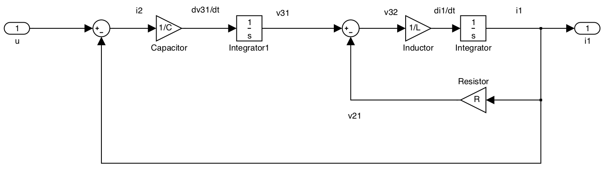
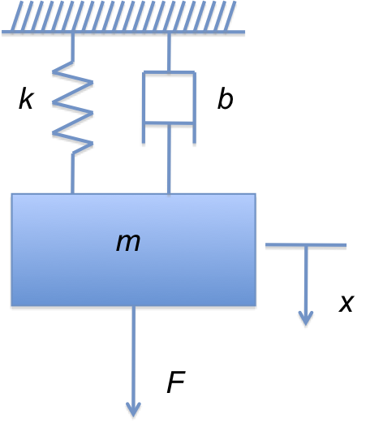

---
redirect_from:
  - "/07/1/intro2ss"
interact_link: content/07/1/intro2ss.ipynb
title: 'State-Space Models'
prev_page:
  url: /07/index
  title: 'Modelling Systems in State-Space'
next_page:
  url: /07/2/tf4ss
  title: 'Laplace Transforms of State Space Models'
comment: "***PROGRAMMATICALLY GENERATED, DO NOT EDIT. SEE ORIGINAL FILES IN /content***"
---

# State Space Models

## Introduction to State Space

Classical control system theory is based on the Transfer Function (TF) model. This applies only to those dynamic systems which can be described by linear time-invariant (LTI) differential equations. TF models are usually applied to Single Input Single Output (SISO) systems. Since the TF is expressed in terms of the Laplace Transform variable, $s$, analysis and design is mostly carried out in the $s$-domain or the frequency domain ($s=j\omega$).

Modern control systems theory is based on a time domain description of a system in terms of a set of first order coupled differential equations in the so-called *state variables* of the system.

State space models can do anything that classical TF models can do.

In addition state space models have allowed control theory to be extended in various directions:

### The Advances Enabled by State Space Models

1.  Handling Multiple Input Multiple Output (MIMO) systems.

2.  Extension to linear time-varying systems.

3.  Clarification of issues of controllability and observability.

4.  Development of powerful compensation methods via state feedback and
    observers.

5.  Development of optimal control theory.

In this module we will restrict ourselves to the study of mostly to SISO
LTI systems, but is important to note the possibility of its extension
to more challenging areas.

## Construction of State Space Models

The state-space model is a form of system representation that is used in several engineering disciplines. It is particularly used in control and in signal processing.

The state-space model is a form of differential equation representation and it is principally used when an analysis of the system behaviour is required in terms of time responses. That stated, it is relatively easy to convert a state-space model into a transfer function, to allow the frequency response analysis of a system. It is however not necessary to do this conversion if the time-response behaviour is all that is required.

The state space model is easily extended to cope with models with more than one input and more than one output. It also has more favourable numerical properties that make it more attractive as a representation for high order systems<sup>1</sup> than the polynomial representation provided by the transfer function. State-space models are easily simulated by the straightforward application of numerical integration.

### Example 1

Figure 7.1 shows a simple electrical circuit. We shall develop this circuit into a block diagram and from the block-diagram we shall develop the state-space model. Later we will generalise this result.


<div style="text-align:center"><b>Figure 7.1: A Simple Circuit</b></div>

If we write down the equations for the elements we get: 

$$\begin{eqnarray}
  \frac{dv_{31}}{dt} &=& \frac{1}{C}\ i_2 \label{eq:l13e1}\\
  \frac{di_{i}}{dt} &=& \frac{1}{L}\ v_{32} \label{eq:l13e2}\\
  v_{21} &=& R\ i_1 \label{eq:l13e3}\end{eqnarray}$$ 
  

The "compatability" and "continuity" equations are 

$$\begin{eqnarray}
  u &=& i_1 + i_2 \label{eq:l13e4}\\
  v_{31} &=& v_{32} + v_{21} \label{eq:l13e5}\end{eqnarray}$$

Since the system "source" is $u$, we can construct the block diagram systematically by tracing the equations through from the source. We also introduce the additional constraint that we would like the derivative terms $dv_{31}/dt$ and $di_1/dt$ to appear as inputs to integrator blocks whose outputs are therefore

$$\begin{eqnarray}
  v_{31} = \int \frac{dv_{31}}{dt} dt \label{eq:l13e6}\\
  i_{1} = \int \frac{di_{1}}{dt} dt \label{eq:l13e7}\end{eqnarray}$$

We can model these equations in MATLAB/Simulink<sup>2</sup> using component block diagram models as shown in Figure 7.2. The other components of equations (1) to (3) appear as gain blocks and (4) and (5) appear as summing junctions.

Simulink model: [blocks.slx](matlab/blocks.slx).


<div style="text-align:center"><b>Figure 7.2: Block models of equations (1) to (7)</b></div>

Combining these blocks such that the input is $u$ and the output is the current flowing through the inductance $i_1$<sup>3</sup> we obtain the block diagram shown in Figure 7.3.

Simulink model: [blockdiag.slx](matlab/blockdiag.slx)




<div style="text-align:center"><b>Figure 7.3: Example 1 as a Block Diagram</b></div>

Having constructed a block diagram that allows us the visualize the structure of the differential equations, we now go on to create the state-space model of the system. 

To do this we first identify the "*state-variables*" which are (in this case) the physical quantities that are changing with time, i.e. the voltage across the capacitor $v_{31}$ and the current through the inductor $i_1$<sup>4</sup>. The derivatives of these state variables become the left-hand-side of the "*state equations*". 

These equations have apparently already been written down as (1) and (2), but we impose an additional condition that the state equations can only involve the state-variables, their derivatives and the system input. Thus we have to trace the path back through the block diagram from the inputs to the integrator blocks to the (nearest) state variable(s). 

The state equations are

$$\begin{eqnarray}
  \frac{dv_{31}}{dt} &=& \frac{1}{C}\ i_2 = -\frac{1}{C}i_1 +
  \frac{1}{C} u \label{eq:l13e8}\\
  \frac{di_{i}}{dt} &=& \frac{1}{L}\ v_{32} = \frac{1}{L}v_{31} -\frac{R}{L} i_1 \label{eq:l13e9}\end{eqnarray}$$

Equations (8) and (9) together form a pair of simultaneous equations (they must both be satisfied by the dynamic response of the circuit voltages and currents to the input) and they may therefore be written in vector form<sup>5</sup>:

$$\begin{equation}\label{eq:l13e10}
  \left[\begin{array}{c}
    dv_{31}/dt \\
    di_{i}/dt \\
    \end{array}\right]=\left[\begin{array}{cc}
      0 & -1/C \\
      1/L & -R/L \\
    \end{array}\right]\left[\begin{array}{c}
      v_{31} \\
      i_1 \\
    \end{array}\right]+\left[\begin{array}{c}
      1/C \\
      0 \\
    \end{array}\right]\ u\end{equation}$$

The vector $[v_{31}, i_{1}]^T$ is called the "*state vector*." Its elements are state variables.<sup>6</sup>

We can generalize this result by defining general state variables $x_1=v_{31}$ and $x_2=i_1$. Using the notational shorthand $\dot{x}=dx/dt$ we then get: 

$$\begin{equation}\label{eq:l13e11}
  \left[\begin{array}{c}
    \dot{x_1} \\
    \dot{x_2} \\
    \end{array}\right]=\left[\begin{array}{cc}
      0 & -1/C \\
      1/L & -R/L \\
    \end{array}\right]\left[\begin{array}{c}
      x_1 \\
      x_2 \\
    \end{array}\right]+\left[\begin{array}{c}
      1/C \\
      0 \\
    \end{array}\right]\ u\end{equation}$$

## General State Space Models of Dynamic Systems

An $n^\mathrm{th}$ order dynamic system can be described by an $n^\mathrm{th}$ order differential equation in one dependent variable, $y(t)$, and an input forcing function, $u(t)$, with time, $t$, as the independent variable.

$$\begin{equation}\frac{d^ny}{dt^n}=f\left(\frac{d^{n-1}y}{dt^{n-1}}, \frac{d^{n-2}y}{dt^{n-2}}, \ldots, \frac{dx_2}{dt}, \frac{dy}{dt}, y, u(t), t \right) \label{eq:l13e12}\end{equation}$$


Alternatively, in a state space model extra variables, called
**states**, are introduced to create an equivalent description, but this
time involving only 1st order differential equations.

$$\begin{eqnarray}
    x_1 & = & y \label{eq:l13e13a}\\
    \frac{dx_1}{dt} & = & \frac{dy}{dt} = x_2  \label{eq:l13e13b} \\
    \frac{dx_2}{dt} & = & \frac{d^2y}{dt^2} = x_3   \\
     \vdots      \nonumber \\
    \frac{dx_{n-2}}{dt} & = & \frac{d^{n-2}y}{dt^{n-2}} = x_{n-1}   \\
    \frac{dx_{n-1}}{dt} & = & \frac{d^{n-1}y}{dt^{n-1}} = x_n   \\
    \frac{dx_n}{dt} &=& \frac{d^{n}y}{dt^{n}} =  f\left(x_n, x_{n-1}, \ldots, x_3, x_2, x_1, u(t), t \right) \label{eq:l13e13c}\end{eqnarray}$$

An nth order system gives rise to a state space model consisting of n coupled 1st order differential equations (the *state equations* (14)--(17)) in terms of $n$ state variables and the input forcing function(s). In addition there are the *output equations* (13) expressing other variables, or outputs, of interest, also in terms of the states and inputs.

You should note that the formulation used in the differential equation (12) and its equivalent state equations (13)--(18) is completely general and makes no assumptions about the nature of $f$. In fact the only condition is that it
represents a lumped parameter system rather than a distributed parameter system. The need to solve such equations by simulation is the basis of the integral models we introduced in [Chapter 1](../../01/modsim#integral-models).

### Example 2

Derive a state space model for the system described by the differential
equation:

$$\frac{d^2y}{dt^2}+3\frac{dy}{dt}+2y=u(t)$$

You should try this now. We will work through the solution in class.

## Physical States

The states are often chosen to have a direct physical significance such
as:

-   *Electrical Systems* -- the charge or voltage on a capacitor or the
    current in an inductor.

-   *Mechanical Systems* -- the force in springs or the velocity of mass
    or angular velocity of moments of inertia.

-   *Aerospace Systems* -- forward velocity, thrust, pitch and pitch
    rate, yaw and yaw rate, position and velocity of control surfaces.

-   *Chemical Process Plant* -- chemical composition, levels,
    temperatures, pressures and flows.

### Example 3

Derive the state equations for the Spring-Mass-Damper system shown in
the Figure 7.4.



<div style="text-align:center"><b>Figure 7.4: A Spring-Mass-Damper System</b></div> 

You should try this now. We will give the solution in the live class.

## The nature of the states

-   The state equations can be solved uniquely when the input functions
    are given together with the initial values of all the states.

-   The solutions for the states are substituted into the output
    equations to obtain the solutions for the other variables in the
    system.

-   In the above examples the states are physical quantities associated
    with energy storage in the system. The energy stored in a inductor
    is $E_L=Li_L^2/2$, and the energy stored in a capacitor is
    $E_C=CV_C^2/2$.

-   Similarly for mechanical systems the velocity of a mass relates to
    its kinetic energy and the force in a spring relates to its elastic
    potential energy.

-   The states encode the configuration of the system, or its whole past
    history.

-   The choice of states is not unique, but they must be chosen such
    that the configuration of the system can be unambiguously and
    completely determined from them.

## State Space Models for Linear Systems

Linear systems are the most important ones for control system analysis
and design as the best methods and techniques apply to these.

Non-linear systems are often approximated about a suitable operating
point by the nearest equivalent linear system allowing linear techniques
to be used in the design of a suitable controller.

In the case of linear systems, each state equation expresses the
derivative of one of the states as a linear function of the states and
inputs. The output equations also express the output variables linearly.
As a consequence the natural mathematical notation to use is that of
vectors and matrices. Thus state, input and output variables are grouped
in column vectors and are multiplied by matrices in the state and output
equations.

For linear time varying systems, the matrices have elements which are
functions of time, but for time invariant systems all the matrices are
constant.

### A vector/matrix notation

In general, we will have $n$ state variables and $q$ system inputs. In such a case we can write down a matrix state equation as developed in the next two slides.

#### Matrix State Equation (1)

Let us define a general $n$-dimensional state vector

$$\mathbf{x} = \left[x_1,\ x_2,\ \ldots, x_n\right]^T$$ 

Its derivative
is $$\frac{d\mathbf{x}}{dt} = \left[\frac{dx_1}{dt},\ \frac{dx_2}{dt},\
\ldots,\
\frac{dx_n}{dt}\right]^T$$ 

or more compactly
$$\dot{\mathbf{x}}=\left[\dot{x_1},\ \dot{x_2},\ \ldots,\
\dot{x_n}\right]^T.$$

There may be any number of inputs to a system, so we also assume a
general vector of $q$ inputs

#### Matrix State Equation (2)

$$\dot{\mathbf{x}}=\left[\begin{array}{cccc}
  a_{11} & a_{12} & \cdots & a_{1n} \\
  a_{21} & a_{22} & \cdots & a_{2n} \\
  \vdots & \vdots & \ddots & \vdots \\
  a_{n1} & a_{n2} & \cdots & a_{nn}
\end{array}\right]\ \mathbf{x} + \left[\begin{array}{cccc}
  b_{11} & b_{12} & \cdots & b_{1q} \\
  b_{21} & b_{22} & \cdots & b_{2q} \\
  \vdots & \vdots & \ddots & \vdots \\
  b_{n1} & b_{n2} & \cdots & b_{nq}
\end{array}\right]\ \mathbf{u} \\
$$ 

or more succinctly
$$\dot{\mathbf{x}}=\mathbf{A}\mathbf{x}+\mathbf{B}\mathbf{u}$$ 

Where
$\mathbf{A}$ is the $n\times n$ "*system matrix*" and $\mathbf{B}$ is
the $n\times q$ "*input matrix*".

The state equations allow us to describe the internal behaviour of the
system when subjected to stimuli from the inputs. In example 1, we need
nothing more if we wish to describe the way that the capacitor voltage
$v_{31}$ and inductor current $i_1$ change with time under the influence
of the input current $u$. However, if we wish to describe the behaviour
of the other variables in the circuit we need to complete the state
space model with a set of "*output equations*."

For illustration purposes we write an "output equation" for every
possible signal. 

$$\begin{eqnarray*}
v_{31}&=&1\times v_{31} \\
i_1 & = & 1\times i_1 \\
v_{32} &=& 1\times v_{31} - R \times i_1 \\
v_{21} & = & R \times i_1\\
i_2 & = & u - 1\times i_1.\end{eqnarray*}$$

Arranging these equations in vector form we have:

$$\left[\begin{array}{c}
  v_{31} \\
  i_1 \\
  v_{32} \\
  v_{21} \\
  i_2
\end{array}\right] = \left[\begin{array}{cc}
  1 & 0 \\
  0 & 1 \\
  1 & -R \\
  0 & R \\
  0 & -1
\end{array}\right]\ \left[\begin{array}{c}
  v_{31} \\
  i_1
\end{array}\right]+\left[\begin{array}{c}
  0 \\
  0 \\
  0 \\
  0 \\
  1
\end{array}\right] u$$

In general, we can describe a system with $r$ inputs in terms of the
generic output variables $y_1, y_2,\ldots,\ y_r$ as shown in the next two slides.

#### General Output Equation (1)

Let us define a general output vector
$$\mathbf{y} = \left[y_1,\ y_2,\ \ldots, y_r\right]^T$$

Given that some of the inputs to the system may be directly connected to
the output, the input vector may also appear in the output general
equation.

#### General Output Equation (2)

$$\mathbf{y}=\left[\begin{array}{cccc}
  c_{11} & c_{12} & \cdots & c_{1n} \\
  c_{21} & c_{22} & \cdots & c_{2n} \\
  \vdots & \vdots & \vdots & \vdots \\
  c_{r1} & c_{r2} & \cdots & c_{rn}
\end{array}\right]\ \mathbf{x} + \left[\begin{array}{cccc}
  d_{11} & d_{12} & \cdots & d_{1q} \\
  d_{21} & d_{22} & \cdots & d_{2q} \\
  \vdots & \vdots & \vdots & \vdots \\
  d_{r1} & d_{r2} & \cdots & d_{rq}
\end{array}\right]\ \mathbf{u} \\
$$ 

or more succinctly
$$\mathbf{y}=\mathbf{C}\mathbf{x}+\mathbf{D}\mathbf{u}$$ 

Where
$\mathbf{C}$ is the $n\times r$ "*output matrix*" and $\mathbf{D}$ is
the $r\times q$ "*feedforward matrix*".

This equation relates the states and inputs to the outputs. There are no
dynamic terms!

#### The State Space Model

$$\begin{aligned}
\dot{\mathbf{x}}=&\mathbf{A}\mathbf{x}+\mathbf{B}\mathbf{u}\\
\mathbf{y}=&\mathbf{C}\mathbf{x}+\mathbf{D}\mathbf{u}\end{aligned}$$ 

This state-space model
always be developed from a system with physically realizable states and
physical realistic sources. Such a system is called "*proper*". If
$\mathbf{D}$ is null (matrix of zeros) the system is called "*strictly
proper*".

A block diagram representation of the state space model is shown in Figure 7.5.
The block diagram of the circuit, rearranged to match the general model
is shown in Figure 7.6.


<div style="text-align:center"><b>Figure 7.5: Block diagram of a state-space model</b></div> 

Simulink model: [statemodel.slx](matlab/statemodel.slx)


<div style="text-align:center"><b>Figure 7.6: State Space Model of Example 1</b></div> 

### Modelling State Space Systems in MATLAB

For the example above

Important note, for this to work you must assign numerical values to the
the parameters `Cap`, `R` and `L`.


{:.input_area}
```matlab
clear all
cd matlab
format compact
```


{:.input_area}
```matlab
Cap = 1e-6; % 1 uF
L = 3e-3;  % 2 mH
R = 200e3; % 200 kOhm
```


{:.input_area}
```matlab
A = [0 -1/Cap; 1/L -R/L];
B = [1/Cap; 0];
C = [1 0; 0 1; 1 -R; 0 R; 0 -1];
D = [0; 0; 0; 0; 1];
circ_ss = ss(A, B, C, D,...
   'statename',{'v31' 'i1'}, 'inputname','u',...
   'outputname', {'v31' 'i1' 'v32' 'v21' 'i2'});
```


{:.input_area}
```matlab
circ_ss
```


{:.output_stream}
```

circ_ss =
 
  A = 
               v31          i1
   v31           0      -1e+06
   i1        333.3  -6.667e+07
 
  B = 
            u
   v31  1e+06
   i1       0
 
  C = 
           v31      i1
   v31       1       0
   i1        0       1
   v32       1  -2e+05
   v21       0   2e+05
   i2        0      -1
 
  D = 
        u
   v31  0
   i1   0
   v32  0
   v21  0
   i2   1
 
Continuous-time state-space model.


```

Once you have the state-space model, all the analysis techniques seen so
far are open to you.

### In class activity

In class we will construct the state-space model for the model chosen by
you from the CTMS.

Construct the state-space model chosen by you from the CTMS.

## Footnotes

1. Systems with large numbers of derivative terms

2. Note that in triangular blocks are used for gains and that the transfer function block $1/s$ represents the integral operator $\int$. The small elliptical blocks represent input and output ports.

3. We could have used any signal as an output as we shall see later.

4. A state variable that can be related to a physical quantity is called a "*physical state variable*."

5. You should expand this matrix equation (8) out to verify that it is equivalent to (6) and (7).

6. The matrix operator $[]^T$ is the "transpose" operator. In this case it converts the row vector shown into the column vector actually used in the state equations. When applied to a matrix, the rows of the matrix become the columns of the transposed matrix. We shall use the transpose operator in the discussion of state equations to avoid messy attempts to write column vectors in the body of a sentence!

## Answers to In-Class Problems

### Solution to Example 2

Introducing state variables $x_1=y$ and $x_2=dy/dt$ then the state equations are: 

$$\frac{dx_1}{dt}=\frac{dy}{dt}=x_2$$

$$\frac{dx_2}{dt}=\frac{d^2y}{dt^2}=-2x_1 - 3x_2 + u$$ 

and the output equation is: 

$$y=x_1.$$

### Solution to Example 3

For this system, summing the forces in the direction $x$ we have

$$F = m\frac{d^2x}{dt^2} + b\frac{dx}{dt} + kx$$

If we chose the position of the mass $x$ and it's velocity $dx/dt$ to be the states, and let the force $F$ be the system input, then $x_1 = x$, $x_2 = dx/dt$ and $u=F$ and the state equations are:

$$\begin{eqnarray*}
    \frac{dx_1}{dt} & = & x_2 \\
    \frac{dx_2}{dt} & = & -\frac{k}{m} x_1 -\frac{b}{m} x_2 + \frac{1}{m} u\end{eqnarray*}$$

You should construct the Simulink model represented by these equations and compare the results with those shown in [Chapter 1](../../01/modsim).
