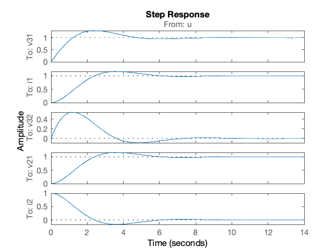

---
redirect_from:
  - "/07/2/tf4ss"
interact_link: content/07/2/tf4ss.ipynb
title: 'Laplace Transforms of State Space Models'
prev_page:
  url: /07/1/intro2ss
  title: 'State-Space Models'
next_page:
  url: /07/3/tr4ss
  title: 'Time Response for State Space Models'
comment: "***PROGRAMMATICALLY GENERATED, DO NOT EDIT. SEE ORIGINAL FILES IN /content***"
---

# Laplace Transforms of State Space Models

The Laplace transform can be used to convert a differential equation into a transfer function. It can also be used to convert a state space model into a transfer function. In this lecture we demonstrate how this is done and we give an example.

The Laplace transform of a vector $\mathbf{v}(t)$ is a vector $\mathbf{V}(s)$. The elements of $\mathbf{V}(s)$ are the Laplace transforms of the corresponding elements of the vector $\mathbf{v}(t)$.

For array 

$$\mathbf{v}(t) = \left[
  \begin{array}{c}
    v_1(t) \\
    v_2(t) \\
    \vdots \\
    v_n(t) \\
  \end{array}
  \right]$$

The transformed variables are 

$$\mathcal{L}\mathbf{v}(t) = \left[
  \begin{array}{c}
   \mathcal{L} v_1(t) \\
   \mathcal{L} v_2(t) \\
    \vdots \\
   \mathcal{L} v_n(t) \\
  \end{array}
  \right] = \left[
  \begin{array}{c}
   V_1(s) \\
   V_2(s) \\
    \vdots \\
   V_n(s) \\
  \end{array}
  \right] = \mathbf{V}(s)$$

For example, if<sup>1</sup> 

$$\mathbf{v}(t)=\left[ \begin{array}{c}
   \epsilon(t) \\
   e^{-at} \\
   \sin bt \\
  \end{array} \right]$$ 
  

then $$\mathbf{V}(s)=\left[ \begin{array}{c}
   1/s \\
   1/s+a \\
   b/(s^2+b^2) \\
  \end{array} \right]$$

Let us now transform the generalized form of the state equations obtained in the last lecture. 

$$\begin{eqnarray*}
  \frac{d\mathbf{x}(t)}{dt} &=&
  \mathbf{A}\mathbf{x}(t)+\mathbf{B}\mathbf{u}(t)\\
  \mathbf{y}(t)&=&\mathbf{C}\mathbf{x}(t)+\mathbf{D}\mathbf{u}(t)\end{eqnarray*}$$

Applying the Laplace transform to both sides of this matrix equation
gives the transform equations 

$$\begin{eqnarray*}
  s\mathbf{X}(s)-\mathbf{x}(0) &=& 
  \mathbf{A}\mathbf{X}(s)+\mathbf{B}\mathbf{U}(s)\\
  \mathbf{Y}(s)&=&\mathbf{C}\mathbf{X}(s)+\mathbf{D}\mathbf{U}(s)\end{eqnarray*}$$

where $\mathbf{x}(0)$ is the vector of initial conditions vector of the
states; $\mathbf{X}(s)$ is the state transform vector; $\mathbf{U}(s)$
input transform vector; $\mathbf{Y}(s)$ is output transform vector.

### Transformed State-Equations for Example 1 from Section

For the system in the example the state vector is defined as $\mathbf{x}=[v_{31}, i_1]^{T}$, the input current is $u$, and the output variables are all the currents and voltages in the circuit $\mathbf{y}=[v_{31}, i_1, v_{32}, v_{21}, i_2]^{T}$. 

The transformed state space model is therefore:

$$\begin{eqnarray}
 s\left[\begin{array}{c}
  V_{31} \\
  I_1
\end{array}\right]-\left[\begin{array}{c}
  v_{31}(0) \\
  i_1(0)
\end{array}\right]&=&\left[\begin{array}{cc}
  0 & -1/C \\
  1/L & -R/L
\end{array}\right]\left[\begin{array}{c}
  V_{31} \\
  I_1
\end{array}\right]+\left[\begin{array}{c}
  1/C \\
  0
\end{array}\right]\left[U\right]\\
\left[\begin{array}{c}
  V_{31} \\
  I_1 \\
  V_{32} \\
  V_{21} \\
  I_{2}
\end{array}\right]&=&\left[\begin{array}{cc}
  1 & 0 \\
  0 & 1 \\
  1 & -R \\
  0 & R \\
  0 & -1
\end{array}\right]\left[\begin{array}{c}
  V_{31} \\
  I_1
\end{array}\right]+\left[\begin{array}{c}
  0 \\
  0 \\
  0 \\
  0 \\
  1
\end{array}\right]\left[U\right].\end{eqnarray}$$

## Laplace Transform from State-Space Models

Substituting $\mathbf{X}$ from (1) into (2) gives 

$$\begin{equation}\label{eqn:def-of-y2}
  \mathbf{Y}=\left[\mathbf{C}\left[s\mathbf{I}-\mathbf{A}\right]^{-1}\mathbf{B}\mathbf{U}+
  \mathbf{C}\left[s\mathbf{I}-\mathbf{A}\right]^{-1}\mathbf{x}(0)\right]+\mathbf{D}\mathbf{U}\end{equation}$$

which after gathering terms and simplifying gives
$$\begin{equation}\label{eqn:def-of-y3}
  \mathbf{Y}=\left[\mathbf{C}\left[s\mathbf{I}-\mathbf{A}\right]^{-1}\mathbf{B}+\mathbf{D}\right]\mathbf{U}
      +\mathbf{C}
  \left[s\mathbf{I}-\mathbf{A}\right]^{-1}\mathbf{x}(0)\end{equation}$$

When the initial conditions of the state-variables are all zero, this
reduces to the transfer matrix model 

$$\begin{equation}\label{eqn:transfer-function}
  \mathbf{Y}=\left[\mathbf{C}\left[s\mathbf{I}-\mathbf{A}\right]^{-1}\mathbf{B}+\mathbf{D}\right]\mathbf{U}\end{equation}$$

The matrix $\mathbf{C}\left[s\mathbf{I}-\mathbf{A}\right]^{-1}\mathbf{B}+\mathbf{D}$ is the *system transfer matrix*.

The element of the $i$-th row and $j$-th column is the transfer function that relates the $i$-th output transform $Y_i$ to the $j$-th input transform $U_j$.

For a single-input, single-output (SISO) system, the system transfer matrix reduces to a single element transfer function.

The matrix $\left[s\mathbf{I}-\mathbf{A}\right]^{-1}$ is very important.

It is known as the *resolvent matrix* of the system.

It may be written as $$\label{eqn:resolvent}
      \left[s\mathbf{I}-\mathbf{A}\right]^{-1} =
        \frac{\mathrm{adj}\left[s\mathbf{I}-\mathbf{A}\right]}
             {\det\left[s\mathbf{I}-\mathbf{A}\right]}.$$

### Resolvent matrix for the example

For the system in the example, the resolvent matrix is developed as

$$\begin{equation*}
\mathbf{A}=\left[\begin{array}{cc}
  0 & -1/C \\
  1/L & -R/L
\end{array}\right] \end{equation*}$$

$$\begin{equation*}
s\mathbf{I}-\mathbf{A}=\left[
\begin{array}{cc}
  s & 0 \\
  0 & s
\end{array}
\right] - \left[
\begin{array}{cc}
  0 & -1/C \\
  1/L & -R/L
\end{array}
\right] = \left[
\begin{array}{cc}
  s & +1/C \\
  -1/L & s+R/L
\end{array}\right] \end{equation*}$$

$$\begin{equation*}
\left[s\mathbf{I}-\mathbf{A}\right]^{-1}=\frac{
\left[\begin{array}{cc}
  s+R/L & -1/C \\
  +1/L & s
\end{array} \right]
}{s(s+R/L)+1/(LC)}=\frac{\left[\begin{array}{cc}
  s+R/L & -1/C \\
  +1/L & s
\end{array} \right]}{s^2 + (R/L)s + 1/(LC) }\end{equation*}$$

When $\left[s\mathbf{I}-\mathbf{A}\right]^{-1}$ has been obtained, then the system transfer function is easily obtained through $\mathbf{C}\left[s\mathbf{I}-\mathbf{A}\right]^{-1}\mathbf{B}+\mathbf{D}$.
For the system in the example, when all outputs are measured, the system transfer matrix is:

### Transfer matrix for example

$$\begin{equation*}
\left[\begin{array}{cc}
  1 & 0 \\
  0 & 1 \\
  1 & -R \\
  0 & R \\
  0 & -1
\end{array}\right]
\left\{\frac{\left[
\begin{array}{cc}
  s+R/L & -1/C \\
 +1/L & s
\end{array}\right]}{s^2 + (R/L)s +1/(LC)}\right\}
\left[\begin{array}{c}
  1/C \\
  0
\end{array}\right]
 + \left[\begin{array}{c}
  0 \\
  0 \\
  0 \\
  0 \\
  1
\end{array} \right]
\end{equation*}$$

$$\begin{equation*}
= \left[\begin{array}{cc}
  1 & 0 \\
  0 & 1 \\
  1 & -R \\
  0 & R \\
  0 & -1
\end{array}\right]
\left\{\frac{\left[
\begin{array}{c}
  (1/C)s+R/(LC)  \\
 +1/(LC)
\end{array}\right]}{s^2 + (R/L)s +1/(LC)}\right\}
 + \left[\begin{array}{c}
  0 \\
  0 \\
  0 \\
  0 \\
  1
\end{array} \right]\end{equation*}$$

$$\begin{equation*}
 = \frac{1}{s^2 + (R/L)s
+1/(LC)}\left[\begin{array}{c}
  (1/C)s+R/(LC) \\
  1/(LC) \\
  (1/C)s \\
  R/(LC) \\
  -1/(LC)
\end{array}\right] + \left[\begin{array}{c}
  0 \\
  0 \\
  0 \\
  0 \\
  1
\end{array} \right]\end{equation*}$$

$$\begin{equation*}
= \left[\begin{array}{c}
  \frac{(1/C)s+R/(LC)}{s^2 + (R/L)s
+1/(LC)} \\
  \frac{1/(LC)}{s^2 + (R/L)s
+1/(LC)} \\
  \frac{(1/C)s}{s^2 + (R/L)s
+1/(LC)} \\
  \frac{R/(LC)}{s^2 + (R/L)s
+1/(LC)} \\
  -\frac{1/(LC)}{s^2 + (R/L)s
+1/(LC)}+1
\end{array}\right]\end{equation*}$$

$$\begin{aligned}
 &=& \frac{1}{s^2 + (R/L)s
+1/(LC)}\left[\begin{array}{c}
  (1/C)s+R/(LC) \\
  1/(LC) \\
  (1/C)s \\
  R/(LC) \\
  -1/(LC)
\end{array}\right] + \left[\begin{array}{c}
  0 \\
  0 \\
  0 \\
  0 \\
  1
\end{array} \right]\\
&=& \left[\begin{array}{c}
  \frac{(1/C)s+R/(LC)}{s^2 + (R/L)s
+1/(LC)} \\
  \frac{1/(LC)}{s^2 + (R/L)s
+1/(LC)} \\
  \frac{(1/C)s}{s^2 + (R/L)s
+1/(LC)} \\
  \frac{R/(LC)}{s^2 + (R/L)s
+1/(LC)} \\
  -\frac{1/(LC)}{s^2 + (R/L)s
+1/(LC)}+1
\end{array}\right]\end{aligned}$$

In matrix form, when combined with the input and output transforms we
have the situation illustrated below. Each transfer function relates the
corresponding output transform to the input transform. For example
$$V_{31}= \frac{(1/C)s+R/(LC)}{s^2 + (R/L)s
+1/(LC)}\ U.$$

### Transform Equations for Example

$$\begin{eqnarray*}
\mathbf{Y}(s)&=&\left[\mathbf{C}\left[s\mathbf{I}-\mathbf{A}\right]^{-1}\mathbf{B}+\mathbf{D}\right]\mathbf{U}(s)\\
\mathbf{Y}(s) &=& \mathbf{G}(s)\mathbf{U}(s)\end{eqnarray*}$$

$$\begin{eqnarray*}\left[\begin{array}{c}
  V_{31}(s) \\
  I_1(s) \\
  V_{32}(s) \\
  V_{21}(s) \\
  I_{2}(s)
\end{array}\right] &=& \left[\begin{array}{c}
  \frac{(1/C)s+R/(LC)}{s^2 + (R/L)s
+1/(LC)} \\
  \frac{1/(LC)}{s^2 + (R/L)s
+1/(LC)} \\
  \frac{(1/C)s}{s^2 + (R/L)s
+1/(LC)} \\
  \frac{R/(LC)}{s^2 + (R/L)s
+1/(LC)} \\
  -\frac{1/(LC)}{s^2 + (R/L)s
+1/(LC)}+1
\end{array}\right]\mathbf{U}(s).\end{eqnarray*}$$

Note that the denominator is the same for each transfer function, and
that the order of the numerator is less than the denominator except for
one case, for which 

$$\begin{eqnarray*}
I_2 & = & \left(-\frac{1/(LC)}{s^2 + (R/L)s +1/(LC)}+1\right)U\\
    & = & \frac{-1/{LC}+s^2 + (R/L)s +1/(LC)}{s^2 + (R/L)s
    +1/(LC)}\ U
    \\
    & = &\frac{s^2 + (R/L)s}{s^2 + (R/L)s
    +1/(LC)}\ U\end{eqnarray*}$$ 
    
Replacing $s$ by $\frac{d}{dt}$ gives the
corresponding differential equations relating the dependant variable to
the input.

### Converting SS to TF in Matlab

Continuing example from [Section 7.1](../1/intro2ss):


{:.input_area}
```matlab
clear all
format compact
```


Define some values for capacitance, inductance and resitance


{:.input_area}
```matlab
Cap = 1; L = 1; R = 1;
```


#### Define state space model and label states inputs and outputs


{:.input_area}
```matlab
A = [0 -1/Cap; 1/L -R/L];
B = [1/Cap; 0];
C = [1 0; 0 1; 1 -R; 0 R; 0 -1];
D = [0; 0; 0; 0; 1];
circ_ss = ss(A, B, C, D, ...
'statename',{'v31' 'i1'}, ...
'inputname', 'u', ...
'outputname', {'v31' 'i1' 'v32' 'v21' 'i2'});
```


#### Show model


{:.input_area}
```matlab
circ_ss
```


{:.output_stream}
```

circ_ss =
 
  A = 
        v31   i1
   v31    0   -1
   i1     1   -1
 
  B = 
        u
   v31  1
   i1   0
 
  C = 
        v31   i1
   v31    1    0
   i1     0    1
   v32    1   -1
   v21    0    1
   i2     0   -1
 
  D = 
        u
   v31  0
   i1   0
   v32  0
   v21  0
   i2   1
 
Continuous-time state-space model.


```

#### Plot a step response


{:.input_area}
```matlab
step(circ_ss)
```





#### Convert to transfer functiom matrix

The function `tf(ss_model)` returns a vector of transfer functions.


{:.input_area}
```matlab
circ_tf = tf(circ_ss)
```


{:.output_stream}
```

circ_tf =
 
  From input "u" to output...
            s + 1
   v31:  -----------
         s^2 + s + 1
 
             1
   i1:  -----------
        s^2 + s + 1
 
              s
   v32:  -----------
         s^2 + s + 1
 
              1
   v21:  -----------
         s^2 + s + 1
 
          s^2 + s
   i2:  -----------
        s^2 + s + 1
 
Continuous-time transfer function.


```

#### Determine poles and zeros


{:.input_area}
```matlab
circ_zpk=zpk(circ_ss)
```


{:.output_stream}
```

circ_zpk =
 
  From input "u" to output...
             (s+1)
   v31:  -------------
         (s^2 + s + 1)
 
              1
   i1:  -------------
        (s^2 + s + 1)
 
               s
   v32:  -------------
         (s^2 + s + 1)
 
               1
   v21:  -------------
         (s^2 + s + 1)
 
           s (s+1)
   i2:  -------------
        (s^2 + s + 1)
 
Continuous-time zero/pole/gain model.


```

#### The state transition matrix

Calculated using the symbolic math tools provided by MATLAB See `help symbolic`


{:.input_area}
```matlab
syms phi t s
phi = inv(s*eye(2) - A)
```


{:.output_stream}
```
phi =
[ (s + 1)/(s^2 + s + 1), -1/(s^2 + s + 1)]
[       1/(s^2 + s + 1),  s/(s^2 + s + 1)]

```

#### The state transfer matrix


{:.input_area}
```matlab
G = C*phi*B + D
```


{:.output_stream}
```
G =
                   (s + 1)/(s^2 + s + 1)
                         1/(s^2 + s + 1)
 (s + 1)/(s^2 + s + 1) - 1/(s^2 + s + 1)
                         1/(s^2 + s + 1)
                     1 - 1/(s^2 + s + 1)

```


{:.input_area}
```matlab
G = simplify(G)
```


{:.output_stream}
```
G =
 (s + 1)/(s^2 + s + 1)
       1/(s^2 + s + 1)
       s/(s^2 + s + 1)
       1/(s^2 + s + 1)
   1 - 1/(s^2 + s + 1)

```


{:.input_area}
```matlab
pretty(G)
```


{:.output_stream}
```
/      s + 1     \
|   ----------   |
|    2           |
|   s  + s + 1   |
|                |
|        1       |
|   ----------   |
|    2           |
|   s  + s + 1   |
|                |
|        s       |
|   ----------   |
|    2           |
|   s  + s + 1   |
|                |
|        1       |
|   ----------   |
|    2           |
|   s  + s + 1   |
|                |
|          1     |
| 1 - ---------- |
|      2         |
\     s  + s + 1 /


```

A executable script version of this example is available as [ssmodels.mlx](matlab/ssmodels.mlx).

## Some Important Properties

### System poles

Clearly the denominator of the transfer function is generated by the
matrix inverse which produces the term: $$\det[s\mathbf{I}-\mathbf{A}]$$

This evaluates to the denominator polynomial and the poles of the system
are the roots of the system's characteristic equation:
$$\det[s\mathbf{I}-\mathbf{A}] = 0.$$

The system poles are solutions to the system's characteristic equation
$$\det[s\mathbf{I}-\mathbf{A}] = 0.$$

### System zeros

What is the corresponding numerator polynomial of the transfer function,
whose roots give the zeros of the system? 

The zeros are those values of
$s$ for which the output is zero when the input and states are not zero.

Thus: $$\begin{eqnarray*}
(s\mathbf{I}-\mathbf{A})\mathbf{X}-\mathbf{B}U & = & \mathbf{0} \\
\mathbf{CX}+dU = Y & = & 0\end{eqnarray*}$$ 

In matrix form:
$$\left[ {\begin{array}{*{20}c}
   {s{\bf{I}} - {\bf{A}}} &  \vdots  & {\bf{B}}  \\
    \cdots  &  \cdots  &  \cdots   \\
   {\bf{C}} &  \vdots  & d  \\
\end{array}} \right]\left[ {\begin{array}{*{20}c}
   {\bf{X}}  \\
    \cdots   \\
   U  \\
\end{array}} \right] = \left[ {\begin{array}{*{20}c}
   {\bf{0}}  \\
    \cdots   \\
   0  \\
\end{array}} \right]$$

Zeros are those values of $s$ for which the system output is zero when
the input and states are not zero 

$$\begin{aligned}
        (s\mathbf{I}-\mathbf{A})\mathbf{X}-\mathbf{B}U & = & \mathbf{0} \\
        \mathbf{CX}+dU = Y & = & 0
    \end{aligned}$$ 

In matrix form: 

$$\left[ {\begin{array}{*{20}c}
   {s{\bf{I}} - {\bf{A}}} &  \vdots  & {\bf{B}}  \\
    \cdots  &  \cdots  &  \cdots   \\
   {\bf{C}} &  \vdots  & d  \\
\end{array}} \right]\left[ {\begin{array}{*{20}c}
   {\bf{X}}  \\
    \cdots   \\
   U  \\
\end{array}} \right] = \left[ {\begin{array}{*{20}c}
   {\bf{0}}  \\
    \cdots   \\
   0  \\
\end{array}} \right]$$

The only way this can have non-zero solutions in $\mathbf{X}$ and $U$ is
if: 

$$\det \left[ {\begin{array}{*{20}c}
   {s{\bf{I}} - {\bf{A}}} &  \vdots  & {\bf{B}}  \\
    \cdots  &  \cdots  &  \cdots   \\
   {\bf{C}} &  \vdots  & d  \\
\end{array}} \right] = 0$$ 

This is another polynomial in $s$ whose roots
give the system zeros and therefore corresponds to the numerator
polynomial of the TF.

Given this result, an alternative expression for the TF is:

$$\frac{Y(s)}{U(s)} = \frac{\det \left[ \begin{array}{*{20}c}
   s\bf{I} - \bf{A} &  \vdots  & \bf{B}  \\
    \cdots  &  \cdots  &  \cdots   \\
   \bf{C} &  \vdots  & d  \\
\end{array} \right]}{\det [s\bf{I} - \bf{A}]}$$

## Time Responses from Transfer Function Matrices

In the [next section](../3/sstr) we will consider how we can use the transfer function model to compute time responses from state-space models.

## Footnote

1. $\epsilon(t)$ is the unit step function $\epsilon(t)=0$ for
    $t < 0$; $\epsilon(t)=1$ for $t \ge 0$.

