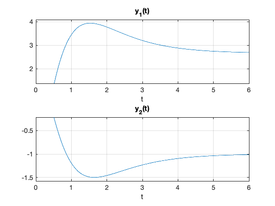

---
redirect_from:
  - "/07/3/tr4ss"
interact_link: content/07/3/tr4ss.ipynb
title: 'Time Response for State Space Models'
prev_page:
  url: /07/2/tf4ss
  title: 'Laplace Transforms of State Space Models'
next_page:
  url: /07/4/canon
  title: 'Canonical Forms'
comment: "***PROGRAMMATICALLY GENERATED, DO NOT EDIT. SEE ORIGINAL FILES IN /content***"
---

# Time Response for State Space Models

In this section we shall determine the time response of a system
represented by a state-space model. We shall take as a starting point
the transformed state space model developed in the [last section](../2/tf4ss). 

It is
possible to derive the time response directly in the time domain from
the state-equations. I believe however, that the following development
will be easier to understand. I advise you to consult any text book for
the time domain development.

In the [last section](../2/tf4ss), we showed that the state space model was 

$$\begin{eqnarray*}
     \dot{\mathbf{x}}(t) & = &
            \mathbf{A}\mathbf{x}(t)+\mathbf{B}\mathbf{u}(t) \\\\
          \mathbf{y}(t) & = &
             \mathbf{C}\mathbf{x}(t)+\mathbf{D}\mathbf{u}(t)
   \end{eqnarray*}$$

and that
the transformed equation was 

$$\begin{eqnarray*}
    s\mathbf{X}(s) - \mathbf{x}(0) & = &
                 \mathbf{A}\mathbf{X}(s)+\mathbf{B}\mathbf{U}(s) \\\\
     \mathbf{Y}(s)                 & = &
                 \mathbf{C}\mathbf{X}(s)+\mathbf{D}\mathbf{U}(s)
  \end{eqnarray*}$$
  

In this section we will show how the time
response of the state space model may be derived from the transformed
model.

## Zero Input Response

We first consider the response of the system to its initial conditions
and zero input. This is the *zero input response* or homogeneous
response of the system. 

With the input transform $U(s)=0$ the state
equation becomes $$\mathbf{X}(s)=\left[s\mathbf{I}-\mathbf{A}\right]^{-1}\mathbf{x}(0).$$ 

We define
$$\Phi(s) = \left[s\mathbf{I}-\mathbf{A}\right]^{-1}$$ 

so that 

$$\begin{equation}\label{eq:l4eq1}
\mathbf{X}(s)=\Phi(s)\mathbf{x}(0)\end{equation}$$ 

is the transform of the zero input
state response. 

In the time domain, the corresponding state response is
given by the inverse Laplace transform of
equation (1)

$$\begin{equation}\label{eq:l4eq2} \mathbf{x}(t) = \mathcal{L}^{-1}
\left\{\Phi(s)\mathbf{x}(0)\right\},\end{equation}$$ 

which, since the initial
condition vector $\mathbf{x}(0)$ is a vector of constants becomes:

$$\begin{eqnarray}
\mathbf{x}(t) & = & \mathcal{L}^{-1}
\left\{\Phi(s)\right\}\mathbf{x}(0)\nonumber \\ & = &
\phi(t)\mathbf{x}(0).\label{eq:l4eq3}\end{eqnarray}$$

## State Transition Matrix

The vector of time functions $\phi(t)$ is known as the *state transition
matrix*. It defines the motion (or *trajectory*) of the state variables
through the $n$-dimensional *state space* from a given set of initial
states.

### Resolvent matrix

The *resolvent matrix* is defined as 

$$\Phi(s) = \left[s\mathbf{I}-\mathbf{A}\right]^{-1} =
\frac{\mathrm{adj}\left[s\mathbf{I}-\mathbf{A}{}\right]}{\left|s\mathbf{I}-\mathbf{A}\right|}.$$ 

The resolvent matrix is a matrix of rational polynomials in the Laplace transform variable $s$. 

The state transition matrix is 

$$\phi(t)
=
\mathcal{L}^{-1}\left\{\frac{\mathrm{adj}\left[s\mathbf{I}-\mathbf{A}{}\right]}{\left|s\mathbf{I}-\mathbf{A}\right|}\right\}.$$ What
is the form of this function?

### Characteristic Polynomial

The adjoint
matrix $\mathrm{adj}\left[s\mathbf{I}-\mathbf{A}{}\right]$ is a matrix of polynomials each of which is of
order $n-1$ or less. 

The determinant
$$\left|s\mathbf{I}-\mathbf{A}\right| = \left|\begin{array}{cccc}
  s-a_{11} & -a_{12} & \cdots & -a_{1n} \\
  -a_{21} & s-a_{22} & \cdots & -a_{2n} \\
  \vdots & \vdots & \ddots & \vdots \\
  -a_{n1} & -a_{2n} & \cdots & s-a_{nn}
\end{array}\right|$$ 

is called the *characteristic polynomial*. It is
always a polynomial of degree $n$. 

Therefore each element of the
resolvent matrix $\Phi(s)$ is of the form
$$\frac{b_{n-1}s^{n-1}+ \cdots + b_0}{s^n + a_{n-1}s^{n-1}+\cdots+a_0}.$$

### System Characteristic (or Eigen) Values

The
coefficients $b_i$ of each element of the resolvent matrix $\Phi(s)$
depend on the form of the system. The characteristic polynomial
$\left|s\mathbf{I}-\mathbf{A}\right|$ is the common denominator of all elements of $\Phi(s)$.


It may be factorized: 

$$\begin{eqnarray*}
\left|s\mathbf{I}-\mathbf{A}\right|&=&s^n + a_{n-1}s^{n-1} + \cdots + a_1s + a_0
\\
&=&(s - p_1)(s-p_2)\cdots(s-p_n)\end{eqnarray*}$$

The values $p_i$ are
known as the *characteristic* (or *eigen*) values of the state matrix
$\mathbf{A}$. The characteristic values are the *poles* of the system!

## Zero-input response

If we make
a partial fraction expansion of the characteristic equation, then for
the $i$-$j$th element of the resolvent matrix we have

$$\Phi_{ij}(s)=\frac{r_1}{s-p_1}+\frac{r_2}{s-p_2} + \cdots +
\frac{r_n}{s-p_n}$$

(where the coefficient $r_i$ is the so called
*residue* of the partial fraction expansion determined at the value
$s=p_i$). 

Inverse Laplace transforming this equation we finally obtain
the *state transition* function:

$$\phi_{ij}(t) = r_1 e^{p_1 t} + r_2 e^{p_2 t} + \cdots + r_n
e^{p_n t}.$$

### System 'modes'

The state
transition matrix $\phi(t)$ is an $n\times n$ matrix, each element of
which is a linear combination of the $n$ "mode functions" (or simply
*modes*) 

$$e^{p_1 t},\ e^{p_2 t},\ \ldots,\ e^{p_n t}.$$ 

Each mode is
constructed from the eigenvalues ($p_1,\ p_2,\ \ldots,\ p_n$) of the
state matrix $\mathbf{A}$. 

The eigenvalues are also known as the
*poles* of the system.

### Example

If 

$$\mathbf{A} = \left[\begin{array}{cc}
  0 & 1 \\
  -6 & -5
\end{array}\right]$$ 

$$s\mathbf{I}-\mathbf{A} = \left[\begin{array}{cc}
  s & -1 \\
  6 & s+5
\end{array}\right]$$ 

so 

$$\left|s\mathbf{I}-\mathbf{A}\right| = s^2 + 5s + 6 = (s+2)(s+3).$$

The characteristic values of the system are $p_1=-2$ and $p_2=-3$ so the
modes are $e^{-2t}$ and $e^{-3t}$.

Now 

$$\mathrm{adj}\left[s\mathbf{I}-\mathbf{A}{}\right] = \left[\begin{array}{cc}
  s+5 & 1 \\
  -6 & s
\end{array}\right]$$ 

so the resolvent matrix is

$$\Phi(s) = \left[\begin{array}{cc}
  \frac{s+5}{(s+2)(s+3)} & \frac{1}{(s+2)(s+3)} \\
  \frac{-6}{(s+2)(s+3)} & \frac{s}{(s+2)(s+3)}
\end{array}\right].$$ 

Expanding each element of $\Phi(s)$ we get

$$\Phi(s) = \left[\begin{array}{cc}
  \frac{3}{s+2}-\frac{2}{s+3} & \frac{1}{s+2}-\frac{1}{s+3} \\
  \frac{-6}{s+2}+\frac{6}{s+3} & -\frac{2}{s+2}+\frac{3}{s+3}
\end{array}\right].$$ 

Inverse Laplace transforming this we get the final
state transition matrix, representing the zero-input response of the
system: 

$$\phi(t)=\left[\begin{array}{cc}
  3e^{-2t}-2e^{-3t} & e^{-2t}-e^{-3t} \\
 -6e^{-2t}+6e^{-3t} & -2e^{-2t}+3e^{-3t}
\end{array}\right].$$

Note that, by an alternative derivation<sup>1</sup>, we can show that
$$\phi(t)=e^{\mathbf{A}t}$$ where $e^{\mathbf{A}t}$ is called the matrix
exponential.

### Unforced system response

To determine the response of the system to the initial state we recall
that 

$$\mathbf{x} = \mathbf{B}\mathbf{\Phi(s)} \mathbf{x}(0)$$ 

and putting
this together with the definition of $\mathbf{Y(s)}$ we can determine
the unforced system response of a system.

### Zero Input System Response

For non-zero
initial conditions and zero input we have 

$$\begin{eqnarray}
\label{eq:l4eq6a}
  \mathbf{X}(s)&=&\left[s\mathbf{I}-\mathbf{A}\right]^{-1}\mathbf{x}(0) \nonumber\\
&=& \Phi(s)\mathbf{x}(0) \label{eq:l4eq7a}\end{eqnarray}$$ 

The zero-input
system output transform is therefore given by 

$$\begin{equation}\label{eq:l4eq8a}
 \mathbf{Y}_\mathrm{zi}(s)=\mathbf{C}\Phi(s)\mathbf{x}(0).\end{equation}$$

Because we have already shown that $\phi(t)$ will be a linear
combination of modes, the unforced system response $y(t)$ will be
another linear combination of the same modes.

We now consider the case where the initial condition vector
$\mathbf{x}(0)=\mathbf{0}$ and we will obtain the response of the system
to an input. This is called the *zero state response* of the system.

## The Zero State Response

For zero initial
conditions we have 

$$\begin{eqnarray}
\label{eq:l4eq6}
  \mathbf{X}(s)&=&\left[s\mathbf{I}-\mathbf{A}\right]^{-1}\mathbf{B}\mathbf{U}(s) \nonumber \\
&=& \Phi(s)\mathbf{B}\mathbf{U}(s) \label{eq:l4eq7}\end{eqnarray}$$ 

The
system output transform (forced response) is given by 

$$\begin{equation}\label{eq:l4eq8}
 \mathbf{Y}_{\mathrm{zs}}(s)=\left[\mathbf{C}\Phi(s)\mathbf{B}+\mathbf{D}\right]\mathbf{U}(s)\end{equation}$$

(where $\mathbf{C}\Phi(s)\mathbf{B}+\mathbf{D}$ is the system transfer matrix).

## Full System Response

The full system response for the state-space model is simply the sum of
the zero-state and zero-input responses: 

$$\begin{eqnarray}
\mathbf{Y}_{\mathrm{full}}(s) &=& \mathbf{Y}_{\mathrm{zs}}(s) +
\mathbf{Y}_{\mathrm{zi}}(s)\nonumber\\ &=&
\mathbf{C}\Phi(s)\left[\mathbf{x}(0)+\mathbf{B}\mathbf{U}(s)\right] + \mathbf{DU}(s).\end{eqnarray}$$

The full system response for the state-space model is simply the sum of
the zero-state and zero-input responses: 

$$\begin{eqnarray}
\mathbf{Y}_{\mathrm{full}}(s) &=& \mathbf{Y}_{\mathrm{zs}}(s) +
\mathbf{Y}_{\mathrm{zi}}(s)\nonumber\\ &=&
\mathbf{C}\Phi(s)\left[\mathbf{x}(0)+\mathbf{B}\mathbf{U}(s)\right] + \mathbf{DU}(s).\end{eqnarray}$$

In the class we will reinforce these concepts by working through an
example in detail.

## Example

Let

$$\begin{eqnarray*}
\dot{\mathbf{x}}&=&\left[\begin{array}{cc}
  0 & 1 \\
  -6 & -5
\end{array}\right]\mathbf{x}+\left[\begin{array}{cc}
  2 & 1 \\
 -1 & 0
\end{array}\right]\mathbf{u}\\
\mathbf{y}&=&\left[\begin{array}{cc}
  2 & -1 \\
  0 & 1
\end{array}\right]\mathbf{x}\\ \mathbf{u}&=&\left[\begin{array}{c}
  e^{-t} \\
  \epsilon(t)
\end{array}\right].\end{eqnarray*}$$ 

Calculate the full system response
for this system given that the initial conditions are
$\mathbf{x}(0)=[-1, 1]^T$.

### Solution to Example

The transfer function is 

$$\begin{eqnarray*}
\mathbf{G}(s)&=&\mathbf{C}\Phi(s)\mathbf{B} =
\left[\begin{array}{cc}
  2 & -1 \\
  0 & 1
\end{array}\right]
\left[\begin{array}{cc}
  \frac{s+5}{(s+2)(s+3)} & \frac{1}{(s+2)(s+3)} \\
  \frac{-6}{(s+2)(s+3)} & \frac{s}{(s+2)(s+3)}
\end{array}\right]\left[\begin{array}{cc}
  2 & 1 \\
 -1 & 0
\end{array}\right]\\
&=&\left[\begin{array}{cc}
  2 & -1 \\
  0 & 1
\end{array}\right]
\left[\begin{array}{cc}
  \frac{2s+9}{(s+2)(s+3)} & \frac{s+5}{(s+2)(s+3)} \\
  \frac{-s-12}{(s+2)(s+3)} & \frac{-6}{(s+2)(s+3)}
\end{array}\right]\\
&=& \left[\begin{array}{cc}
  \frac{5s+30}{(s+2)(s+3)} & \frac{2s+16}{(s+2)(s+3)} \\
   \frac{-s-12}{(s+2)(s+3)} & \frac{-6}{(s+2)(s+3)}
\end{array}\right]\end{eqnarray*}$$

The transform of the input vector is

$$\mathbf{U}(s) = \mathcal{L}\left[\begin{array}{c}
  e^{-t} \\
  \epsilon(t)
\end{array}\right] = \left[\begin{array}{c}
  \frac{1}{s+1} \\
  \frac{1}{s}
\end{array}\right].$$ Hence $$\begin{eqnarray*}
\mathbf{Y}(s) &=& \left[\begin{array}{cc}
  \frac{5s+30}{(s+2)(s+3)} & \frac{2s+16}{(s+2)(s+3)} \\
   \frac{-s-12}{(s+2)(s+3)} & \frac{-6}{(s+2)(s+3)}
\end{array}\right]\left[\begin{array}{c}
  \frac{1}{s+1} \\
  \frac{1}{s}
\end{array}\right]\\
&=&\left[\begin{array}{c}
  \frac{7s^2+48s+16}{s(s+1)(s+2)(s+3)} \\
  \frac{-(s^2+18s+6)}{s(s+1)(s+2)(s+3)}
\end{array}\right] = \left[\begin{array}{c}
  \frac{8/3}{s}+\frac{25/2}{s+1}-\frac{26}{s+2}+\frac{65/6}{s+3} \\
   -\frac{1}{s}-\frac{11/2}{s+1}+\frac{13}{s+2}-\frac{13/2}{s+3}
\end{array}\right]\end{eqnarray*}$$

Inverse Laplace transforming the previous result gives the zero-state
output response of the system: 

$$\left[\begin{array}{c}
  \frac{8}{3}\epsilon(t)+\frac{25}{2}e^{-t}-26e^{-2t}+\frac{65}{6}e^{-3t} \\
   -\epsilon(t)-\frac{11}{2}e^{-t}+13e^{-2t}-\frac{13}{2}e^{-3t}
\end{array}\right].$$ 

Note that response is now a linear combination of
the system modes ($e^{-2t}$ and $e^{-3t}$) and the input modes
($\epsilon(t)$ \[the unit step function\] and $e^{-t}$).

If the initial condition vector $\mathbf{x}(0)=[-1, 1]^T$ what is the
total response of the system?

$$\begin{eqnarray*}
 \mathbf{Y}(s)&=&
\left[\begin{array}{cc}
  2 & -1 \\
  0 & 1
\end{array}\right]
\left[\begin{array}{cc}
  \frac{s+5}{(s+2)(s+3)} & \frac{1}{(s+2)(s+3)} \\
  \frac{-6}{(s+2)(s+3)} & \frac{s}{(s+2)(s+3)}
\end{array}\right]\\
&\times& \left\{\left[\begin{array}{c}
  -1 \\
  1
\end{array}\right]+\left[\begin{array}{cc}
  2 & 1 \\
  -1 & 0
\end{array}\right]\left[\begin{array}{c}
  \frac{1}{s+1} \\
  \frac{1}{s}
\end{array}\right]\right\}\\
&=& \left[\begin{array}{cc}
  \frac{2s+16}{(s+2)(s+3)} & \frac{-s+2}{(s+2)(s+3)} \\
  \frac{-6}{(s+2)(s+3)} & \frac{s}{(s+2)(s+3)}
\end{array}\right]\left[\begin{array}{c}
  \frac{-s^2+2s+1}{s(s+1)} \\
  \frac{s^2}{s(s+1)}
\end{array}\right]\end{eqnarray*}$$

$$\begin{eqnarray*}
\mathbf{Y}(s)&=& \left[\begin{array}{c}
  \frac{-3s^2-10s^2+34s+16}{s(s+1)(s+2)(s+3)} \\
  \frac{s^3+6s^2-12s-6}{s(s+1)(s+2)(s+3)}
\end{array}\right]\\
\mathbf{y}(t)&=& \left[\begin{array}{c}
  \frac{8}{3}\epsilon(t)+\frac{25}{2}e^{-t}-34e^{-2t}+\frac{59}{6}e^{-3t} \\
   -\epsilon(t)-\frac{11}{2}e^{-t}+17e^{-2t}-\frac{19}{2}e^{-3t}
\end{array}\right].\end{eqnarray*}$$

### Solving this problem in MATLAB

We can use the symbolic toolbox!

Set up the problem ... we can use ordinary matrices for this


{:.input_area}
```matlab
format compact
A = [0, 1; -6, -5]; B = [2, 1; -1, 0];
C = [2, -1; 0, 1]; D = [0, 0; 0, 0];
x0 = [-1, 1]';
```


Now define $s$ and $t$ as symbolic variables


{:.input_area}
```matlab
 syms t s
```


Define input vector $\mathbf{U}(s)$


{:.input_area}
```matlab
u = [exp(-t);heaviside(t)];
Us = laplace(u)
```


{:.output_stream}
```
Us =
 1/(s + 1)
       1/s

```

Compute $\Phi(s)$


{:.input_area}
```matlab
PhiS = inv(s*eye(2) - A)
```


{:.output_stream}
```
PhiS =
[ (s + 5)/(s^2 + 5*s + 6), 1/(s^2 + 5*s + 6)]
[      -6/(s^2 + 5*s + 6), s/(s^2 + 5*s + 6)]

```

Now compute zero state response:

$$\mathbf{Y}_{\mathrm{zs}}(s) = \left(\mathbf{C}\mathbf{\Phi}(s)\mathbf{B}+\mathbf{D}\right)$$


{:.input_area}
```matlab
Yzs = (C*PhiS*B + D)*Us
```


{:.output_stream}
```
Yzs =
 (s/(s^2 + 5*s + 6) + 10/(s^2 + 5*s + 6) + (4*(s + 5))/(s^2 + 5*s + 6))/(s + 1) + (6/(s^2 + 5*s + 6) + (2*(s + 5))/(s^2 + 5*s + 6))/s
                                                           - 6/(s*(s^2 + 5*s + 6)) - (s/(s^2 + 5*s + 6) + 12/(s^2 + 5*s + 6))/(s + 1)

```

Unforced (zero-initial condition) response:

$$\mathbf{Y}_{\mathrm{zi}}(s) = \left(\mathbf{C}\mathbf{\Phi}(s)\mathbf{B}+\mathbf{D}\right)$$


{:.input_area}
```matlab
Yzi = C*PhiS*x0
```


{:.output_stream}
```
Yzi =
 - s/(s^2 + 5*s + 6) - 4/(s^2 + 5*s + 6) - (2*(s + 5))/(s^2 + 5*s + 6)
                                 s/(s^2 + 5*s + 6) + 6/(s^2 + 5*s + 6)

```

Total response:

$$\mathbf{Y}(s) = \mathbf{Y}_{\mathrm{zs}}(s) + \mathbf{Y}_{\mathrm{zi}}(s)$$


{:.input_area}
```matlab
Ytotal = Yzs + Yzi
```


{:.output_stream}
```
Ytotal =
 (s/(s^2 + 5*s + 6) + 10/(s^2 + 5*s + 6) + (4*(s + 5))/(s^2 + 5*s + 6))/(s + 1) - 4/(s^2 + 5*s + 6) - s/(s^2 + 5*s + 6) - (2*(s + 5))/(s^2 + 5*s + 6) + (6/(s^2 + 5*s + 6) + (2*(s + 5))/(s^2 + 5*s + 6))/s
                                                                                           s/(s^2 + 5*s + 6) + 6/(s^2 + 5*s + 6) - 6/(s*(s^2 + 5*s + 6)) - (s/(s^2 + 5*s + 6) + 12/(s^2 + 5*s + 6))/(s + 1)

```

Finally compute the time response $\mathbf{y}(t)$


{:.input_area}
```matlab
y = ilaplace(Ytotal)
```


{:.output_stream}
```
y =
 (25*exp(-t))/2 - 34*exp(-2*t) + (95*exp(-3*t))/6 + 8/3
   17*exp(-2*t) - (11*exp(-t))/2 - (19*exp(-3*t))/2 - 1

```

Plot response


{:.input_area}
```matlab
subplot(211)
ezplot(y(1),[0,6]),grid,title('y_1(t)')
subplot(212)
ezplot(y(2),[0,6]),grid,title('y_2(t)')
```





### Simulation of State Space Models in Matlab

-   The functions `step` and `impulse` will produce step impulse
    responses of a system with zero initial conditions.

-   The function `lsim` can be used to determine the state space
    response to arbitrary inputs.

-   If you need to simulate a system with arbitrary inputs and
    predefined initial conditions, you should use the *Linear Simulation
    Tool* which is opened when you execute `lsim(model)`. 
    
Visit the MATLAB Control Systems Toolbox help pages to find out more.

## Footnote


1. For a first order differential equation 

    $$\frac{dx}{dt}=ax$$ 
    
    so
    the Laplace transform is 
    
    $$\begin{eqnarray*}
    sX(s) - x(0) & = &
    aX(s)\\ X(s)(s - a)& = & x(0)\\ X(s)
    &=&\frac{x(0)}{s-a}.\end{eqnarray*}$$ 
    
    The inverse laplace transform of
    the final equation gives 
    
    $$x(t) = e^{at}.$$ 
    
    For the vector case
    
    $$s\mathbf{X}(s)-\mathbf{x}(0)=\mathbf{A}\mathbf{X(s)}$$ 
    
    so by
    comparison 
    
    $$\mathbf{x}(t)=e^{\mathbf{A} t}.$$ 
    
    The proper proof is
    of course a little more involved and will be explored in [Section 7.6](../5/gensolution)!
