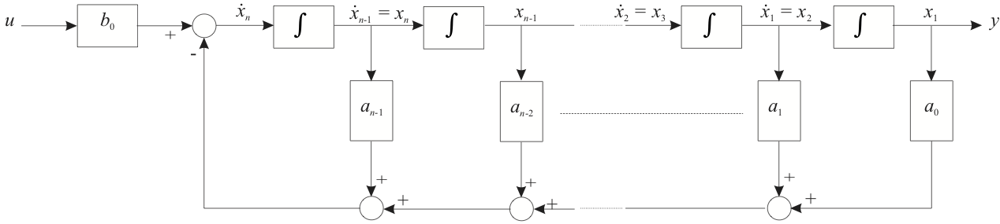
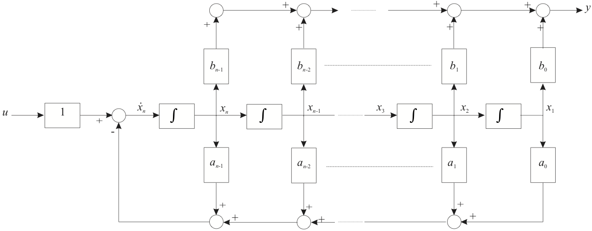
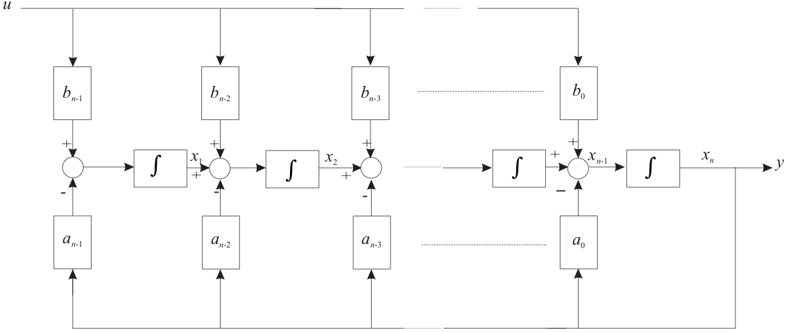
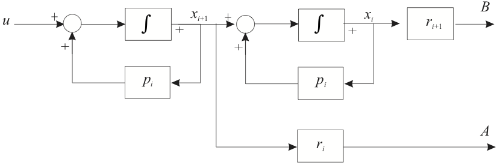

---
redirect_from:
  - "/07/4/canon"
interact_link: content/07/4/canon.ipynb
title: 'Canonical Forms'
prev_page:
  url: /07/3/tr4ss
  title: 'Time Response for State Space Models'
next_page:
  url: /07/5/systransf
  title: 'Transformation of States and System Diagonalization'
comment: "***PROGRAMMATICALLY GENERATED, DO NOT EDIT. SEE ORIGINAL FILES IN /content***"
---

# Canonical Forms

Although a state-space model may uniquely represent a given dynamic
system, there is no state-space model that uniquely represents a given
transfer function. That is there are many state-space models that can be
transformed into a given transfer function. If one begins the analysis
of a dynamic system from an analysis of the elementary dynamics then the
state space model that results from such an analysis will accurately
reflect the physical state variables in the system. However, if one's
analysis begins from a differential equation or (equivalently) from a
transfer function, then it is convenient to transform the model
description into one of a small number of "standard" or *canonical
forms*.

## Part 1: Introducing Canonical Forms

Standard forms for state space models derived from differential
equations or transfer function models.

-   Derivation of the companion form

* Example

## Converting a Differential Equation into State Space Form

These notes describe how a general differential equation may be converted into a state-space model.

### Differential Equation into State Space

Consider the general differential equation:

$$\frac{d^{n}y}{dt^{n}} +
a_{n-1}\frac{d^{n-1}y}{dt^{n-1}}+a_{n-2}\frac{d^{n-2}y}{dt^{n-2}}+\cdots+a_1\frac{dy}{dt}+a_0
y = b_0 u$$

In class we will show how this can be converted into the so-called "companion form" state-space model.

We rearrange this equation so that the highest power is on the left

$$\frac{d^{n}y}{dt^{n}} = -a_{n-1}\frac{d^{n-1}y}{dt^{n-1}}-a_{n-2}\frac{d^{n-2}y}{dt^{n-2}}-\cdots-a_1\frac{dy}{dt}-a_0 y + b_0 u.$$ 

Let:

$$\begin{eqnarray*}
x_1 &=& y \\ x_2 &=& \frac{dy}{dt} \\
x_3 & = & \frac{d^2y}{dt^2} \\ 
\vdots \\ 
x_{n-1} &=& \frac{d^{n-2}y}{dt^{n-2}} \\ 
x_{n} &=& \frac{d^{n-1}y}{dt^{n-1}}
\end{eqnarray*}$$

If we differentiate both sides of these new definitions we obtain

$$\begin{eqnarray*}
\dot{x}_1 &=& \frac{dy}{dt} \\
\dot{x}_2 &=& \frac{d^2y}{dt^2} \\
\dot{x}_3 & = & \frac{d^3y}{dt^3} \\ 
\vdots \\ 
\dot{x}_{n-1}  &=& \frac{d^{n-1}y}{dt^{n-1}} \\
\dot{x}_{n} &=& \frac{d^{n}y}{dt^{n}}
\end{eqnarray*}$$

These equations represent the left-hand-side of the state equations and if we make the substitutions we get 

$$\begin{eqnarray*}
\dot{x}_1 &=& x_2 \\ 
\dot{x}_2 &=&  x_3   \\
\dot{x}_3 & = &  x_4 \\ 
\vdots \\ 
\dot{x}_{n-1}  &=& x_n \\ 
\dot{x}_{n} &=& -a_{0}x_1 -a_1x_2 - \cdots  -a_{n-2}x_{n-1} -a_{n-1}x_{n} + b_0 u
\end{eqnarray*}$$

We then define the state vector 

$$\mathbf{x}=[x_1,\ x_2,\ \ldots,\ x_n]^T$$ 

and the matrix form of the state equations are

$$\dot{\mathbf{x}} = \left[\begin{array}{ccccc}
  0 & 1 & 0 & \cdots & 0 \\
  0 & 0 & 1 & \cdots & 0 \\
  \vdots & \vdots & \vdots & \ddots & \vdots \\
  0 & 0 & 0 & \cdots & 1 \\
  -a_{0} & -a_{1} & -a_{2} & \cdots & -a_{n-1}
\end{array}\right]\mathbf{x}+\left[\begin{array}{c}
  0 \\
  0 \\
  0 \\
  \vdots \\
  1
\end{array}\right]u$$ 

The system matrix is in "*companion form*", so called because the coefficients in the final row are the same as for the differential equation. The output equation depends on the dependent variable of interest but the simplest is $y=x_1$ which gives the solution of the differential equation. Thus 

$$y = [1,\ 0,\ 0,\ \ldots, 0] \mathbf{x}.$$

### Transfer Function

The transfer function equivalent of this differential equation is obtained from the differential equation: 

$$\frac{d^{n}y}{dt^{n}} + a_{n-1}\frac{d^{n-1}y}{dt^{n-1}}+a_{n-2}\frac{d^{n-2}y}{dt^{n-2}}+\cdots+a_1\frac{dy}{dt}+a_0 y = b_0 u$$ 

The transform of this equation, ignoring initial conditions, is 

$$\left(s^n + a_{n-1}s^{n-1}+a_{n-2}s^{n-2}+\cdots+a_1s+a_0\right)Y(s) = b_0 U(s)$$ 

so the transfer function is

$$G(s) = \frac{Y(s)}{U(s)} = \frac{b_0}{s^n + a_{n-1}s^{n-1}+a_{n-2}s^{n-2}+\cdots+a_1s+a_0}.$$ 

Note that the numerator has no terms in $s$. We shall consider completely general case for both proper and strictly proper systems later.

## The Companion Form

We have just shown that a state space model for the system defined by the **general differential equation** was the **companion form**.

### General differential equation

$$\frac{d^{n}y}{dt^{n}} +
a_{n-1}\frac{d^{n-1}y}{dt^{n-1}}+a_{n-2}\frac{d^{n-2}y}{dt^{n-2}}+\cdots+a_1\frac{dy}{dt}+a_0
y = b_0 u$$ 

or transfer function 

$$\begin{equation}
G(s) = \frac{Y(s)}{U(s)} = \frac{b_0}{s^n +
a_{n-1}s^{n-1}+a_{n-2}s^{n-2}+\cdots+a_1s+a_0}.\end{equation}$$ 

The state variables in this model are the so-called "*phase variables*" $x_1 = y$,
$x_2 = dy/dt$, $\ldots$ $x_n = dy^{n-1}/dt^{n-1}$.

### Companion Form

$$\begin{eqnarray*}
 \dot{\mathbf{x}} &=&
\left[\begin{array}{ccccc}
  0 & 1 & 0 & \cdots & 0 \\
  0 & 0 & 1 & \cdots & 0 \\
  \vdots & \vdots & \vdots & \ddots & \vdots \\
  0 & 0 & 0 & \cdots & 1 \\
  -a_{0} & -a_{1} & -a_{2} & \cdots & -a_{n-1}
\end{array}\right]\mathbf{x}+\left[\begin{array}{c}
  0 \\
  0 \\
  0 \\
  \vdots \\
  b_0
\end{array}\right]u\\
y & = & [1,\ 0,\ 0,\ \ldots, 0] \mathbf{x}.\end{eqnarray*}$$

The structure of this state-space model is illustrated in Figure 1.

### Figure 1: Block Diagram of Companion Form




### System with a Strictly Proper Transfer Function

Now let us consider the case of a system that has derivatives of the
input.

A strictly proper system has transfer function

$$G(s)=\frac{Y(s)}{U(s)} = \frac{b_ms^m +
b_{m-1}s^{m-1}+b_{m-2}s^{m-2}+\cdots+b_1s+b_0}{s^n +
a_{n-1}s^{n-1}+a_{n-2}s^{n-2}+\cdots+a_1s+a_0}$$ 

where $m<n$.

In class, we will show how this more general system converted into a state-space model.

Well, let us introduce an intermediate variable $W(s)$ and use this to
split the transfer function into two parts like so: 

$$\begin{equation}
W(s) = \frac{1}{s^n +
a_{n-1}s^{n-1}+a_{n-2}s^{n-2}+\cdots+a_1s+a_0}U(s)\end{equation}$$ 

and

$$\begin{equation}
Y(s) = \left(b_ms^m +
b_{m-1}s^{m-1}+b_{m-2}s^{m-2}+\cdots+b_1s+b_0\right)W(s).\end{equation}$$

Now equation (2) has the same form as the system of equation (1) with $b_0 = 1$. So if we define our first phase
variable to be $X_1(s) = W(s)$ then the state matrix $\mathbf{A}$ will be the same as for the previous example and the input matrix $\mathbf{B} = \left[0, 0, \ldots, 1\right]^T$. To determine the output matrix $\mathbf{C}$ we inverse Laplace transform equation (3) to
get: 

$$\begin{equation}
y(t) = b_m\frac{d^m}{dt^m}w(t) +
b_{m-1}\frac{d^{m-1}}{dt^{m-1}}w(t)+\cdots+b_1\frac{d}{dt}w(t)+
b_0w(t).\end{equation}$$ 

Now, since by definition $x_1(t) = w(t)$, then

$$\begin{equation}
y(t) = b_mx_{m+1}(t) + b_{m-1}x_m(t)+\cdots+b_1x_2(t)+
b_0x_1(t).\end{equation}$$ 

Where, in (5), substitutions have been made according to the definition of the phase variables. 

The vector state equations are therefore: 

$$\begin{eqnarray*}
 \dot{\mathbf{x}} &=&
\left[\begin{array}{ccccc}
  0 & 1 & 0 & \cdots & 0 \\
  0 & 0 & 1 & \cdots & 0 \\
  \vdots & \vdots & \vdots & \ddots & \vdots \\
  0 & 0 & 0 & \cdots & 1 \\
  -a_{0} & -a_{1} & -a_{2} & \cdots & -a_{n-1}
\end{array}\right]\mathbf{x}+\left[\begin{array}{c}
  0 \\
  0 \\
  0 \\
  \vdots \\
  1
\end{array}\right]u\\
y & = & [b_0,\ b_1,\ \dots,\ b_{m-1}, b_m]
\mathbf{x}.\end{eqnarray*}$$ 

Note that the coefficients of the numerator appear in reverse order in the $\mathbf{C}$ matrix. The structure of
this system is illustrated in Figure 2 for the case $m=n-1$.

### Figure 2: System with a Strictly Proper Transfer Function



### System with a Proper Transfer Function

The general form of a transfer function of a proper single-input,
single-output system of order $n$ is

$$\frac{b_ns^n+b_{n-1}s^{n-1}+\cdots+b_1s + b_0}{s^n+a_{n-1}s^{n-1}+\cdots+a_1s + a_0}$$

In class, we will show how this system converted into state-space form.

An alternative form, obtained by dividing the numerator by the
denominator, is

$$b_n+\frac{(b_{n-1} - b_n a_{n-1})s^{n-1}+\cdots+(b_1 - b_n a_1)+(b_0 - b_n a_0)}{s^n+a_{n-1}s^{n-1}+\cdots+a_1s + a_0}.$$

If we define $d=b_n$ and the modified numerator coefficients are

$$c_j=b_j - b_n a_j,\ j=1,2,\ldots,n$$ 

then the transfer function may be re-written

$$d+\frac{c_{n-1}s^{n-1}+c_{n-2}s^{n-2}+\cdots+c_1s + c_n}{s^n+a_{n-1}s^{n-1}+\cdots++a_1s + a_0}.$$

Writing the transfer function in its functional form we have:

$$Y(s)=d U(s) +\frac{c_{n-1}s^{n-1}+c_{n-2}s^{n-2}+\cdots+c_1s +
c_0}{s^n+a_{n-1}s^{n-1}+\cdots+a_1s + a_0}U(s).$$ 

Performing a similar
analysis, as before, we obtain the state-equations for a proper system:

$$\begin{aligned}
\dot{\mathbf{x}} & = & \left[\begin{array}{ccccc}
  0 & 1 & 0 & \cdots & 0 \\
  0 & 0 & 1 & \cdots & 0 \\
  \vdots & \vdots & \vdots & \ddots & \vdots \\
  0 & 0 & 0 & \cdots & 1 \\
  -a_{0} & -a_{1} & -a_{2} & \cdots & -a_{n-1}
\end{array}\right]\mathbf{x}+\left[\begin{array}{c}
  0 \\
  0 \\
  0 \\
  \vdots \\
  1
\end{array}\right]u\\
y & = & [c_0,\ c_1,\ \dots,\ c_{n-1}, c_n] \mathbf{x} + d
u.\end{aligned}$$ 

The block diagram for this system is illustrated in Figure 3.

### Figure 3: System with a Proper Transfer Function


### Example 1

A system has transfer function

$$G(s)=\frac{Y(s)}{U(s)}=\frac{2s^3 + 16s^2 + 30s + 8}{s^3 + 7s^2 + 10s}$$

This system is "proper" because order of numerator equals order of denominator.

Determine the system state-space model in companion form.

#### Solution

First divide the numerator into the denominator to get 

$$\begin{eqnarray*}
G(s)&=&\frac{2(s^3 + 7s^2 + 10s) + 2s^2 + 10s + 8}{s^3 + 7s^2 +
10s}\\ &=& \frac{2s^2 + 10s + 8}{s^3 + 7s^2 + 10s} +
2.\end{eqnarray*}$$

The companion form of the state matrices are 

$$\begin{eqnarray*}
\mathbf{A} & = & \left[\begin{array}{ccc}
  0 & 1 & 0 \\
  0 & 0 & 1 \\
  0 & -10 & -7
\end{array}\right]\ \mathbf{B}=\left[\begin{array}{c}
  0 \\
  0 \\
  1
\end{array}\right]\\ \mathbf{C} & = & \left[\begin{array}{ccc}
  8 & 10 & 2
\end{array}\right]\ \mathbf{D}=\left[2\right]\end{eqnarray*}$$

## End of Pre-Class Presentation

In class we will:

-   Work through the three cases introduced here

-   Complete the worked example

## Part 2: Other Canonical Forms

- Controller and Observer Canonical Forms

- Normal form

- Jordan forms

## Controller Canonical Form

If one defines a transfer function in , e.g. as shown in the slide entitled **A Litte MATLAB** below, the result of
converting the system into state-space form using MATLAB's `tf2ss` function is rather surprisingly not the companion form we have seen before. 

Instead, the result is what is known as the *Controller Canonical Form*. This is still a companion form because the coefficients of the $\mathbf{A}$ and $\mathbf{C}$ matrices are the coefficients of the transfer function's denominator and numerator polynomials.

### A Little MATLAB

Let 

$$G(s) =\frac{Y(s)}{U(s)} = \frac{s^2 + 7s + 2 }{s^3 + 9s^2 + 26s + 24}$$


{:.input_area}
```matlab
format compact
num=[1, 7, 2]; den=[1, 9, 26 24];
[A,B,C,D]=tf2ss(num,den)
```


{:.output_stream}
```
A =
    -9   -26   -24
     1     0     0
     0     1     0
B =
     1
     0
     0
C =
     1     7     2
D =
     0

```

Result: 

$$\begin{eqnarray*}
\dot{\mathbf{x}} & = &\left[\begin{array}{ccc}
  -9 & -26 & -24  \\
  1 & 0 & 0  \\
  0 & 1  & 0
 \end{array}\right]\mathbf{x}+\left[\begin{array}{c}
  1 \\
  0 \\
  0
\end{array}\right]u\\
y & = & [1,\ 7,\ 2] \mathbf{x}.\end{eqnarray*}$$

The controller canonical form is simply obtained by re-ordering the phase variables as illustrated below. 

### The Companion Form

$$\begin{eqnarray*}
 \left[\begin{array}{c}
  \dot{x}_{1} \\
  \dot{x}_{2} \\
  \vdots \\
  \dot{x}_{n-1} \\
  \dot{x}_n
\end{array}\right] &=& \left[\begin{array}{ccccc}
  0 & 1 & 0 & \cdots & 0 \\
  0 & 0 & 1 & \cdots & 0 \\
  \vdots & \vdots & \vdots & \ddots & \vdots \\
  0 & 0 & 0 & \cdots & 1 \\
  -a_{0} & -a_{1} & -a_{2} & \cdots & -a_{n-1}
\end{array}\right]\left[\begin{array}{c}
  {x}_{1} \\
  {x}_{2} \\
  \vdots \\
  {x}_{n-1} \\
  {x}_{n}
\end{array}\right]+\left[\begin{array}{c}
  0 \\
  0 \\
  \vdots \\
  0 \\
  1
\end{array}\right]u\\
y & = & [b_0,\ b_1,\ \dots,\ b_{n-2}, b_{n-1}][
  {x}_{1},\
  {x}_{2},\
  \ldots,\
  {x}_{n-1},\
  {x}_{n}]^T\end{eqnarray*}$$

### Controller canonical form: Re-number States

$$\begin{eqnarray*}
 \left[\begin{array}{c}
  \dot{x}_{n} \\
  \dot{x}_{n-1} \\
  \vdots \\
  \dot{x}_{2} \\
  \dot{x}_{1}
\end{array}\right] &=& \left[\begin{array}{ccccc}
  0 & 1 & 0 & \cdots & 0 \\
  0 & 0 & 1 & \cdots & 0 \\
  \vdots & \vdots & \vdots & \ddots & \vdots \\
  0 & 0 & 0 & \cdots & 1 \\
  -a_{0} & -a_{1} & -a_{2} & \cdots & -a_{n-1}
\end{array}\right]\left[\begin{array}{c}
  {x}_{n} \\
  {x}_{n-1} \\
  \vdots \\
  {x}_{2} \\
  {x}_{1}
\end{array}\right]+\left[\begin{array}{c}
  0 \\
  0 \\
  \vdots \\
  0 \\
  1
\end{array}\right]u\\ y & = & [b_0,\ b_1,\ \dots,\ b_{n-2}, b_{n-1}]
\left[
  {x}_{n},\
  {x}_{n-1},\
  \ldots,\
  {x}_{2},\
  {x}_{1}
\right]^T\end{eqnarray*}$$

The general form of the controller canonical state-space model is the as shown below.

### Controller canonical form: Re-Ordered States

$$\begin{eqnarray*}
 \left[\begin{array}{c}
  \dot{x}_{1} \\
  \dot{x}_{2} \\
  \vdots \\
  \dot{x}_{n-1} \\
  \dot{x}_{n}
\end{array}\right] &=& \left[\begin{array}{ccccc}
 -a_{n-1} & -a_{n-2} & \cdots & -a_{1} & -a_{0} \\
   1 & 0 & \cdots & 0 & 0 \\
  0 & 1 & \cdots & 0 & 0 \\
  \vdots & \vdots & \ddots & \vdots & \vdots \\
  0 & 0 & \cdots & 1 & 0
\end{array}\right]\left[\begin{array}{c}
  {x}_{1} \\
  {x}_{2} \\
  \vdots \\
  {x}_{n-1} \\
  {x}_{n}
\end{array}\right]+\left[\begin{array}{c}
  1 \\
  0 \\
  \vdots \\
  0 \\
  0
\end{array}\right]u\\ y & = & [b_{n-1},\ b_{n-2},\ \dots,\ b_{1}, b_{0}]
\left[
  {x}_{1},\
  {x}_{2},\
  \ldots,\
  {x}_{n-1},\
  {x}_{n}
\right]^T\end{eqnarray*}$$

### Figure 4: Controller Canonical Form: Block Diagram


## Observer Canonical Form

The observer canonical form is the "dual" of the controller canonical
form.

The state equations are shown below. Note that the $\mathbf{A}$
matrix is the transpose of the controller canonical form and that
$\mathbf{b}$ and $\mathbf{c}$ are the transposes of the $\mathbf{c}$ and
$\mathbf{b}$ matrices, respectively, of the controller canonical form.

### Observer canonical form

$$\begin{eqnarray*}
 \left[\begin{array}{c}
  \dot{x}_{1} \\
  \dot{x}_{2} \\
  \vdots \\
  \dot{x}_{n-1} \\
  \dot{x}_{n}
\end{array}\right] &=& \left[\begin{array}{ccccc}
 -a_{n-1} & 1 & 0 & \cdots & 0 \\
 -a_{n-2} & 0 & 1 & \cdots & 0 \\
 -a_{n-3} & 0 & 0 & \cdots & 0 \\
  \vdots & \vdots & \vdots & \ddots & \vdots \\
 -a_{1} & 0 & \cdots & 0 & 1 \\
 -a_{0} & 0 & \cdots & 0 & 0
\end{array}\right]\left[\begin{array}{c}
  {x}_{1} \\
  {x}_{2} \\
  {x}_{3} \\
  \vdots \\
  {x}_{n-1} \\
  {x}_{n}
\end{array}\right]+\left[\begin{array}{c}
  b_{n-1} \\
  b_{n-2} \\
  b_{n-3} \\
  \vdots \\
  b_{1} \\
  b_0
\end{array}\right]u\\ y & = & [1,\ 0,\ 0,\ \ldots, 0]\left[
  {x}_{1},\
  {x}_{2},\
  \ldots,\
  {x}_{n-1},\
  {x}_{n}
\right]^T\end{eqnarray*}$$

### Figure 5: Observer Canonical Form: Block Diagram



### Example 2

The system with transfer function

$$G(s)=\frac{Y(s)}{U(s)}=\frac{2s^3 + 16s^2 + 30s + 8}{s^3 + 7s^2 + 10s}$$

was found, earlier, to have companion form 

$$\begin{eqnarray*}
\mathbf{A} & = & \left[\begin{array}{ccc}
  0 & 1 & 0 \\
  0 & 0 & 1 \\
  0 & -10 & -7
\end{array}\right]\ \mathbf{B}=\left[\begin{array}{c}
  0 \\
  0 \\
  1
\end{array}\right]\\ \mathbf{C} & = & \left[\begin{array}{ccc}
  8 & 10 & 2
\end{array}\right]\ \mathbf{D}=\left[2\right]\end{eqnarray*}$$

Express this system in controller canonical and observer canonical
forms.

### Solution

The controller canonical form is obtained by re-ordering the state
variables: 

$$\begin{eqnarray*}
\mathbf{A} & = & \left[\begin{array}{ccc}
  -7 & -10 & 0 \\
  1 & 0 & 0 \\
  0 & 1 & 0
\end{array}\right]\ \mathbf{B}=\left[\begin{array}{c}
  1 \\
  0 \\
  0
\end{array}\right]\\ \mathbf{C} & = & \left[\begin{array}{ccc}
  2 & 10 & 8
\end{array}\right]\ \mathbf{D}=\left[2\right]\end{eqnarray*}$$ 

and the
observable canonical form is obtained by transposing the $\mathbf{A}$
matrix and letting $\mathbf{B} = \mathbf{C}^T$ and
$\mathbf{C}=\mathbf{B}^T$. 

$$\begin{eqnarray*}
\mathbf{A} & = & \left[\begin{array}{ccc}
  -7 & 1 & 0 \\
  -10 & 0 & 1 \\
  0 & 0 & 0
\end{array}\right]\ \mathbf{B}=\left[\begin{array}{c}
  2 \\
  10 \\
  8
\end{array}\right]\\ \mathbf{C} & = & \left[\begin{array}{ccc}
  1 & 0 & 0
\end{array}\right]\ \mathbf{D}=\left[2\right]\end{eqnarray*}$$

### MATLAB Code for Examples

We will show these in class.

#### Controller canonical companion form


{:.input_area}
```matlab
Acc = [-7, -10, 0; 1, 0, 0; 0, 1, 0];
Bcc = [1, 0, 0]';
Ccc = [2, 10, 8]; D = 2;
Gcc = ss(Acc,Bcc,Ccc,D)
```


{:.output_stream}
```

Gcc =
 
  A = 
        x1   x2   x3
   x1   -7  -10    0
   x2    1    0    0
   x3    0    1    0
 
  B = 
       u1
   x1   1
   x2   0
   x3   0
 
  C = 
       x1  x2  x3
   y1   2  10   8
 
  D = 
       u1
   y1   2
 
Continuous-time state-space model.


```

#### Observer canonical form

To create the observer canonical form, we transpose some of the matrices


{:.input_area}
```matlab
Goc = ss(Acc',Ccc',Bcc',D)
```


{:.output_stream}
```

Goc =
 
  A = 
        x1   x2   x3
   x1   -7    1    0
   x2  -10    0    1
   x3    0    0    0
 
  B = 
       u1
   x1   2
   x2  10
   x3   8
 
  C = 
       x1  x2  x3
   y1   1   0   0
 
  D = 
       u1
   y1   2
 
Continuous-time state-space model.


```

#### Companion form

To obtain the companion form, some trickery is needed to re-order the controller
canonical state matrices:


{:.input_area}
```matlab
[n,m]=size(Acc); % n = m = 3 for the example
Acf = Acc(n:-1:1,n:-1:1);
Bcf = Bcc(n:-1:1,:);
Ccf = Ccc(:,n:-1:1);
```


The companion form is then created from the reordered matrices.


{:.input_area}
```matlab
Gcf = ss(Acf,Bcf,Ccf,D)
```


{:.output_stream}
```

Gcf =
 
  A = 
        x1   x2   x3
   x1    0    1    0
   x2    0    0    1
   x3    0  -10   -7
 
  B = 
       u1
   x1   0
   x2   0
   x3   1
 
  C = 
       x1  x2  x3
   y1   8  10   2
 
  D = 
       u1
   y1   2
 
Continuous-time state-space model.


```

#### MATLAB's built-in canonical form

This is none of the forms discussed. So for example if we convert the transfer function directly:


{:.input_area}
```matlab
num = [2, 16, 30, 8];
den = [1, 7, 10, 0];
G = tf(num,den)
```


{:.output_stream}
```

G =
 
  2 s^3 + 16 s^2 + 30 s + 8
  -------------------------
     s^3 + 7 s^2 + 10 s
 
Continuous-time transfer function.


```

Then convert into state space using the `ss` function


{:.input_area}
```matlab
Gtf = ss(G)
```


{:.output_stream}
```

Gtf =
 
  A = 
         x1    x2    x3
   x1    -7  -2.5     0
   x2     4     0     0
   x3     0  0.25     0
 
  B = 
       u1
   x1   4
   x2   0
   x3   0
 
  C = 
          x1     x2     x3
   y1    0.5  0.625      2
 
  D = 
       u1
   y1   2
 
Continuous-time state-space model.


```

This is a canonical form known only to the Mathworks! The algorithm used to generate it presumably has some useful numerical properties.

#### All forms represent the same transfer function!


{:.input_area}
```matlab
G1 = tf(Gtf) % Mathworks tf-t--ss form
```


{:.output_stream}
```

G1 =
 
  2 s^3 + 16 s^2 + 30 s + 8
  -------------------------
     s^3 + 7 s^2 + 10 s
 
Continuous-time transfer function.


```


{:.input_area}
```matlab
G2 = tf(Gcc) % Controller Canonical form
```


{:.output_stream}
```

G2 =
 
  2 s^3 + 16 s^2 + 30 s + 8
  -------------------------
     s^3 + 7 s^2 + 10 s
 
Continuous-time transfer function.


```


{:.input_area}
```matlab
G3 = tf(Goc) % Observer Canonical Form
```


{:.output_stream}
```

G3 =
 
  2 s^3 + 16 s^2 + 30 s + 8
  -------------------------
     s^3 + 7 s^2 + 10 s
 
Continuous-time transfer function.


```


{:.input_area}
```matlab
G4 = tf(Gcf)
```


{:.output_stream}
```

G4 =
 
  2 s^3 + 16 s^2 + 30 s + 8
  -------------------------
     s^3 + 7 s^2 + 10 s
 
Continuous-time transfer function.


```

We now consider one final canonical form, the so-called "normal" or "parallel" form.

## Normal Canonical Form

The normal form of a state-space model isolates the characteristic values, also called the eigen values, or system poles, of the system.

If all the poles of a system are real and distinct then the transfer function may be written as a partial fraction expansion

$$G(s) = \frac{Y(s)}{U(s)} = \left\{\frac{r_1}{s-p_1} +
\frac{r_2}{s-p_2} + \cdots + \frac{r_n}{s-p_n} + d\right\}$$ 

we can develop a state-space model for each term:

$$Y(s)=\frac{r_i}{s-p_i}U(s).$$ 

$$\begin{eqnarray*}
(s-p_i)Y(s) & = & r_i U(s)\\ \frac{d}{dt}y(t)-p_i y(t) &=& r_i
u(t).\end{eqnarray*}$$ 

If we let $x_i(t) = y(t)$ then 

$$\begin{eqnarray*}
\dot{x}_i &=& p_i x_i + r_i u \\ y &=& x_i\end{eqnarray*}$$ 

Thus, each partial fraction term may be represented by the block diagram shown in Figure 6.

### Figure 6 State-Space model of a first-order system

$$\begin{eqnarray*}
\dot{x}_i &=& p_i x_i + r_i u \\ y &=& x_i\end{eqnarray*}$$


Thus, the total state-space model of the system is simply the sum of such terms as shown in Figure 7.

### Figure 7 Normal Canonical Form: Block Diagram


Therefore the state space model for the whole system is as shown below.

### Normal Observable Canonical State-Space Model

$$\begin{eqnarray*}
 \mathbf{\dot{x}}&=&\left[\begin{array}{ccccc}
  p_1 & 0 & 0 & \cdots & 0 \\
  0 & p_2 & 0 & \cdots & 0 \\
  0 & 0 & p_3 & \cdots & 0 \\
  \vdots & \vdots & \vdots & \ddots & \vdots \\
  0 & 0 & 0 & \cdots & p_n
\end{array}\right] \mathbf{x} + \left[\begin{array}{c}
  r_1 \\
  r_2 \\
  r_3 \\
  \vdots \\
  r_n
\end{array}\right] u\\ y &=& \left[1,\ 1,\ 1,\ \ldots,\ 1\right] \mathbf{x} + d u\end{eqnarray*}$$

Note that the residues of the partial fraction expansion $r_1,\ r_2,\ \ldots,\ r_n$ have been allocated to the input side of the block diagram and therefore to the input matrix in the state space model. This model, in which all the elements of the output matrix are unity, is called the "*Normal Observable Canonical Form*". It would be equally
valid to allocate the residues to the output matrix, leaving the elements of the input matrix as unity, this would be the "*Normal Controllable Canonical Form*" illustrated below.

### Normal Controllable Canonical State-Space Model

$$\begin{eqnarray*}
 \mathbf{\dot{x}}&=&\left[\begin{array}{ccccc}
  p_1 & 0 & 0 & \cdots & 0 \\
  0 & p_2 & 0 & \cdots & 0 \\
  0 & 0 & p_3 & \cdots & 0 \\
  \vdots & \vdots & \vdots & \ddots & \vdots \\
  0 & 0 & 0 & \cdots & p_n
\end{array}\right] \mathbf{x} + \left[\begin{array}{c}
  1 \\
  1 \\
  1 \\
  \vdots \\
  1
\end{array}\right] u\\ y &=& \left[r_1,\ r_2,\ r_3,\ \ldots,\ r_n\right] \mathbf{x} + d u\end{eqnarray*}$$

The most important property of the normal canonical model is that the $\mathbf{A}$ matrix is diagonal and that the elements on the diagonal are the eigenvalues of the system matrix. If you form the systemtransition matrix for this system each state response is simply of the form $r_i e^{p_i t}$, that is each state response is equal to the corresponding mode response<sup>1</sup>.

### Example 3

Determine the observer and controller normal canonical forms for the system examined earlier.

#### Solution

$$\begin{eqnarray*}
G(s) &=& \frac{2s^3 + 16s^2 + 30s + 8}{s^3 + 7s^2 + 10s} \\
 &=&
\frac{2s^2 + 10s + 8}{s^3 + 7s^2 + 10s} + 2 \\
 &=& \frac{2s^2 + 10s + 8}{s(s+2)(s+5)} + 2 \\
 &=& \frac{4/5}{s} + \frac{2/3}{s+2} + \frac{8/15}{s+5} + 2
\\\end{eqnarray*}$$ 

The normal controllable canonical form therefore is:

$$\begin{eqnarray*}
\mathbf{\dot{x}}&=&\left[\begin{array}{ccc}
  0 & 0 & 0  \\
  0 & -2 & 0  \\
  0 & 0 & -5  \\
 \end{array}\right] \mathbf{x} + \left[\begin{array}{c}
  4/5 \\
  2/3 \\
  8/15
\end{array}\right] u\\ y &=& \left[1,\ 1,\ 1\right] \mathbf{x} + 2 u\end{eqnarray*}$$

and the normal observable canonical form is: 

$$\begin{eqnarray*}
\mathbf{\dot{x}}&=&\left[\begin{array}{ccc}
  0 & 0 & 0  \\
  0 & -2 & 0  \\
  0 & 0 & -5  \\
 \end{array}\right] \mathbf{x} + \left[\begin{array}{c}
  1 \\
  1  \\
  1
\end{array}\right] u\\ y &=& \left[4/5,\ 2/3,\ 8/15\right] \mathbf{x} + 2
u\end{eqnarray*}$$

## Time Response from Normal Form

Notice that in the case of a system defined in *normal form*, because the $\mathbf{A}$ matrix is diagonal, the state equations are decoupled from each other and can be solved independently. This canonical form is useful for the solution of the state equations. 

Given initial states $x_1(t)=x_{1}(0)$, $x_2(t)=x_2(0)$, etc at $t=0$

$$\begin{eqnarray*}
     sX_1 (s) - x_{1}(0)  & = & p_1 X_1 (s) + r_1 U(s) \\
     (s - p_1 )X_1 (s) & = & x_{1}(0)  + r_1 U(s) \\
     X_1 (s) & = & \frac{x_{1}(0)}{s - p_1 } + \frac{r_1 }{s - p_1 }U(s)
    \end{eqnarray*}$$ 
    
    

Taking inverse Laplace transforms:

$$x_1 = x_{1}(0)e^{p_1t}+r_1\int_0^tu(\tau)e^{p_1(t-\tau)}d\tau$$ 

Repeated for the other states.

These are then combined through the output equation to give the solution for $y$: 

$$y(t) = x_1(t) + x_2(t) + ... + x_n(t) + du(t).$$

### System Response

Combine state responses through the output equation

$$y(t) = x_1(t) + x_2(t) + ... + x_n(t) + du(t)$$ 

$$\begin{eqnarray*}
	y(t) & = & x_{1}(0)e^{p_1t}+r_1\int_0^tu(\tau)e^{p_1(t-\tau)}d\tau  \\
         & + &	x_{2}(0)e^{p_2t}+r_2\int_0^tu(\tau)e^{p_2(t-\tau)}d\tau \\
	     & \vdots & \\
	     & + & x_{n}(0)e^{p_nt}+r_n\int_0^tu(\tau)e^{p_n(t-\tau)}d\tau + du(t)\end{eqnarray*}$$
         

## Jordan Forms

Are needed for the special cases of

-   Systems with repeated poles

-   Systems with complex poles

These are discussed in the notes but will not be examined!

## System with Repeated Poles

If the transfer function has repeated poles, then the form of the model must be changed. The partial fraction expansion contains terms of the form 

$$\frac{r_i}{s-p_i} + \frac{r_{i+1}}{(s-p_i)^2}.$$ 

This is most easily implemented using the *Normal Controllable Canonical Form* using a series connection of the
block diagram for the single pole $$\frac{1}{s-p_i}$$ as shown in Figure 8. By examination of this diagram it should be clear that the signal seen at point $A$ is 

$$A(s) = \frac{r_i}{s-p_i}U(s)$$

and that at $B$ is

$$B(s) = \frac{1}{s-p_i}\times\frac{1}{s-p_i}\times r_{i+1} U(s)$$ as
required.

### Figure 8 Part of a system with repeated poles



For this portion of the state space model we have 

$$\begin{eqnarray*}
\left[\begin{array}{c}
  \dot{x}_i \\
  \dot{x}_{i+1}
\end{array}\right] &=& \left[\begin{array}{cc}
  p_i & 1 \\
  0 & p_i
\end{array}\right]\left[\begin{array}{c}
  x_i \\
  x_{i+1}
\end{array}\right] + \left[\begin{array}{c}
  0 \\
  1
\end{array}\right] u\\
y & = & \left[r_{i+1},\ r_i\right]\left[\begin{array}{c}
  x_i \\
  x_{i+1}
\end{array}\right].\end{eqnarray*}$$

By comparison of this result with the normal situation we see that the
state matrices (of the observer controllable canonical form) are
modified as follows.

-   in $\mathbf{A}$ 

    $$\left[\begin{array}{cc}
        p_i & 0 \\
        0 & p_{i+1} \\
      \end{array}\right] \rightarrow \left[\begin{array}{cc}
        p_i & 1 \\
        0 & p_{i} \\
      \end{array}\right];$$

-   in $\mathbf{B}$ 
   
    $$\left[\begin{array}{c}
        1 \\
        1  \\
      \end{array}\right] \rightarrow \left[\begin{array}{c}
        0 \\
        1 \\
      \end{array}\right];$$

-   in $\mathbf{C}$ 

     $$\left[\begin{array}{cc}
        r_i & r_{i+1}\\
      \end{array}\right] \rightarrow \left[\begin{array}{cc}
        r_{i+1} & r_i\\
      \end{array}\right].$$

The block 

$$\left[\begin{array}{cc}
    p_i & 1 \\
    0 & p_{i} \\
  \end{array}\right]$$
  
is known as a "*Jordan Block*". A matrix with one (or more) Jordan Blocks instead of a pure diagonal

$$\left[\begin{array}{cc}
    p_i & 0 \\
    0 & p_{i+1} \\
  \end{array}\right]$$
  
is in the "*Jordan Form*". The idea may be extended to systems with poles of higher multiplicity. For example for
the case where the multiplicity is 3 as in 

$$\frac{1}{(s-p_i)^3}$$ 

the Jordan Block is 

$$\left[\begin{array}{ccc}
    p_i & 1 & 0 \\
    0 & p_{i} & 1 \\
    0 & 0 & p_i
  \end{array}\right].$$

### Example 4

**Not examined**

The system with transfer function 

$$\begin{eqnarray*}
G(s) &=& \frac{1}{s^3 + 4s^2 + 5s + 2}\\
&=& \frac{1}{(s+1)^2(s+2)} \\ &=& \frac{-1}{s+1} +
\frac{1}{(s+1)^2} + \frac{1}{s+2}.\end{eqnarray*}$$ 

The normal canonical form is therefore given by: 

$$\begin{eqnarray*}
\mathbf{A} &=& \left[\begin{array}{ccc}
  -1 & 1 & 0 \\
  0 & -1 & 0 \\
  0 & 0 & -2
\end{array}\right] \mathbf{B} = \left[\begin{array}{c}
  0 \\
  1 \\
  1
\end{array}\right]\\ \mathbf{C} &=& \left[\begin{array}{ccc}
  1 & -1 & 1
\end{array}\right] \mathbf{D} = \left[0\right]\end{eqnarray*}$$

## Normal Canonical Form with Complex Poles

A system with complex poles will have a partial fraction expansion containing terms of the form

$$\frac{\Re\{ r_i\} + j\Im\{ r_i\}}{s - \Re\{p_i\} + j\Im\{p_i\}} + \frac{\Re\{r_i\} - j\Im\{ r_i\}}{s - \Re\{p_i\} - j\Im\{p_i\}}$$

(where the poles and the residuals both appear as complex conjugate pairs). We cannot implement these directly in state space form because the state matrices must have real coefficients to be realisable. However, the complex factors involved can be combined into a quadratic form and blocks replaced in the normal canonical form<sup>2</sup> as follows:

-   in $\mathbf{A}$ 

    $$\left[\begin{array}{cc}
        p_i & 0 \\
        0 & p_{i+1} \\
      \end{array}\right] \rightarrow \left[\begin{array}{cc}
        +\Re\{p_i\} & +\Im\{p_i\} \\
        -\Im\{p_i\} & +\Re\{p_i\} \\
      \end{array}\right];$$

-   in $\mathbf{B}$ 

    $$\left[\begin{array}{c}
        1 \\
        1  \\
      \end{array}\right] \rightarrow \left[\begin{array}{c}
        0 \\
        1 \\
      \end{array}\right];$$

-   in $\mathbf{C}$ 

    $$\left[\begin{array}{cc}
        r_i & r_{i+1}\\
      \end{array}\right] \rightarrow \left[\begin{array}{cc}
        2\Im\{r_{i}\} & 2\Re\{r_i\}\\
      \end{array}\right].$$

### Example 5

The system with transfer function 

$$\begin{eqnarray*}
G(s) &=& \frac{6s+6}{s^2 + 4s + 13}\\
&=& \frac{6(s+1)}{(s+2)^2 + 3^2} \\ &=&
\frac{6(s+1)}{(s+2+3j)(s+2-3j)}
\\ &=& \frac{3-j}{s+2+3j} + \frac{3-j}{s+2-3j}.\end{eqnarray*}$$ 

The normal canonical form is therefore given by: 

$$\begin{eqnarray*}
\mathbf{A} &=& \left[\begin{array}{cc}
  -2-3j & 0 \\
  0 & -2+3j
\end{array}\right] \mathbf{B} = \left[\begin{array}{c}
  1 \\
  1
\end{array}\right]\\ \mathbf{C} &=& \left[\begin{array}{cc}
  3-j & 3+j
\end{array}\right] \mathbf{D} = \left[0\right]\end{eqnarray*}$$ 

But this is not realisable so instead we use 

$$\begin{eqnarray*}
\mathbf{A} &=& \left[\begin{array}{cc}
  -2 & -3 \\
  3 & -2
\end{array}\right] \mathbf{B} = \left[\begin{array}{c}
  0 \\
  1
\end{array}\right]\\ \mathbf{C} &=& \left[\begin{array}{cc}
  -2 & -6
\end{array}\right] \mathbf{D} = \left[0\right].\end{eqnarray*}$$

## End of Pre-Class Presentation

In class we will work through the examples given here and if we have time we'll look at

-   Examples of controllable and observable forms

-   MATLAB and canonical forms

-   Normal form

-   Time response of normal form


## Footnotes

1. The proof is left as an exercise.

2. The details are left as an exercise.
