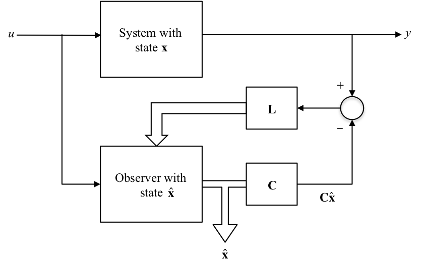
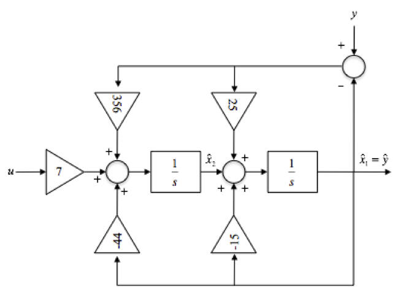

---
redirect_from:
  - "/08/3/observers"
interact_link: content/08/3/observers.ipynb
title: 'State Observers'
prev_page:
  url: /08/2/sfcontrol
  title: 'State-Feedback Control'
next_page:
  url: /08/4/observer_controller
  title: 'Combined Observer and Controller'
comment: "***PROGRAMMATICALLY GENERATED, DO NOT EDIT. SEE ORIGINAL FILES IN /content***"
---

# State Observers

-   In many practical cases it is not possible to measure all the states
    of a system.

-   That is we cannot form $u=r-\mathbf{Kx}$ for the purposes of
    feedback control because we do not have access to $\mathbf{x}$.

-   If we know $\mathbf{A}$, $\mathbf{B}$, $\mathbf{C}$, and
    $\mathbf{D}$ then it may be possible to reconstruct the states from
    one or more of the system outputs by means of an **observer**.

-   It is necessary that the system states be observable from the
    output(s).

### State Observer

The main idea is to construct a model of the system and subject it to the same input:

Severe differences occur between $\mathbf{x}$ and $\hat{\mathbf{x}}$ due
to disturbances and parameter errors. Solution:- Employ feedback !

**NB** To simplify treatment, we take $\mathbf{D}=0$.

### State Observer with Feedback

### Observer state equations

For the **observer** we have the state equations:

$$\frac{d{\bf{\hat x}}}{dt} = {\bf{A\hat x}} + {\bf{B}}u + {\bf{L}}\underbrace {(y - {\bf{C\hat x}})}_{\rm{feedback}}$$

### Observed State Errors

Let the error in the estimated states $\hat{\mathbf{x}}$ be:

$$\mathbf{e}=\mathbf{x}-\hat{\mathbf{x}}$$ 

then

$$\frac{d\mathbf{e}}{dt}=\frac{d\mathbf{x}}{dt}-\frac{d\hat{\mathbf{x}}}{dt}$$

Given,

$$\frac{d\mathbf{x}}{dt}=\mathbf{A}\mathbf{x}+\mathbf{B}u\ \mathrm{and}\ y=\mathbf{C}\mathbf{x}$$

then 

$$\begin{eqnarray*}
	\frac{d\mathbf{e}}{dt} & = & \left(\mathbf{A}\mathbf{x}+\mathbf{B}u\right)-\left\{\mathbf{A}\hat{\mathbf{x}}+\mathbf{B}u+\mathbf{L}(y-\mathbf{C}\hat{\mathbf{x}})\right\} \\
	& = & \mathbf{A}(\mathbf{x}-\hat{\mathbf{x}})-\mathbf{L}(\mathbf{C}\mathbf{x}-\mathbf{C}\hat{\mathbf{x}}) = \mathbf{Ae}-\mathbf{LCe}\\
	& = & (\mathbf{A}-\mathbf{LC})\mathbf{e}\end{eqnarray*}$$

### Properties of the Observed Error State Equations

-   These are the state equations for the observer error.

-   The errors decay to zero with time if the eigen values of
    $(\mathbf{A}-\mathbf{LC})$ lie in the left half plane (LHP).

-   In fact we can design the matrix $\mathbf{L}$ to place the eigen
    values anywhere we wish

-   If we place them well into the LHP then $\mathbf{e}$ will decay
    quickly to zero making the observer states accurately track the
    system states $\mathbf{x}$ after a short time.

-   $\hat{\mathbf{x}}$ can then be used for feedback control.

## Design of the L Matrix

This is particularly easy when we use the observer canonical form.

Given the TF:

$$\frac{Y(s)}{U(s)}=\frac{c_1s^{n-1}+\cdots+c_n}{s^n + a_1s^{n-1}+\cdots+a_n}$$

the matrices of the state space model are: 

$$\begin{eqnarray*}
	 {\bf{A}} & = & \left[ {\begin{array}{*{20}c}
	   { - a_1 } & 1 &  \cdots  & 0  \\
	   { - a_2 } & 0 &  \ddots  & {0}  \\
	    \vdots  &  \vdots  & {} &  \vdots   \\
	   { - a_n } & 0 &  \cdots  & 0  \\
	\end{array}} \right];\quad {\bf{B}} = \left[ {\begin{array}{*{20}c}
	   {c_1 }  \\
	   {c_2 }  \\
	    \vdots   \\
	   {c_n }  \\
	\end{array}} \right] \\ 
	 {\bf{C}} & = & \left[ {\begin{array}{*{20}c}
	   1 & 0 &  \cdots  & 0  \\
	\end{array}} \right];\quad {\bf{D}} = 0 \\ 	\end{eqnarray*}$$

and the feedback vector is: 

$$L = \left[ {\begin{array}{*{20}c}
   {l_1 } & {l_2 } &  \cdots  & {l_n }  \\
\end{array}} \right]^T$$ 

The state matrix of the observer is:

$${\bf{A}} - {\bf{LC}} = \left[ {\begin{array}{*{20}c}
   {( - a_1  - l_1 )} & 1 &  \cdots  & 0  \\
   {( - a_2  - l_2 )} & 0 &  \ddots  & 0  \\
    \vdots  &  \vdots  & {} &  \vdots   \\
   {( - a_n  - l_n )} & 0 &  \cdots  & 0  \\
\end{array}} \right]$$

The poles of the observer are the roots of the CE:

$$s^n+(a_1+l_1)s^{n-1}+\cdots+(a_n+l_n)=0$$

If the desired observer poles are at $s=p_1,p_2,\ldots,p_n$ then the
desired CE equation is: 

$$\begin{eqnarray*}
	\alpha_e(s) & = & (s-p_1)(s-p_2)\cdots(s-p_n) \\
	            & = & s^n + \alpha_1s^{n-1} + \cdots + \alpha_n = 0\end{eqnarray*}$$

The $l$ coefficients may be found by matching the two equations above.
Thus,

$$l_1=\alpha_1-a_1,\ l_2=\alpha_2-a_2,\ \cdots\ l_n=\alpha_n-a_n.$$

### In-Class Example 1

**Problem**: Design an observer with poles or eigen values
$\lambda_{1,2} = -20,\ -20$ using the observer canonical form for the
system with a TF: 

$$\frac{Y(s)}{U(s)}=\frac{7}{s^2+15s+44}.$$

**SOLUTION**: The observer canonical form gives:

$${\bf{A}} = \left[ {\begin{array}{*{20}c}
   { - 15} & 1  \\
   { - 44} & 0  \\
\end{array}} \right];\;{\bf{B}} = \left[ {\begin{array}{*{20}c}
   0  \\
   7  \\
\end{array}} \right];\;{\bf{C}} = \left[ {\begin{array}{*{20}c}
   1 & 0  \\
\end{array}} \right];\;{\bf{D}} = 0$$ 

with $\mathbf{L}=[l_1,\ l_2]^T$ we
have observer poles at the roots of: 

$$s^2+(15+l_1)s+(44+l_2)=0.$$

The desired CE is: 

$$\alpha_e(s)=(s + 20)(s + 20)=s^2+40s+400=0$$

Comparing coefficients gives: 

$$\begin{eqnarray*}
    s^1:\ 15 + l_1 & = & 40 \to l_1=25 \\
    s^0:\ 44 + l_2 & = & 400 \to l_2=356 \\ \end{eqnarray*}$$

So the observer states are given by:

$$\frac{d\hat{\mathbf{x}}}{dt}=\mathbf{A}\hat{\mathbf{x}}+\mathbf{B}u-\mathbf{L}(\mathbf{C}\hat{\mathbf{x}}-y)$$

where $\mathbf{L}=[25\ 356]^T.$

#### Block Diagram of the Observer

## Design of L Matrix for Other Forms of State Equation

When the observer canonical form is not used, then the design of the
observer is more difficult. Ackermann's formula can be adapted as
follows: 

$${\bf{L}}^T  = \left[ {\begin{array}{*{20}c}
   0 &  \ldots  & 0 & 1  \\
\end{array}} \right]\mathcal{O}^{ - 1} \alpha _e ({\bf{A}}^T )$$

$\mathcal{O}$ is the observability matrix:

$$\mathcal{O}=[\mathbf{C}^T\vdots\mathbf{A}^T\mathbf{C}^T\vdots\cdots\vdots(\mathbf{A}^T)^{n-1}\mathbf{C}^T]$$

and if $\alpha_e(s)=s^n + \alpha_1s^{n-1}+\cdots+\alpha_n$ then

$$\alpha_e(\mathbf{A}^T)=(\mathbf{A}^T)^n + \alpha_1(\mathbf{A}^T)^{n-1}+\cdots+\mathbf{I}\alpha_n.$$

Notice that if the system is unobservable, then the matrix inverse
$\mathcal{O}^{-1}$ does not exist and we cannot design an observer for
this system.

In MATLAB we could evaluate the $\mathbf{L}$ matrix using:

        L=(acker(A',C',p))'

where `p` is a vector of desired observer poles.

## Choice of Observer Poles

-   Rule of thumb: observer poles can be faster than the controller
    poles (i.e. further from the origin) by a factor of 2 to 6. This
    makes the effect of the observer dynamics short-term and the overall
    response is dominated by the controller poles.

-   If noise/disturbance is present this has an effect on the choice:

    **Process noise** $w$: $d\mathbf{x}/dt=\mathbf{Ax}+\mathbf{B}u+\mathbf{B}_1 w$

    **Sensor noise** $v$: $y = \mathbf{C}x+v$

    **Observer**: $d\hat{\mathbf{x}}=\mathbf{A}\hat{\mathbf{x}}+\mathbf{B}u+\mathbf{L}(y-\mathbf{C}\hat{\mathbf{x}})$

    **Error** $\mathbf{e}=\mathbf{x}-\hat{\mathbf{x}}$: $d\mathbf{e}/dt=(\mathbf{A}-\mathbf{LC})\mathbf{e}+\mathbf{B}_1 w - \mathbf{L}v.$

In the error equation, the sensor noise is multiplied by $\mathbf{L}$
and the process noise is not. Therefore,

1.  if $\mathbf{L}$ is very small, the effect of sensor noise $v$ is
    removed but the observer is "slow" to respond, so that the error
    will not reject the effect of $w$ very well.

2.  if $\mathbf{L}$ is large, the observer response is "fast" and the
    error rejects the process noise $w$ well, but the sensor noise $v$
    is amplified by $\mathbf{L}$ resulting in large errors.

Optimal control design methods can be used to achieve the "best"
compromise.

## Footnote

1. Or some states in $\mathbf{x}$, either because the states are not *physical states* and hence cannot be measured, or because they *are* physical states but we do not have suitable sensors for the physical quantity that is represented by the state.
