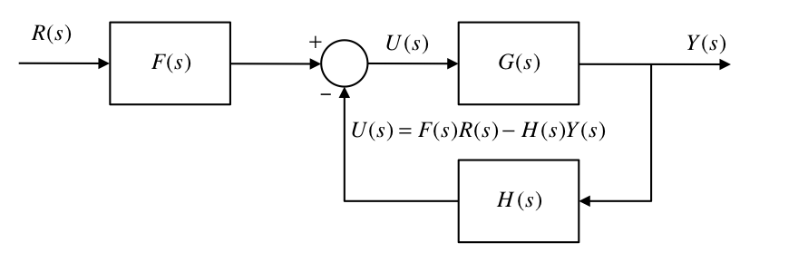
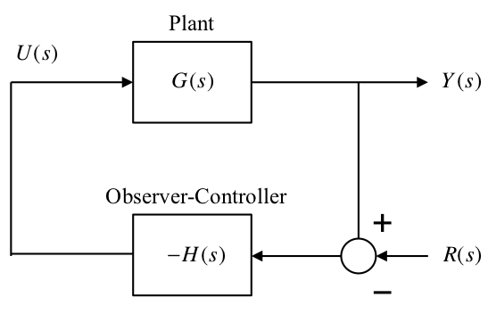

---
redirect_from:
  - "/08/4/observer-controller"
interact_link: content/08/4/observer_controller.ipynb
title: 'Combined Observer and Controller'
prev_page:
  url: /08/3/observers
  title: 'State Observers'
next_page:
  url: /01/mattf
  title: 'Appendix A Defining Transfer Functions in MATLAB'
comment: "***PROGRAMMATICALLY GENERATED, DO NOT EDIT. SEE ORIGINAL FILES IN /content***"
---

# Combined Observer and Controller

-   The observer states can be used to provide feedback control when the
    plant's own states are not available.

-   The combined observer-controller is equivalent to a classical
    compensator.

-   The combined system has twice as many states as the plant because of
    the duplicated states of the observer.

-   *Question to be answered here*: how does the whole thing behave?

## Content

-   Dynamics of the combined controller-observer system

    1.   Separation principle

    2.   Equivalent classical controller

-   Introducing the reference input

    1.  The normal position

    2.  Observer driven by the tracking error

## Dynamics of the combined system

**The control**: $u=r-\mathbf{K}\hat{\mathbf{x}}$

**The plant dynamics**: $\dot{\mathbf{x}}=\mathbf{A}\mathbf{x}+\mathbf{B}(r-\mathbf{K}\hat{\mathbf{x}})$

**Error**:  $\mathbf{e}=\mathbf{x}-\hat{\mathbf{x}}$ so $\hat{\mathbf{x}}=\mathbf{x}-\mathbf{e}$ therefore 

$$\begin{eqnarray*}
    			\dot{\mathbf{x}} & = & \mathbf{A}\mathbf{x}+\mathbf{B}r-\mathbf{BK}(\mathbf{x}-\mathbf{e}) \\
    			                 & = & (\mathbf{A}-\mathbf{BK})\mathbf{x}+\mathbf{BK}\mathbf{e}-\mathbf{B}r
    	\end{eqnarray*}$$

From previous work the error dynamics are:

$$\dot{\mathbf{e}} = (\mathbf{A}-\mathbf{LC})\mathbf{e}$$ 

Therefore the
dynamics of the combined system is: 

$$\left[ {\begin{array}{*{20}c}
   {\dot{\mathbf{x}}}  \\
   {\dot{\mathbf{e}}}  \\
\end{array}} \right] = \left[ {\begin{array}{*{20}c}
   {\left( \bf{A} - \bf{BK} \right)} & \bf{BK}  \\
   {\bf{0}} & {\left( {\bf{A} - {\bf{LC}}} \right)}  \\
\end{array}} \right]\left[ {\begin{array}{*{20}c}
   {\bf{x}}  \\
   {\bf{e}}  \\
\end{array}} \right] + \left[ {\begin{array}{*{20}c}
   {\bf{B}}  \\
   {\bf{0}}  \\
\end{array}} \right]r$$

The eigenvalues or poles of the combined system are the roots of the CE:

$$\begin{eqnarray*}
	\det \left[ {s{\bf{I}}_{2n}  - \left[ {\begin{array}{*{20}c}
	   {\left( \bf{A} - \bf{BK} \right)} & {\bf{BK}}  \\
	   {\bf{0}} & {\left( \bf{A} - \bf{LC} \right)}  \\
	\end{array}} \right]} \right] & = &  0 \\
	\det \left[ {\begin{array}{*{20}c}
	   {\left[ {s{\bf{I}} - \left( \bf{A} - \bf{BK} \right)} \right]} & { - {\bf{BK}}}  \\
	   {\bf{0}} & {\left[ {s{\bf{I}} - \left( \bf{A} - \bf{LC} \right)} \right]}  \\
	\end{array}} \right] & = & 0\end{eqnarray*}$$

The matrix is block triangular with square matrices on the diagonal.
Therefore:

$$\det \left[ {s{\bf{I}} - \left( \bf{A} - \bf{BK} \right)} \right]\det\left[ s\bf{I} - \left( \bf{A} - \bf{LC} \right) \right] = 0$$

$$\alpha_c(s)\alpha_e(s) = 0$$

These are the combined characteristic polynomials of the controller and
the observer.

### Separation Principle

From the above work, we can conclude that the set of poles of the
combined observer-controller system is the union of the set of closed
loop controller poles and the set of observer poles.

The controller matrix $\mathbf{K}$ is designed as before, as if the real
plant states are going to be used for the feedback. This fixes the
positions of the controller poles into the desired positions.

Then, quite independently, the matrix $\mathbf{L}$ is designed as before
to fix the observer poles as required.

Using the observer states for the control feedback instead of the plant
states does not affect the closed loop poles.

This is a fortunate situation and is known as the **separation
principle**. The problems of controller design and observer design have
been separated.

### The Equivalent Classical Compensator

-   We shall determine the classical compensator TF which is equivalent
    to the combined observer-controller.

-   This is simpler to do if we remove the reference input, for the time
    being.

Setting the reference input $r = 0$ gives:

$$\frac{d\hat{\mathbf{x}}}{dt}=(\mathbf{A}-\mathbf{LC})\hat{\mathbf{x}}+ \mathbf{B}u+\mathbf{L}y$$

where $u=-\mathbf{K}\hat{\mathbf{x}}$ therefore

$$\frac{d\hat{\mathbf{x}}}{dt}=(\mathbf{A}-\mathbf{LC})\hat{\mathbf{x}} - \mathbf{BK}\hat{\mathbf{x}}+\mathbf{L}y$$

or

$$\frac{d\hat{\mathbf{x}}}{dt}=(\mathbf{A} - \mathbf{LC} - \mathbf{BK})\hat{\mathbf{x}} + \mathbf{L}y$$

Taking Laplace transforms, ignoring ICs: Taking Laplace transforms,
ignoring ICs: 

$$\begin{eqnarray*}
s\hat{\mathbf{X}}(s) & = & (\mathbf{A} - \mathbf{LC} - \mathbf{BK})\hat{\mathbf{X}}(s) + \mathbf{L}Y(s) \\	
\underbrace {(s{\bf{I}} - {\bf{A}} + {\bf{BK}} + {\bf{LC}})}_{\bf{M + BK}}{\bf{\hat X}}(s) & = & {\bf{L}}Y(s) \\
\hat{\mathbf{X}}(s) & = & (\mathbf{M}+\mathbf{BK})^{-1}{\bf{L}}Y(s)\end{eqnarray*}$$

where $\mathbf{M}=s\mathbf{I}-\mathbf{A}+\mathbf{LC}$.

$$U(s)=-\mathbf{K}\hat{\mathbf{X}}(s)=-\mathbf{K}(\mathbf{M}+\mathbf{BK})^{-1}\mathbf{L}Y(s)$$

therefore the compensator TF is:

$$H(s)=-\frac{U(s)}{Y(s)}=\mathbf{K}(\mathbf{M}+\mathbf{BK})^{-1}\mathbf{L}$$

Alternatively, since

$$s{\bf{\hat X}}(s) =  {\bf{A\hat X}}(s) + {\bf{B}}U(s) + {\bf{L}}\left( {Y(s) - {\bf{C\hat X}}}(s) \right)$$

then,

$$\left( {s{\bf{I}} - {\bf{A}} + {\bf{LC}}} \right){\bf{\hat X}}(s) = {\bf{B}}U(s) + {\bf{L}}Y(s)$$

or,

$${\bf{\hat X}}(s) = {\bf{M}}^{ - 1} {\bf{B}}U(s) + {\bf{M}}^{ - 1} {\bf{L}}Y(s)$$

Now $$U(s) =  - {\bf{K\hat X}}(s)$$ 

so

$$U (s) =   - {\bf{K}}\left( {\bf{M}^{ - 1} {\bf{B}}U(s) + {\bf{M}}^{ - 1} {\bf{L}}Y(s)} \right)$$

$$\left( {1 + {\bf{KM}}^{ - 1} {\bf{B}}} \right)U(s) =  - {\bf{KM}}^{ - 1} {\bf{L}}Y(s)$$

$$H\left( s \right) =  - \frac{U(s)}{Y(s)} = \frac{\bf{KM}^{ - 1} {\bf{L}}}{1 + \bf{KM}}^{ - 1} {\bf{B}}$$

## Introducing the Reference Input

Two cases considered:

1.  The Normal Position

    -   The reference input is introduced as
        $u=r-\mathbf{K}\hat{\mathbf{x}}$.

2.  Observer driven by the tracking error

    -   Sense the tracking error and use this to control the system.

    -   The tracking error is the difference between the desired and
        actual outputs $\tilde e =  - r + y$

    Systems in each case have different properties.

### 1. The Normal Position

In this case the reference input $r$ is introduced as before:
$u=r-\mathbf{K}\hat{\mathbf{x}}$. This results in an equivalent
classical system with the structure shown below:

#### Finding $F(s)$ and $H(s)$

For the observer we have:

$$\frac{d\hat{\mathbf{x}}}{dt} = \mathbf{A}\hat{\mathbf{x}}+\mathbf{B}u-\mathbf{L}(\mathbf{C}\hat{\mathbf{x}} - y)$$

Taking Laplace transforms ignoring ICs 

$$\begin{eqnarray*}
s\hat{\mathbf{X}}(s) & = & \mathbf{A}\hat{\mathbf{X}} - \mathbf{B}U - \mathbf{LC}\hat{\mathbf{X}} + \mathbf{L}Y(s) \\	
\underbrace {(s{\bf{I}} - {\bf{A}} + {\bf{LC}})}_{\bf{M}}{\bf{\hat X}} & = & {\bf B}U + {\bf{L}}Y(s) \\
\hat{\mathbf{X}} & = & \mathbf{M}^{-1}\mathbf{B}U + \mathbf{M}^{-1}{\bf{L}}Y\end{eqnarray*}$$

For the controller we have: 

$$u = r - \mathbf{K}\hat{\mathbf{x}}$$

Taking Laplace transforms 

$$U = R - \mathbf{K}\hat{\mathbf{X}}$$

Therefore, for the combined observer-controller

$$U=R-\mathbf{K}\left(\mathbf{M}^{-1}\mathbf{B}U + \mathbf{M}^{-1}{\bf{L}}Y\right)$$

Re-arranging:

$$\left(\mathbf{KM}^{-1}\mathbf{B}+1\right)U=R-\mathbf{KM}^{-1}\mathbf{L}Y$$

therefore,

$$U=\frac{1}{\mathbf{KM}^{-1}\mathbf{B}+1}R-\frac{\mathbf{KM}^{-1}\mathbf{L}}{\mathbf{KM}^{-1}\mathbf{B}+1}Y$$

Comparing with: 

$$U=F(s)R-H(s)Y$$

$$F(s) = \frac{1}{\mathbf{KM}^{-1}\mathbf{B}+1}$$ and

$$H(s) = \frac{\mathbf{KM}^{-1}\mathbf{L}}{\mathbf{KM}^{-1}\mathbf{B}+1}$$

#### A useful theorem

If $\mathbf{M}$ is square and $\mathbf{V}$ is a row vector and
$\mathbf{W}$ is a column vector then,

$$\mathbf{VM}^{-1}\mathbf{W}=\frac{\det\left(\mathbf{M}+\mathbf{WV}\right)}{\det{\mathbf{M}}}-1$$

#### Zeros and Poles of $F(s)$ and $H(s)$

Applying the theorem:

$$\mathbf{KM}^{-1}\mathbf{B}+1=\frac{\det\left(\mathbf{M}+\mathbf{BK}\right)}{\det{\mathbf{M}}}$$

therefore,

$$F(s) = \frac{\det\mathbf{M}}{\det\left(\mathbf{M}+\mathbf{BK}\right)}$$

From previous work,

$$\det\mathbf{M}=\det\left(s\mathbf{I}-\mathbf{A}=\mathbf{LC}\right)=\alpha_e(s)$$

where $\alpha_e(s)=0$ is the characteristic equation of the observer.

Let $\det\left(\mathbf{M}+\mathbf{BK}\right)=\alpha_1(s)$ then,

$$F(s)=\frac{\alpha_e(s)}{\alpha_1(s)}.$$

Similarly for $H(s)$:

$$H\left( s \right) = \frac{\left( {\frac{\det \left( \bf{M} + \bf{LK} \right)}{\det \bf{M}} - 1} \right)}{\frac{\det \left( \bf{M} + \bf{BK} \right)}{\det \bf{M}}} = \frac{\det \left( \bf{M} + \bf{LK} \right) - \det \bf{M}}{\det \left( \bf{M} + \bf{BK} \right)}$$

Letting $\det\left(\mathbf{M}+\mathbf{LK}\right)-\det\mathbf{M}=\alpha_2(s)$ then, 

$$H(s)\frac{\alpha_2(s)}{\alpha_1(s)}.$$

#### The Overall Closed Loop TF

$$\frac{Y(s)}{R(s)}=F(s)=\frac{G(s)}{1+G(s)H(s)}$$ 

Let the plant TF be:

$$\frac{\alpha_z(s)}{\alpha_p(s)}$$ 

therefore, 

$$\begin{eqnarray*}
	\frac{Y(s)}{R(s)} &=& \frac{\alpha_e(s)}{\alpha_1(s)}\frac{\frac{\alpha_z(s)}{\alpha_p(s)}}{1+\frac{\alpha_z(s)}{\alpha_p(s)}\frac{\alpha_2(s)}{\alpha_1(s)}} \\
	\frac{Y(s)}{R(s)} &=& \frac{\alpha_e(s)\alpha_z(s)}{\alpha_p(s)\alpha_1(s)+\alpha_z(s)\alpha_2(s)}\end{eqnarray*}$$

We know from previous work that the denominator, corresponding to the
closed loop CE of the overall system must, from the separation
principle, be equivalent to: $$\alpha_e(s)\alpha_c(s)$$ therefore,

$$\frac{Y(s)}{R(s)} = \frac{\alpha _e (s)\alpha _z (s)}{\alpha _e (s)\alpha _c (s)} = \frac{\alpha _z (s)}{\alpha _c (s)}$$

-   Notice here how the input TF $F(s)$ contains as its zeros all the
    poles of the observer given by $\alpha_e(s)$.

-   Because of the separation principle, these are also half of the
    poles of the overall closed loop TF.

-   The pole-zero cancellation results in the final TF having just the
    plant zeros and the controller poles.

-   Thus we can say that, using the observer states for the feedback,
    instead of the unavailable plant states, has not affected the closed
    loop TF.

-   This is not the case when the reference input is introduced
    elsewhere.

### 2. Observer Driven by the Tracking Error

Sometimes it is desired to sense the tracking error and use this to
control the system.

The tracking error is the difference between the desired and actual
outputs, 

$$\tilde e =  - r + y$$

Some sensors can only measure a difference between two measurands. eg a
thermocouple can only sense the temperature difference between its hot
and cold junctions.

Redraw:

In this configuration the observer is driven by: $$\tilde E =  Y + R$$
Hence the observer dynamics are:

$$s\hat{\mathbf{X}}=\mathbf{A}\hat{\mathbf{X}}+\mathbf{B}U+\mathbf{L}(\tilde E - \mathbf{C}\hat{\mathbf{X}})$$

therefore, 

$$\begin{eqnarray*}
	\underbrace {\left( {s{\bf{I}} - {\bf{A}} + {\bf{LC}}} \right)}_{\bf{M}}{\bf{\hat X}} & = & {\bf{B}}U + {\bf{L}}\tilde E \\
	{\bf{\hat X}} & = & {\bf{M}}^{ - 1} {\bf{B}}U + {\bf{M}}^{ - 1} {\bf{L}}\tilde E\end{eqnarray*}$$

Now $U=-\mathbf{K}\hat{\mathbf{X}}$, therefore $$\begin{eqnarray*}
	U & = &  - \bf{KM}^{ - 1} {\bf{B}}U - {\bf{KM}}^{ - 1} {\bf{L}}\tilde E \\
	U & = &  - \frac{\bf{KM}^{ - 1} {\bf{L}}}{1 + {\bf{KM}}^{ - 1} {\bf{B}}}\tilde E \\
	H\left( s \right) & = &  - \frac{U}{\tilde E} = \frac{\bf{KM}^{ - 1} {\bf{L}}}{1 + {\bf{KM}}^{ - 1} {\bf{B}}}\end{eqnarray*}$$

Here $H(s)$ is the same as before: 

$$\frac{\alpha_2(s)}{\alpha_1(s)}$$

where $\alpha_1(s)=\det(\mathbf{M}+\mathbf{BK})$ and $\alpha_2(s)=\det(\mathbf{M}+\mathbf{LK})-\det{M}$.

The overall TF is: 

$$\begin{eqnarray*}
	\frac{Y(s)}{R(s)} &=& \frac{G(s)}{1+G(s)H(s)}= \frac{\frac{\alpha_z(s)}{\alpha_p(s)}\times\frac{\alpha_2(s)}{\alpha_1(s)}}{1+\frac{\alpha_z(s)}{\alpha_p(s)}\times\frac{\alpha_2(s)}{\alpha_1(s)}} \\
	\frac{Y(s)}{R(s)} &=& \frac{\alpha_z(s)\alpha_2(s)}{\alpha_p(s)\alpha_1(s)+\alpha_z(s)\alpha_2(s)}=\frac{\alpha_z\alpha_2}{\alpha_c\alpha_e}\end{eqnarray*}$$

-   In this case we see that the overall TF contains the poles of the
    observer as well as the controller.

-   Whereas in the normal position changes in the reference input do not
    excite the error dynamics of the observer, in this configuration
    they do.

-   As a result the difference between the observer and the plant states
    is affected during operation and take further time to settle down.

## Summary

-   Dynamics of the combined controller-observer system

    1.   Separation principle

    2.  Equivalent classical controller

-   Introducing the reference input

    1.  The normal position

    2.  Observer driven by the tracking error
