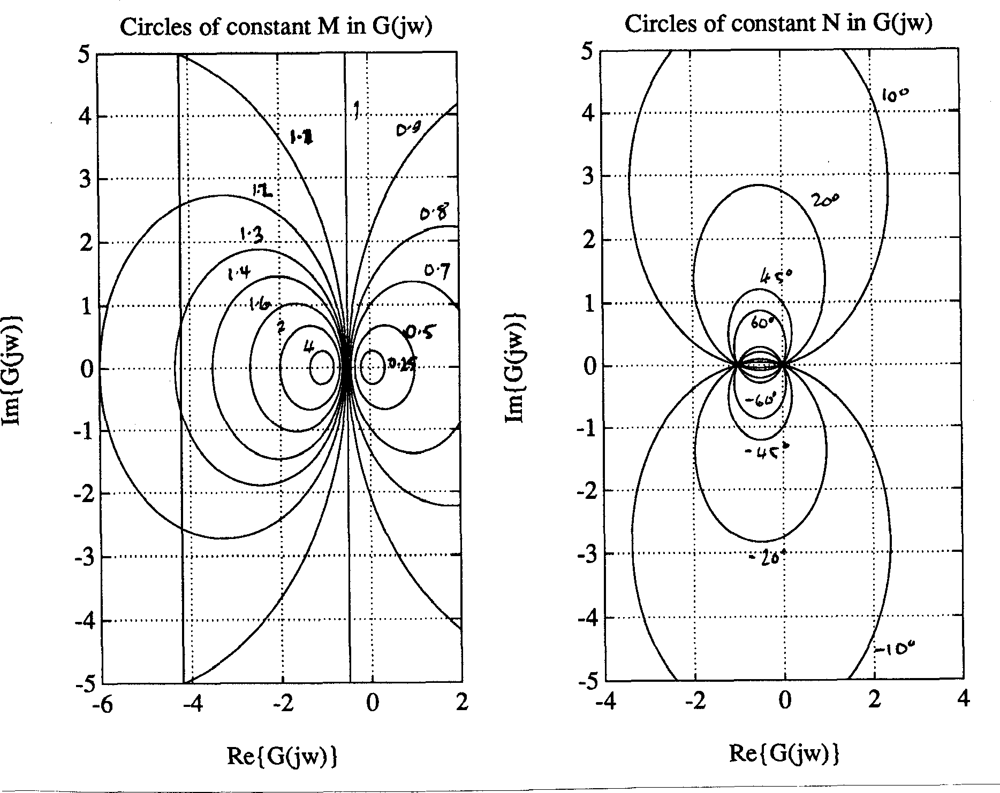

---
redirect_from:
  - "/handouts/csd/2"
title: '2. Design Methods'
prev_page:
  url: /handouts/csd/1
  title: '1. Aims of Control Systems Analysis and Design'
next_page:
  url: /handouts/csd/3
  title: '3. Design Strategies'
comment: "***PROGRAMMATICALLY GENERATED, DO NOT EDIT. SEE ORIGINAL FILES IN /content***"
---
# 2.	Design Methods

## 2.1	Bode

Bode diagrams can be used for the quick design of simple systems, provided that the open-loop contains no more than two integrators and no right half plane poles or zeros (almost certainly true if the data has been obtained experimentally). The stability is easily assessed, and the open-loop gain can be adjusted to give the desired gain and phase margins.

Theoretical Bode diagrams can be plotted accurately by calculation (use MATLAB command `bode`), or from summation of first and second order templates (Figures 16, 17 and 18), but often straight line segment approximations are adequate especially for the gain plot. See also [Appendix](appendix).

Furthermore, for simple designs such as operational amplifier stabilisation where generous stability margins can be allowed and where no time delays exist, the stability can often be estimated on the basis of the gain diagram alone. Observing that a steady slope of $-20$ dB/decade corresponds to a phase lag of $90^\circ$, $-40$ dB/decade to $180^\circ$ lag, etc., it may readily be verified that the amplifier will be very stable if the gain falls at no more than $-20$ dB/decade for a decade on either side of the unity open-loop gain frequency $\omega_1$.

For digital systems, the bilinear transform

$$z = \frac{1+\omega T/2}{1 - \omega T/2}$$

(MATLAB function `z2w`) is used to map the $z$-transfer function into a $w$-transfer function which obeys the same stability laws as the $s$-plane. Bode diagrams may be plotted for these $w$-transfer functions.

## 2.2	Root Locus

This is a more advanced method that requires an accurate mathematical model of the system. Example loci for typical systems are given in [Appendix](appendix). These can be deduced and their important features quantified by using simple construction rules. However, the full strength of the method is only revealed when computerised locus plotting is available (see MATLAB command `rlocus`).

The main features of the method are the good correlation that may be obtained with either time or frequency domain criteria, the direct assessment that is made of the sensitivity, and the ease with which the right half plane poles or zeros are included.

The correlation with the time and frequency domain criteria is usually defined in terms of a 2nd order model and can be extended to higher order systems because of the effect of "*dominant poles*". The following general conclusions can be made:

*	Poles in the right-half plane are unstable.
*	Zeros in the right half plane are stable but give an undesirable reverse transient.
*	Poles and zeros further from the origin give a faster response.
*	Poles subtending larger angles with the negative real axis give an under-damped response.
* Poles and zeros with the largest negative real parts dominate the response. Poles and zeros with real parts more than perhaps two to five times more negative can generally be neglected.

The response of a dominant first-order pole is easily assessed and examining standard responses of a pure second order can assess dominant second-order poles. Figure 15 shows the family of under-damped second-order step responses, Figure 9 examines the settling time, and Figures 6, 14 and 11 shows the relationship of damping ratio $\zeta$ to percentage overshoot $M_p$, phase margin $\phi_m$ and resonant peak $M_{\mathrm max}$ respectively. The relationship between these show that the damping ratio should generally be greater than $0.25$ and will usually be better placed between $0.5$ and $0.8$.

The root-locus is equally applicable to digital control systems. The only differences are that in the $z$-plane, the stability boundary is the unit circle and poles and zeros in the negative half plane produce responses that alternate positive and negative, so dominant poles are kept in the right half of the unit circle.

Finally note that the root locus may also be employed the examine sensitivity to parameters other than loop gain.

## 2.3	Nyquist

The Nyquist diagram can be used with practical as well as theoretical data but is more powerful than the Bode diagram enabling peak magnification $M_{\mathrm max}$ and closed-loop bandwidth to be evaluated.

Sample diagrams are given in [Appendix](appendix), but note the error in item 5 and other examples with the factor

$$\frac{1}{s(s\tau1 + 1)}$$

of assuming that the real part tends to zero when $\omega \to \infty$.

By examination of the magnitude and phase of the closed-loop frequency response

$$G_c(j\omega) = \frac{G_o(j\omega)}{1+G_o(j\omega)}$$

it is fairly easy to derive equations for curves of constant closed-loop magnitude (magnification) and constant closed-loop phase, both or which turn out to be circles (called respectively the M and N circles) in the $G_o(j\omega)$ plane. By noting at what frequency the Nyquist curve crosses these circles it is possible, if tedious, to develop the closed-loop frequency response. Of particular importance is the
M-circle which is tangential to the Nyquist diagram since this represents the peak magnification $M_{\mathrm max}$ -- a useful design parameter.

The formulae for the M and N circles are1:

M-circle (for $M = \left\|G_c(j\omega)\right\|$): Centre: ${M^2}/(1 - {M^2}) + j0$, Radius: $\left\|M/(1-M^2)\right\|$

N-circle (for $\alpha = \angle G_c(j\omega)$), $N = \tan\alpha$): Centre: $1/2+j(1/2N)$, Radius: $(1/2)\sqrt{1+1/(N^2)}$

Examples are given in Figure 1. Collections of M and N circles are available as design charts (called *Hall Charts*).

Design in the Nyquist domain is somewhat tedious, due to the fact that any modification in gain or phase requires a reshaping of the frequency response. This is somewhat less of a problem in MATLAB where the functions `nyquist`, `mcircle` and `ncircle` have been provided to do the donkeywork.

The Nyquist diagram can also cope with open-loop poles and zeros in the right-half plane and with more than two integrations, provided that these hazards are enumerated.

## 2.4	Nichols

The Nichols chart (complete with M and N curves) is a variation of the Nyquist diagram which is better suited to iterative design, particularly by hand. The choice of axes (phase in degrees versus gain in dB) makes the choice of open-loop gain trivial and dynamic compensation can be accomplished by the straightforward addition of standard templates (see for example Chapters 17 and 18 of DiSteffano et al). When computer-aided tools are available, the Nyquist diagram is as easy to work with!

**Figure 1 M and N Circles**

## 2.5	Inverse Nyquist

This technique is more appropriate for parallel compensation such as velocity feedback. The adjustment of open-loop gain is accomplished by a change of scale and is straightforward because the contours of constant closed-loop gain (M-circles) are concentric circles, and parallel compensation is achieved by straightforward addition.

## 2.6	Simulation

For complex control systems an analogue or digital computer simulation enables the above methods to be tested by examining the exact design criteria of interest. An analogue or hybrid simulation also enables the electronic controller to be validated with a simulated plant before it is used on the real plant.

## 2.7	Experiment

In the end there is no alternative but to experiment with the real system. With the results of one or more of the above methods this should be a fairly painless process though some final adjustments are usually required. In some cases (particularly in process control) the above methods may be difficult and use of the Ziegler-Nichols design rules may be an adequate starting point (ref. Franklin, Powell and Emami-Naeini, "Feedback Control of Dynamic Systems", pp 103-106, Addison-Wesley, 1986).

1. For derivation and examples of the use of M and N circles see, e.g. Dorf section 8.5, DiSteffano et al Section 11.2.
