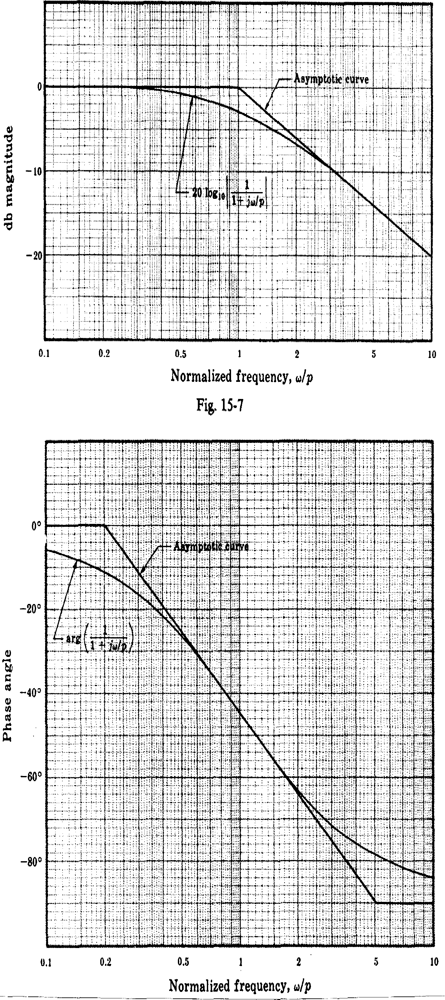
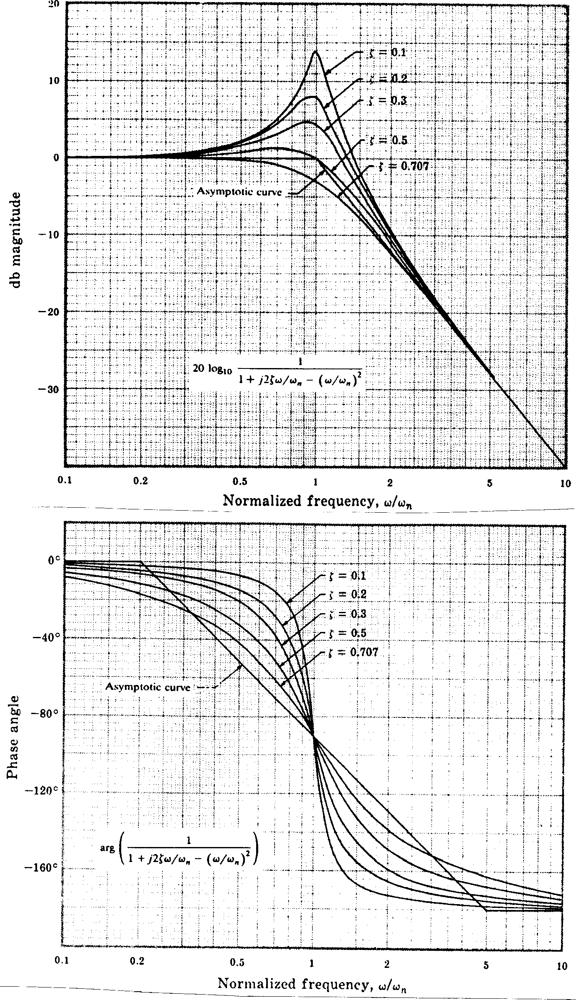

---
redirect_from:
  - "/handouts/csd/5"
title: '5. Some Useful Design Curves'
prev_page:
  url: /handouts/csd/4
  title: '4. Design Criteria'
next_page:
  url: /handouts/csd/ack
  title: 'Acknowledgements'
comment: "***PROGRAMMATICALLY GENERATED, DO NOT EDIT. SEE ORIGINAL FILES IN /content***"
---
# 5. Some useful design curves

**Figure 15 Unit step response vs normalised time $\omega_n t$ for various values of $\zeta$ (2nd order)**

**Figure 16 Bode diagram of a first order pole plotted against normalised frequency $\omega/p$**

**Figure 17 Bode diagram of a first order zero plotted against normalised frequency $\omega/z$**

**Figure 18 Bode diagram of a second order complex pair of poles plotted against normalised frequency $\omega/\omega_n$ for various values of $\zeta$**

**Figure 19 Effect of an extra pole at $s = -­p_r$ on a second order system**

**a)	% overshoot $M_P$ vs $p_r/\zeta \omega_n$**

**b)	normalised rise time $\omega_n t_r$ vs $p_r/\zeta \omega_n$**

**Figure 20 Effect of an extra zero at $s = -­z_r$ on a second order system**

**a)	% overshoot $M_P$ vs $z_r/\zeta \omega_n$**

**b)	normalised rise time $\omega_n t_r$ vs $z_r/\zeta \omega_n$**

**Figure 21 Maximum phase lead v $\alpha$ for a phase-lead compensator**

**Figure 22 Transient response overshoot $M_P$ and frequency response resonant peak vs phase margin for a second order system (note $M_r = M_\max$)**
