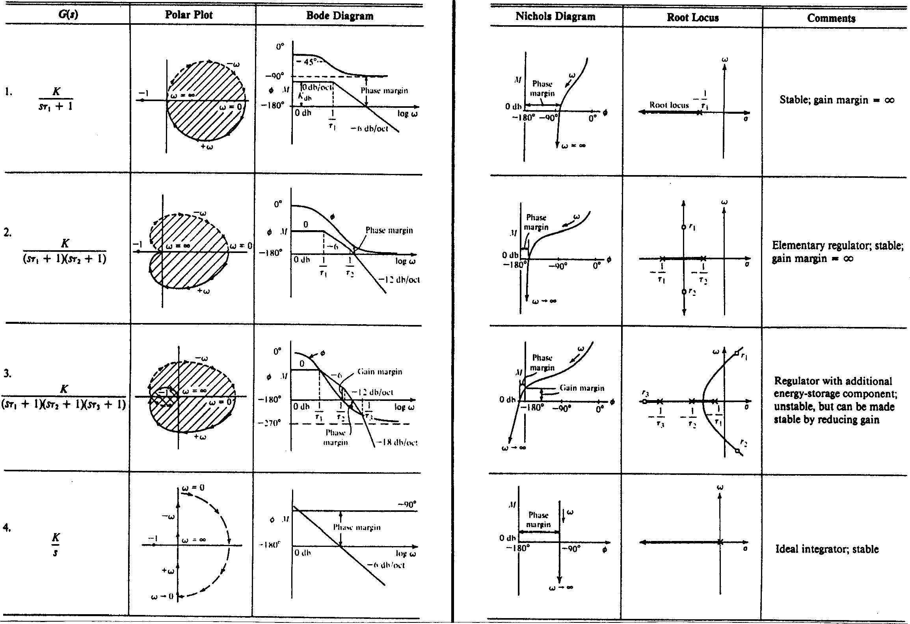
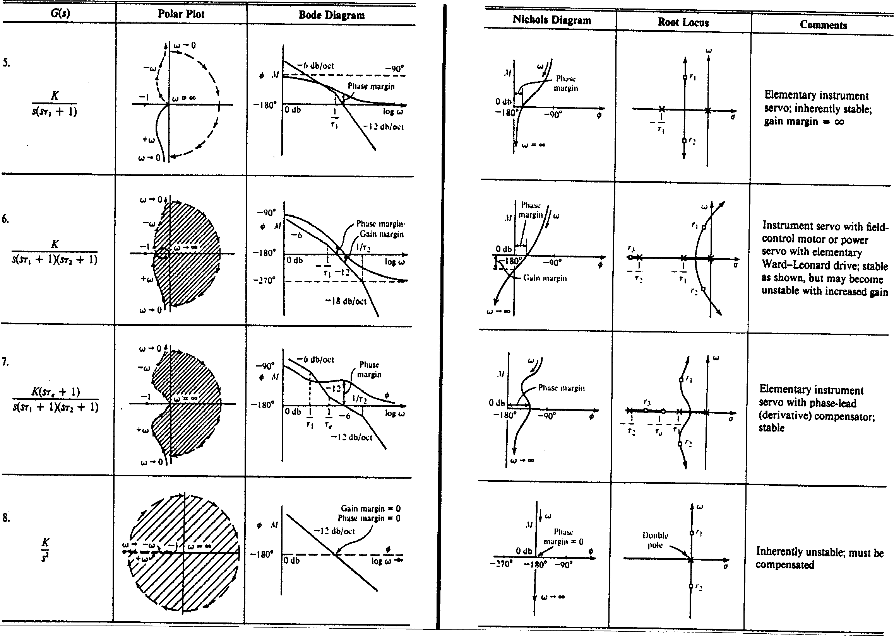
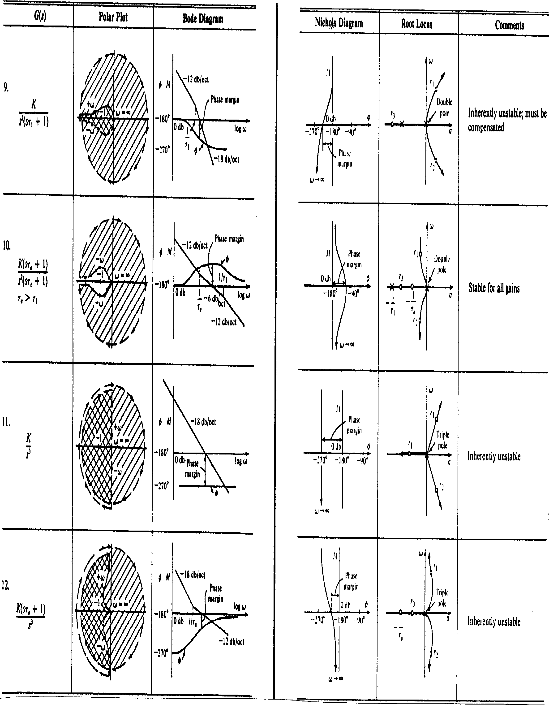
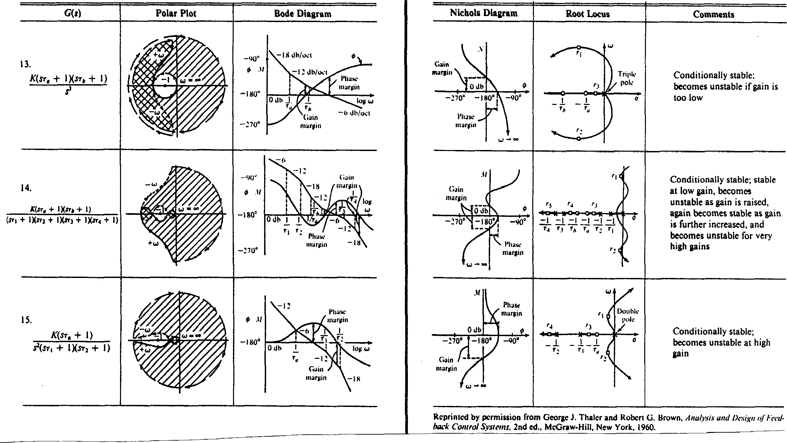

---
redirect_from:
  - "/handouts/csd/appendix"
title: 'Appendix -- Transfer Function Plots for Typical Transfer Functions'
prev_page:
  url: /handouts/csd/ack
  title: 'Acknowledgements'
next_page:
  url: /homework/index
  title: 'Homework Problems'
comment: "***PROGRAMMATICALLY GENERATED, DO NOT EDIT. SEE ORIGINAL FILES IN /content***"
---
## Appendix – Transfer Function Plots for Typical Transfer Functions

Note error in Nyquist diagrams for terms with denominator factor $s(s\tau_1 +1)$. The real part of $G(j\omega)$ does not (necessarily) tend to zero as $\omega \to \infty$.

**Table A1 Transfer function plots for typical transfer functions**

**Table A2 Transfer function plots for typical transfer functions (continued)**

**Table A3 Transfer function plots for typical transfer functions (continued)**

**Table A4 Transfer function plots for typical transfer functions (continued)**

