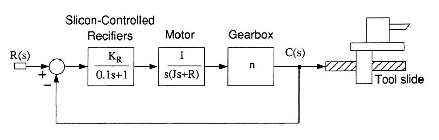

---
redirect_from:
  - "/homework/lag-compensation/problems"
interact_link: content/homework/lag_compensation/problems.ipynb
title: 'Homework 3 - Lag Compensation'
prev_page:
  url: /homework/lead_compensation/problems
  title: 'Homework 2 - Dominant Poles and Lead Compensation'
next_page:
  url: /handouts/csd/index
  title: 'Control System Design Methods'
comment: "***PROGRAMMATICALLY GENERATED, DO NOT EDIT. SEE ORIGINAL FILES IN /content***"
---

#### Swansea University
#### College of Engineering

## EGLM03 Modern Control Systems

# Homework 3: Lag Compensation

## Problems

1. A satellite attitude control system has an open-loop transfer function

    $$G_o(s)=\frac{4(s+2)}{s}$$

   determine the low frequency gain required to ensure that the steady-state error to a constant acceleration input of 1 rad/s2 is 1/40 rad. Design a lag compensator to give the required low frequency gain.

2. A plant has a transfer function

    $$G(s) = \frac{K}{s(s+10)^2}$$

   The velocity constant $K_v$ of a feedback control system for this plant is to be 20, while  the  damping ratio $\zeta$ of the dominant second-order closed-loop poles is to be 0.707. Design a lag compensator to achieve this specification.
   

3. A numerical path-controlled turret lathe control system is illustrated in Figure 1. The gear ratio is $n = 0.1$, the motor inertia is $J = 10^{- 3}$ kg.m2 and  the motor resistance is $R = 10^{-2}$ Nm/(rad/s). It is necessary to attain an accuracy of 0.5 thousandths of an inch in the position of the cutting tool relative to the workpiece and therefore a position accuracy of 1% is required for a ramp input. Design a cascade controller, to be inserted before the silicon-controlled-rectifiers (SCRs), in order to provide a step command with an overshoot of less than 2%. A suitable damping ratio for the system is 0.8. The gain of the SCRs is $K_r = 5$.

Figure 1

