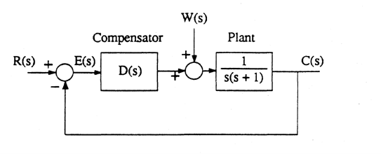

---
redirect_from:
  - "/homework/lead-compensation/problems"
interact_link: content/homework/lead_compensation/problems.ipynb
title: 'Homework 2 - Dominant Poles and Lead Compensation'
prev_page:
  url: /homework/revision/problems
  title: 'Homework 1 - Revision'
next_page:
  url: /homework/lag_compensation/problems
  title: 'Homework 3 - Lag Compensation'
comment: "***PROGRAMMATICALLY GENERATED, DO NOT EDIT. SEE ORIGINAL FILES IN /content***"
---

#### Swansea University
#### College of Engineering

## EGLM03 Modern Control Systems

# Homework 2: Dominant Poles and Lead Compensation

## Problems

1. A certain control system has loop transfer function 
   
   $$\frac{2100 (s^2 + 8.1s + 12.6)}{s^7 + 30s^6 + 406s^5 + 2970s^4 + 11759s^3 + 27500s^2 + 39354s + 26460}$$
   
   Use MA
   TLAB to determine the location of the poles and zeros of this transfer function in the s-plane. Use the function residue to determine the contribution made by each pole to the loop transfer function and hence reduce the order of the system by removing any poles that have contribution figures less than 0.2. For the remaining poles, identify the dominant pole pair and estimate the normalised rise time and peak overshoot in the system. 

2. A position control system for a satellite tracking dish has open-loop transfer function 

   $$G(s) = \frac{K}{s(s+1)}$$
   
   Velocity feedback with gain $K_T$ is added to the system in order to achieve ideal damping with a settling time $t_s \le 2.3$ s. Use the root locus technique to determine suitable values for $K$ and $K_T$.
   

3. A control system has a forward loop transfer function 
   
   $$G(s)=\frac{K}{(s+1)(s+3)}.$$ 
   
   Assuming unity gain feedback is used to close the loop, design a cascade compensator $D_G(s)$ to satisfy the following criteria: $t_r \le 0.4$ s, $M_p \le 0.2$ using 

    a. a proportional + derivative (PD) compensator 
    
    b. a lead compensator. 

    In each case, determine the value of $K$ required and the steady-state position error achieved. 

4. Re-work Question 2 as necessary in order to provide a velocity-error of less than 5%. 

5. A unity-gain feedback position control system has the transfer function 
   
   $$G(s)=\frac{K}{s(s+2)(s+4).}$$
   
   It is desired that the closed-loop dominant poles are such that the natural frequency $\omega_n = 3$ rad/s and damping ratio $\zeta = 0.5$. We also require that the velocity error constant $K_v = 2.7$. Show that the cascade lead compensator 
   
   $$DG(s)= \frac{7.53(s+2.2)}{s + 16.7}$$ 

   satisfies the design requirements and show that the required value of $K$ is 21.74. 

6. Consider the position control system shown in Figure 1. A compensator is to be designed to meet the following requirements 

   * Steady-state error in $c$ due to a constant unit disturbance $w$ should be less than 4/5. 

   * damping ratio is ideal. 

   a. Show that proportional control alone is not adequate 
   
   b. that cascade proportional+derivative control will work, and that 
   
   c. for a cascade compensator with transfer function $D(s) = K + K_ds$, find values for $K$ and $K_d$ to meet the design specifications. 
   

Figure 1

