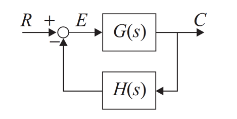
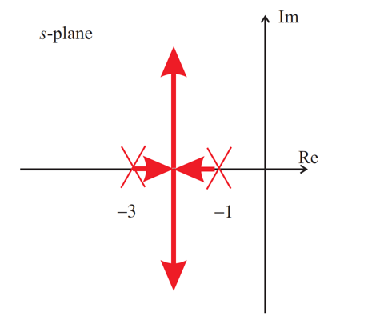

---
redirect_from:
  - "/homework/revision/problems"
interact_link: content/homework/revision/problems.ipynb
title: 'Homework 1 - Revision'
prev_page:
  url: /homework/index
  title: 'Homework Problems'
next_page:
  url: /handouts/csd/index
  title: 'Control System Design Methods'
comment: "***PROGRAMMATICALLY GENERATED, DO NOT EDIT. SEE ORIGINAL FILES IN /content***"
---

#### Swansea University
#### College of Engineering

## EGLM03 Modern Control Systems

# Homework 1: Revision

## Problems

1. Find the closed-loop characteristic equation of the system illustrated in Figure 1
when:
  1. $$G(s) = \frac{1}{s+1}$$ when $$H(s) = 1,\;\frac{1}{s+2}\; \mathrm{and}\; s.$$
  2. $$G(s) = \frac{K(s+2)}{s\left(s^2 + s +1\right)}$$ when $$H(s) = \frac{s+1}{s+10}.$$
  
  
  
Figure 1: A Closed Loop System

2. A feedback control system has an open-loop transfer function 
   
   $$G(s) = \frac{K(s + 2)}{(s + 1)(s - 5)}$$
   
   and unity gain feedback. Find the values of $K$ for which the system is closed-loop stable.

3. A control system has the root-locus shown in Figure 2. Find the closed-loop poles, natural frequency $\omega_n$ 
   and gain $K$ when the damping ratio $\zeta = 0.0,\;0.1,\;0.5\;\textrm{and}\;1.0$. 
   
   What values of gain and damping 
   ratio satisfy the constraints $2 < \omega_n \le 10$ rads-1. 
   
   Is it possible to satisfy the following 
   constraints: rise-time $T_r \le 0,4$ seconds and peak overshoot $M_p \le 0.2$ (20%) by adjusting the forward loop 
   gain only?

   
   
Figure 2: Root Locus Diagram for Question 3

4. Sketch the root-locus diagram for the system of Question 2. Find the value of the
   open-loop gain that yields closed-loop poles having ideal damping $\left(\zeta = 1/\sqrt{2}\right)$.

5. For the system shown in Figure 1
   
   $$G(s) = \frac{1}{sT + 1}$$
   
   and
   
   $$H(s) = h.$$
   
   Find the steady-state step error of of the closed-loop system and determine its
   system type number. What is the system type number when $h = 1$?

6. A general second-order closed-loop control system has the transfer function

   $$G_c(s)=\frac{b_1 s + b_0}{s^2 + a_1 s + a_0}$$
   
   Find suitable values of the parameters $b_1$, $b_0$, $a_1$, and $a_0$ that provide rise-time
   $Tr \le 0.1$ s, settling-time $T_s \le 0.5$ s, peak-overshoot $\%\mathrm{OS} \le  20\%$, zero steady-state 
   step error and a ramp error of $0.01$.
