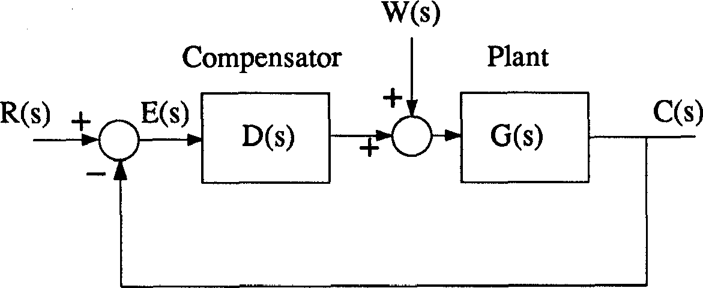
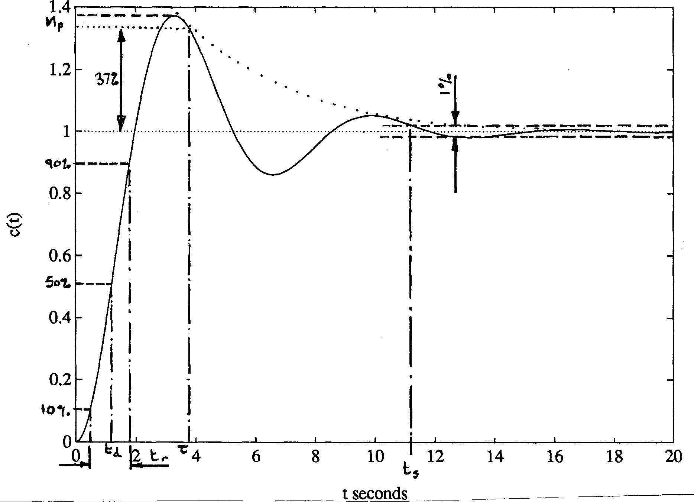
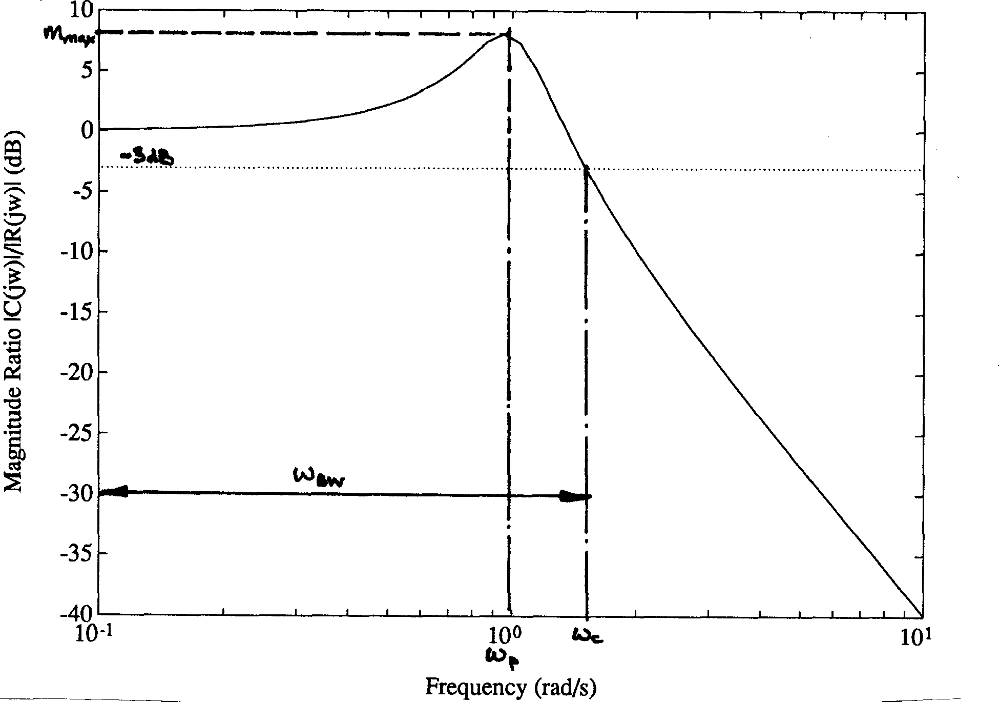
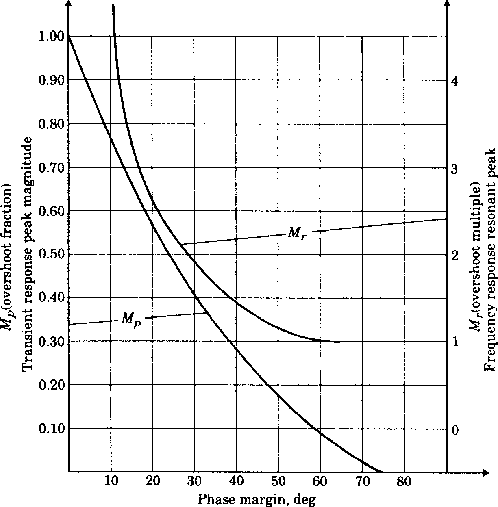

# Control System Design Methods, Compensation Strategies and Design Criteria[1](#fn1)

## 1	Aims of Control Systems Analysis and Design

## 1.1	Analysis

* *Objectives*: Determination of the following system characteristics:
    * degree and extent of system stability
    *	steady-state (d-c) performance (accuracy)
    *	transient performance
* *Methods of analysis*
    * determine differential equations or transfer functions for each component
    * choose suitable representation, e.g. block diagram
    *	formulate system model by connecting components together
    * *determine system response*.

    For the latter there are several methods used:

    * Direct solution to find steady-state and transient solutions. (Difficult with high order systems -- relative stability difficult to study in time domain)
    * Four graphical methods (described in [Section 2](#section2))

        * Root locus
        * Bode diagram
        * Nyquist diagram
        *	Nichols chart

        (The last three are all frequency response methods)

### 1.2	Design Objectives

To meet performance specifications. Performance specifications are constraints on the system characteristics which are a number of ways of specifying these constraints. These fall into two broad classes

* *Time domain criteria*
* *Frequency domain criteria*

The required response is prescribed in either or both forms. In general, the constraints define:

*	speed of response
*	relative stability
*	system accuracy or allowable error.

These are described in [Section 4](#section4).

## 2	Design Methods

### 2.1	Bode

Bode diagrams can be used for the quick design of simple systems, provided that the open-loop contains no more than two integrators and no right half plane poles or zeros (almost certainly true if the data has been obtained experimentally). The stability is easily assessed, and the open-loop gain can be adjusted to give the desired gain and phase margins.

Theoretical Bode diagrams can be plotted accurately by calculation (use MATLAB command `bode`), or from summation of first and second order templates (Figures [16](#fig16), [17](#fig17) and [18](#fig18)), but often straight line segment approximations are adequate especially for the gain plot. See also [Appendix](appendix).

Furthermore, for simple designs such as operational amplifier stabilisation where generous stability margins can be allowed and where no time delays exist, the stability can often be estimated on the basis of the gain diagram alone. Observing that a steady slope of $-20$ dB/decade corresponds to a phase lag of $90^\circ$, $-40$ dB/decade to $180^\circ$ lag, etc., it may readily be verified that the amplifier will be very stable if the gain falls at no more than $-20$ dB/decade for a decade on either side of the unity open-loop gain frequency $\omega_1$.

For digital systems, the bilinear transform

$$z = \frac{1+\omega T/2}{1 - \omega T/2}$$

(MATLAB function `z2w`) is used to map the $z$-transfer function into a $w$-transfer function which obeys the same stability laws as the $s$-plane. Bode diagrams may be plotted for these $w$-transfer functions.

### 2.2	Root Locus

This is a more advanced method that requires an accurate mathematical model of the system. Example loci for typical systems are given in [Appendix](appendix). These can be deduced and their important features quantified by using simple construction rules. However, the full strength of the method is only revealed when computerised locus plotting is available (see MATLAB command `rlocus`).

The main features of the method are the good correlation that may be obtained with either time or frequency domain criteria, the direct assessment that is made of the sensitivity, and the ease with which the right half plane poles or zeros are included.

The correlation with the time and frequency domain criteria is usually defined in terms of a 2nd order model and can be extended to higher order systems because of the effect of "*dominant poles*". The following general conclusions can be made:

*	Poles in the right-half plane are unstable.
*	Zeros in the right half plane are stable but give an undesirable reverse transient.
*	Poles and zeros further from the origin give a faster response.
*	Poles subtending larger angles with the negative real axis give an under-damped response.
* Poles and zeros with the largest negative real parts dominate the response. Poles and zeros with real parts more than perhaps two to five times more negative can generally be neglected.

The response of a dominant first-order pole is easily assessed and examining standard responses of a pure second order can assess dominant second-order poles. [Figure 15](#fig15) shows the family of under-damped second-order step responses, [Figure 9](#fig9) examines the settling time, and Figures [6](#fig6), [14](#fig14) and [11](#fig11) shows the relationship of damping ratio $\zeta$ to percentage overshoot $M_p$, phase margin $\phi_m$ and resonant peak $M_{\mathrm max}$ respectively. The relationship between these show that the damping ratio should generally be greater than $0.25$ and will usually be better placed between $0.5$ and $0.8$.

The root-locus is equally applicable to digital control systems. The only differences are that in the $z$-plane, the stability boundary is the unit circle and poles and zeros in the negative half plane produce responses that alternate positive and negative, so dominant poles are kept in the right half of the unit circle.

Finally note that the root locus may also be employed the examine sensitivity to parameters other than loop gain.

### 2.3	Nyquist

The Nyquist diagram can be used with practical as well as theoretical data but is more powerful than the Bode diagram enabling peak magnification $M_{\mathrm max}$ and closed-loop bandwidth to be evaluated.

Sample diagrams are given in [Appendix](appendix), but note the error in item 5 and other examples with the factor

$$\frac{1}{s(s\tau1 + 1)}$$

of assuming that the real part tends to zero when $\omega \to \infty$.

By examination of the magnitude and phase of the closed-loop frequency response

$$G_c(j\omega) = \frac{G_o(j\omega)}{1+G_o(j\omega)}$$

it is fairly easy to derive equations for curves of constant closed-loop magnitude (magnification) and constant closed-loop phase, both or which turn out to be circles (called respectively the M and N circles) in the $G_o(j\omega)$ plane. By noting at what frequency the Nyquist curve crosses these circles it is possible, if tedious, to develop the closed-loop frequency response. Of particular importance is the
M-circle which is tangential to the Nyquist diagram since this represents the peak magnification $M_{\mathrm max}$ -- a useful design parameter.

The formulae for the M and N circles are[2](#fn2):

M-circle (for $M = \left|G_c(j\omega)\right|$): Centre: ${M^2}/(1 - {M^2}) + j0$, Radius: $\left|M/(1-M^2)\right|$

N-circle (for $\alpha = \angle G_c(j\omega)$), $N = \tan\alpha$): Centre: $1/2+j(1/2N)$, Radius: $(1/2)\sqrt{1+1/(N^2)}$

Examples are given in [Figure 1](#fig1). Collections of M and N circles are available as design charts (called *Hall Charts*).

Design in the Nyquist domain is somewhat tedious, due to the fact that any modification in gain or phase requires a reshaping of the frequency response. This is somewhat less of a problem in MATLAB where the functions `nyquist`, `mcircle` and `ncircle` have been provided to do the donkeywork.

The Nyquist diagram can also cope with open-loop poles and zeros in the right-half plane and with more than two integrations, provided that these hazards are enumerated.

### 2.4	Nichols

The Nichols chart (complete with M and N curves) is a variation of the Nyquist diagram which is better suited to iterative design, particularly by hand. The choice of axes (phase in degrees versus gain in dB) makes the choice of open-loop gain trivial and dynamic compensation can be accomplished by the straightforward addition of standard templates (see for example Chapters 17 and 18 of DiSteffano et al). When computer-aided tools are available, the Nyquist diagram is as easy to work with!

**Figure 1 M and N Circles**

### 2.5	Inverse Nyquist

This technique is more appropriate for parallel compensation such as velocity feedback. The adjustment of open-loop gain is accomplished by a change of scale and is straightforward because the contours of constant closed-loop gain (M-circles) are concentric circles, and parallel compensation is achieved by straightforward addition.

### 2.6	Simulation

For complex control systems an analogue or digital computer simulation enables the above methods to be tested by examining the exact design criteria of interest. An analogue or hybrid simulation also enables the electronic controller to be validated with a simulated plant before it is used on the real plant.

### 2.7	Experiment

In the end there is no alternative but to experiment with the real system. With the results of one or more of the above methods this should be a fairly painless process though some final adjustments are usually required. In some cases (particularly in process control) the above methods may be difficult and use of the Ziegler-Nichols design rules may be an adequate starting point (ref. Franklin, Powell and Emami-Naeini, “Feedback Control of Dynamic Systems”, pp 103-106, Addison-Wesley, 1986).

## 3	Design Strategies

### 3.1	Proportional Control

For simple systems, a loop gain can often be chosen which is high enough to give acceptably small errors, low sensitivity and compliance (see [Section 4.1.4](#section4.1.4)) an adequate speed of response and yet good stability. When these specifications cannot be satisfied simultaneously a more sophisticated strategy is required.

### 3.2	Phase Lag Compensation

The lag compensator

$$\frac{K(1+T_Gs)}{1+\alpha T_gs},\;\alpha>1$$

and proportional-plus-integral (PPI) compensator

$$K(1+1/(T_I s))$$

are used either to increase the loop gain at low frequencies, and so reduce the errors and the sensitivity, or to reduce the loop gain at higher frequencies (specifically around the region of $180^\circ$ phase lag (phase cross-over frequency $\omega_\pi$ ) to reduce the band-width and improve stability. PPI action may be preferred for the former (it increases system type number by 1 and so eliminates steady state-errors) and a lag compensator for the latter. In any case the phase lag is incidental and since it is a destabilising influence it should be used well below the unity loop gain frequency (gain cross-over frequency $\omega_1$). When there is nothing else to choose between the two, the smaller phase lag of the lag controller (PPI is always $90^\circ$ at zero frequency) and its freedom from ‘warm-up’ problems will lead to its use.

### 3.3	Phase Lead Compensation

The lead compensator

$$\frac{K(1+T_L s)}{1+\alpha T_L s},\; \alpha < 1$$

is used to reduce the phase lag around the gain cross-over frequency (unity loop gain frequency) $\omega_1$. It is therefore used to increase stability without reducing bandwidth. Naturally it may also permit the use of a higher proportional gain than would otherwise be possible. The gain of the lead compensator at high frequencies is a destabilising influence so that it should be used at the highest effective frequency and $\alpha$ should not be reduced below $0.1$. The high gain will also amplify any noise in the measurement sensor, which may be a problem.

### 3.4	The Three-Term Controller

This combines the effect of both phase lag and phase lead compensation. A special case is the proportional + integral + derivative (PID) compensator

$$K(1 + T_D s + 1/(T_I s))$$

### 3.5	Parallel Compensation

Parallel compensation (seen in this course as velocity feedback) can be used to produce the same stabilising effect as phase lead compensation without amplifying the measurement noise. For this reason it may be possible to introduce a little more phase advance. Note that velocity feedback will reduce the bandwidth a little.

### 3.6	Feed-forward Control

Feed-forward control is used when the compliance is too high but when the disturbances can be measured. If the load disturbances can be measured, feeding the measurement 'forward' to the error comparator can reduce compliance errors. It does not affect the stability.

## 4	Design Criteria

### 4.1	Steady-­State Criteria

These criteria are measures of the 'tracking accuracy' and robustness of control systems.

#### 4.1.1	Type 0 systems: position constant ($K_p$)

For the simple, unity-gain feedback system shown in [Figure 2](#fig2) the error is given by[3](#fn2)

$$E(s) = \frac{R(s)}{1 + G_o(s)}$$

For a type 0 system, the position constant, $K_p$ is the d-c open loop gain:

$$K_p = \mathop{lim}_{s\to 0}\left.G_o(s)\right.$$

and implies a steady state error of

$$\frac{1}{1+K_p}$$

following a unit step input. Thus a large position constant implies a small steady state error. For a type 1 control system $G_o(s)$ contains an integration so that $K_p = \infty$ and the error tends to zero.

**Unity gain feedback control system**

#### 4.1.2	Type 1 systems: velocity constant ($K_v$)

For the same system,

$$K_v = \mathop{lim}_{s\to 0}\;\left.sG_o(s)\right.$$

The steady state position error for a constant velocity input is $1/K_v$, so a large velocity constant implies a small steady-state error. For a type 2 system $G_o(s)$ contains two integrations so that $K_v = \infty$ and the error to a constant velocity input tends to zero.

#### 4.1.3	Type 2 systems: acceleration constant ($K_a$)

Similarly
$$K_a = \mathop{lim}_{s\to 0}\;\left.s^2G_o(s)\right.$$

but this is not often specified.

#### 4.1.4	Compliance

For the system illustrated in Figure 3, with a disturbance $W(s)$, the error is given by

$$E(s) = \frac{R(s) + G(s)W(s)}{1+D(s)G(s)}$$

The compliance is the steady-state error following a unit step change in $W(s)$. A small compliance requires $D(s) \gg 1$ and zero compliance is obtained when $D(s)$ contains an integrator.

**Figure 3 Compliance**

#### 4.1.5	Sensitivity

The sensitivity is the proportional variation in the closed-loop system caused by a variation in one of the open-loop components. A system will always be sensitive to variations of input, feedback and feed-forward paths, but the sensitivity to variations in the forward path is reduced by a factor of $1/(1 + \mathrm{loop\;gain})$.

### 4.2	Time Domain Criteria
The time domain criteria defined below are derived from the model second order under-damped output response to a step input shown in [Figure 4](#fig4). Similar criteria may be defined from the impulse or ramp response. The performance measures are related to the s-plane via the pole-zero diagram shown in [Figure 5](#fig5) where the poles are solutions of the equation

$$s^2 + 2\zeta \omega_n s + \omega_n^2 = 0$$

and $\alpha$, $\sigma$ and $\omega_d$ are defined as

$$\alpha = \cos^{-1}\zeta$$

$$\sigma = \zeta\omega_n$$

$$\omega_d = \omega_n\sqrt{1-\zeta^2}$$

**Figure 4 Model second-­order under-­damped step response**

**Figure 5 Location of second-­order complex poles**

#### 4.2.1	Percentage overshoot ($M_p$)

Maximum difference between transient and steady state response to a unit step input. A measure of relative stability. Often quoted as a percentage of the final value of the response.

Design values: $M_p$ should be kept below 40% and < 25% is usually required. For a second order system (or a system with a pair of dominant complex poles) $M_p$ may be related to the damping ratio $\zeta$ by the equation

$$M_p = e^{-\pi\zeta/\sqrt{1-\zeta^2}}\;  0 \le \zeta \lt 1$$

A plot of this curve is shown in [Figure 6](#fig6).

A useful approximation to $M_p$ is given by the straight-line equation:

$$M_p \approx 1 - \frac{\zeta}{0.6}\; 0\le \zeta \le 0.6$$

**Figure 6 Plot of the peak overshoot $M_p$ versus the damping ratio $\zeta$ for the second-­order system**

#### 4.2.2	Rise time ($t_r$)

Usually defined as the time taken for the response to rise from 10% to 90% of its final value. A measure of the speed of response of the system. [Figure 7](#fig7) shows the relationship between normalised rise time and the damping ratio $\zeta$.

*Design values*: For a second order system (or a system with a pair of complex dominant poles) rise time may be related to the natural frequency $\omega_n$ by

$$t_r \approx \frac{1.8}{\omega_n}$$

For process control, the step response is often over-damped and an alternative definition of rise time for such a response is illustrated in [Figure 8](#fig8).

**Figure 7 Normalised rise time vs damping ratio for a second order system**

**Figure 8 Typical process response curve**

#### 4.2.3	Settling time ($t_s$)

Usually defined as the time taken for the response to reach and remain within some percentage of its final (steady-state) value (often 1, 2, or 5%). This parameter is related to the real part of the dominant poles $\sigma = \zeta\omega_n$. [Figure 9](#fig9) shows the relationship between settling time and damping ratio for 5% settling time.

**Figure 9 Normalised 5% settling time vs damping ratio for a second order system**

*Design values*: For a second order system (or a system with a pair of dominant complex poles) rise time may be related to $\sigma$ by

$${t_s} = \frac{ - \ln \left( \frac{\% \;{\kern 1pt} {\text{of}}\;{\kern 1pt} {\text{final}}\;{\kern 1pt} {\text{value}}}{100} \right)}{\sigma }$$

**Table 1 Typical settling time values**

Percentage of final value	    | 1% |	2% | 5%	| 10%
------------------------------|----|-----|----|-----
Settling time $t_s$ seconds   | $$\frac{4.6}{\sigma}$$ |  $$\frac{3.9}{\sigma}$$ | $$\frac{3}{\sigma}$$ | $$\frac{2.3}{\sigma}$$

Other parameters sometimes given are

#### 4.2.4	Delay time ($t_d$)

Usually defined as the time taken for the response to reach 50% of its final value. An alternative definition favoured for process control (under-damped responses) is illustrated in [Figure 8\(#fig8).

#### 4.2.5	Predominant time constant ($\tau$)

Sometimes given as an alternative to $t_s$. The exponential envelope of the second order response decays to 37% of its final value in $\tau$ seconds.

*Design values*: for a second order system (or a system with a pair of dominant second order poles)

$$\tau = \frac{1}{\zeta\omega_n}.$$

The second order parameters $\zeta$ and $\omega_n$ may also be given as figures of merit. They can be useful in the design of higher order systems.

### 4.3 Frequency Domain Criteria

Frequency domain specifications are usually given in terms of the steady-state response of a system to a sinusoidal input.

#### 4.3.1 Gain margin (GM)

A measure of relative stability. It is defined as the reciprocal of the magnitude of the open-loop transfer function evaluated at the frequency $\omega_\pi$, at which the phase angle is $-180^\circ$ ($-\pi$ radians). That is

$$\mathrm{GM} \equiv \frac{1}{\left|GH(j\omega_\pi)\right|}$$

where $\angle GH(j\omega_\pi) = -180^\circ = -\pi$ radians.

$\omega_\pi$ is called the 'phase-cross-over frequency'. See [Figure 10](#fig10) for an illustration of gain margin determination from frequency response data.

*Design values*: for absolute stability we require $\left|GH(j\omega_\pi)\right| <  1$ or GM > 1 (0 dB). Typical values are 3dB < GM < 8dB.

**Figure 10 Determination of gain margin (GM) from frequency response diagrams**

#### 4.3.3	Phase margin (PM or $\phi_m$)

Another measure of relative stability. It is defined as $180^\circ$ plus the phase angle $\phi$ of the loop-transfer function at unity gain. That is

$$\phi_m \equiv 180^\circ + \angle GH(j\omega_1)$$

where $GH(j\omega_1) = 1$ (0 dB). Frequency $\omega_1$ is called the gain cross-over frequency. See [Figure 11](#fig11) for illustration of phase margin determination from frequency response data.

*Design values*: for absolute stability we require $GH(j\omega_1) < 180^\circ$ or $\phi_m > 0^\circ$. Typical values used are $\phi_m > 30^\circ$, preferably $45^\circ < \phi_m < 60^\circ$.

Note that if the Nyquist diagram is of the form illustrated in [Figure 11](#fig11), then $\phi_m$ is related to the damping ratio $\zeta$ by the curve illustrated in [Figure 12](#fig12), for which $\zeta \approx \phi_m/100$.

**Figure 11 Determination of phase margin ($\phi_m$) from frequency response diagrams**

**Figure 12 Figure 12 Damping ratio $\zeta$ versus phase margin $\phi_m$**

#### 
4.3.4	Band-­width ($\omega_\mathrm{BW}$)

A measure of the speed of response of a system. In control systems, this is defined as the frequency at which the magnitude ratio $C(j\omega)/R(j\omega)$ is 3 dB down from the magnitude at $\omega = 0$. The frequency $\omega_\mathrm{BW}$ is then
equal to the cut-off frequency $\omega_c$. See [Figure 13](#fig13). Note that for a second-order underdamped system, $\omega_\mathrm{BW}$ is approximately equal to $2\omega_1$, where $\omega_1$ is the gain cross-over frequency.

**Figure 13 Typical second-­order closed-­loop frequency response**

#### 4.3.5	Cut-off rate

The rate at which the magnitude ratio decreases beyond cut-off. E.g. 6 dB/octave = 20 dB/decade.

#### 4.3.6	Resonant peak ($M_\mathrm{max}$)

A good measure of stability, maximum value of the closed-loop frequency response (see Figures [13](#fig13) and [14](#fig14)).

$${M_{\max }} = \mathop {\max }\limits_\omega  \left| \frac{C(j\omega )}{R(j\omega )} \right|$$

*Design values*: a useful rule-of thumb is $M_\max =| C(j\omega_1)|/|R(j\omega_1)|$. That is the closed-loop resonant peak occurs at about the open-loop gain cross-over frequency. A more accurate value can be obtained by finding the M-circle that is tangential to the Nyquist curve (see [Section 2.3](#section2.3)). We usually require $M_\max < 2$ (6 dB), preferably $M_\max < 1.3$ (2.3 dB).

#### 4.3.7	Resonant frequency ($\omega_p$)

The frequency $\omega_p$ at which $M_\max$ occurs.

A final frequency response criterion sometimes encountered is

#### 4.3.7	Delay time ($T_d$)

A measure of the speed of response is given by

$$T_d(\omega) = \frac{d\gamma}{d\omega}$$

where $\gamma = \angle C(j\omega)/R(j\omega) = $ phase of closed-loop frequency response. The average value of $T_d(\omega)$ of the frequency range of interest is usually specified.

**Figure 14 Relationship between resonant peak $M_\max$ and damping ratio $\zeta$**

## Some useful design curves

**Figure 15 Unit step response vs normalised time $\omega_n t$ for various values of $\zeta$ (2nd order)**

**Figure 16 Bode diagram of a first order pole plotted against normalised frequency $\omega/p$**

**Figure 17 Bode diagram of a first order zero plotted against normalised frequency $\omega/z$**

**Figure 18 Bode diagram of a second order complex pair of poles plotted against normalised frequency $\omega/\omega_n$ for various values of $\zeta$**

**Figure 19 Effect of an extra pole at $s = -­p_r$ on a second order system**

**a)	% overshoot $M_P$ vs $p_r/\zeta \omega_n$**

**b)	normalised rise time $\omega_n t_r$ vs $p_r/\zeta \omega_n$**

**Figure 20 Effect of an extra zero at $s = -­z_r$ on a second order system**

**a)	% overshoot $M_P$ vs $z_r/\zeta \omega_n$**

**b)	normalised rise time $\omega_n t_r$ vs $z_r/\zeta \omega_n$**

**Figure 21 Maximum phase lead v $\alpha$ for a phase-lead compensator**

**Figure 22 Transient response overshoot $M_P$ and frequency response resonant peak vs phase margin for a second order system (note $M_r = M_\max$)**

## Acknowledgements

Figures [6](#fig6), [11](#fig11), [21](#fig21) and [22](#fig22) are reproduced from Franklin, Powell and Emami-Naeini, “Feedback Control of Dynamic Systems”, Addison-Wesley, 1986.

Figures [15](#fig15), [16](#fig16), [17](#fig17), [18](#fig18), [19](#fig19) and [20](#fig20) are reproduced from DiStefano, Stubberud and Williams, “Feedback and Control Systems”, 2nd Ed., Schaum’s Outline Series, McGraw & Hill, 1989.

Figures [7](#fig7) and [9](#fig9) are reproduced from Hostetter, Savant and Stefani, “Design of Feedback Control Systems”, 2nd Ed., Holt, Rinehart and Winston, 1989.

Figures in the [Appendix](appendix) are reproduced from Dorf, “Modern Control Systems”, 5th Ed., Addison Wesley, 1989.

Figure [14](#fig14) is reproduced from Open University, “Control Engineering”, T391 Course Notes.

This handout is based, in part, on lecture notes written by Dr W.R. Moore for a second-year course in Automatic Control given in the Department of Electronic Engineering, University of Hull, circa 1979.

## End notes

1. Adapted from DiSteffano, Stubberud and Williams, “Feedback and Control Systems”, 2nd Ed., Schaum’s Outline Series, McGraw & Hill, 1989.

2. For derivation and examples of the use of M and N circles see, e.g. Dorf section 8.5, DiSteffano et al Section 11.2.

3. for more general systems with desired output $C(s)$ and demanded output $R(s)$ the formula $E(s) = R(s) - C(s)$ must be used to derive a relationship between $E(s)$ and $R(s)$.
